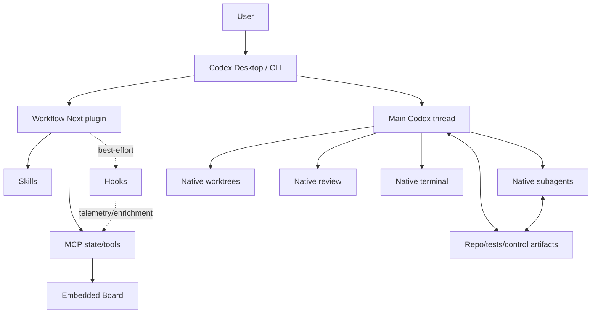

# Codex Workflow Next — Consolidated Master Architecture & Implementation Plan

**Статус:** post-H0 architecture baseline; normative replacement for earlier Master Plan revisions/amendments  
**Ревизия:** **4.3 — Upstream v1.1.15 context-routing and ownership alignment**  
**Дата среза:** 2026-09-08  
**Продукт:** **Codex Workflow Next / Codex Director**  
**Primary host:** ChatGPT Desktop / Codex  
**Compatible host:** Codex CLI  
**Current upstream references:** `viettran-edgeAI/codex_workflow` `main` **v1.1.15**, SHA `a596daaee01bffaff9c04c31e85d378b139cd6c7`; `letya999/workflow-herdr` `dev`, SHA `b1eab041cf2f97da4605c036900d07ff5426cc40` (operational-safety reference only)  
**Executed platform baseline:** Windows 11 build 26200, Desktop `26.901.1978.0`, CLI `0.153.4`  
**PH-00 outcome:** **PASS_WITH_AMENDMENTS**

**Packaging decision 2026-09-08:** Workflow Next production uses Agent Plugins
v1 root `plugin.json` + `mcp.json`. The legacy Codex plugin MCP parser was proven
not to inject `PLUGIN_DATA`; it remains compatibility evidence only. Persistent
state is allowed solely under the host-managed Agent Plugin `PLUGIN_DATA` root,
with no fallback. Hooks remain optional/degraded.

> This revision consolidates the original Desktop-first design, trace-based eval architecture, the `v1.1.13..v1.1.15` upstream review, the actual PH-00 capability evidence, configurable native-agent profiles, and the latest decision to adopt upstream context-routing/ownership ideas without inheriting its route/doc/runtime architecture. Earlier amendment files are historical only; this document is the new architectural source of truth.
>
> The product is **not another Codex runtime**. It is a minimal policy/context/evidence/attention layer that uses native Codex primitives and must prove its marginal value against modern native Codex before Board/Durable expansion.

---

<a id="idx-00"></a>
## [IDX-00] Document role

This file defines:

- product scope and non-goals;
- ownership boundary between Codex and Workflow Next;
- post-H0 capability assumptions;
- domain contracts;
- Skills/agent/context contracts;
- state/MCP/hooks architecture;
- Board UX architecture;
- security/authority model;
- trace/eval methodology;
- milestone contracts and acceptance gates;
- provenance and source map.

Implementation order is controlled by `CODEX_WORKFLOW_NEXT_ROADMAP.md`. The currently executable phase plan is `CODEX_WORKFLOW_PH01_IMPLEMENTATION_PLAN.md`.

### Stable ID families

| Prefix | Meaning |
|---|---|
| `GOAL-*` | product goals |
| `NOGO-*` | excluded scope |
| `PRN-*` | architectural principles |
| `CAP-*` | post-H0 capability evidence |
| `ARC-*` | architecture/components |
| `DOM-*` | domain contracts |
| `SKL-*` | Skills |
| `AGT-*` | agent roles |
| `CTX-*` | context/memory |
| `POL-*` | routing/policy |
| `HK-*` | hooks |
| `API-*` | MCP interface |
| `SEC-*` | security/authority |
| `UX-*` | Board/UX |
| `OBS-*` | observability/evals |
| `MIG-*` | migration/coexistence |
| `MILE-*` | milestones |
| `WP-*` | work packages |
| `AC-*` | acceptance criteria |
| `RISK-*` | risks |
| `ADR-*` | architectural decisions |
| `SRC-*` | sources |

<a id="idx-01"></a>
## [IDX-01] Fast index

| Area | IDs |
|---|---|
| Product | `GOAL-01..08`, `NOGO-01..15` |
| Evidence baseline | `CAP-01..14` |
| Principles | `PRN-01..22` |
| Native boundary | `ARC-01..08` |
| Domain | `DOM-01..16` |
| Skills | `SKL-01..07` |
| Agents | `AGT-01..06` |
| Context | `CTX-01..12` |
| Policy | `POL-01..15` |
| State/MCP/Hooks | `ARC-09..19`, `HK-01..08`, `API-01..05` |
| Board | `UX-01..18` |
| Security | `SEC-01..12` |
| Evals | `OBS-01..18` |
| Milestones | `MILE-00..10` |
| Risks | `RISK-01..20` |
| ADRs | `ADR-00..27` |
| Sources | `SRC-01..31` |

---

# 1. Product Definition

<a id="goal-01"></a>
## [GOAL-01] Desktop-first Codex plugin

Workflow Next is an installable Codex plugin that adds:

- adaptive orchestration guidance;
- bounded task-transfer contracts;
- conditional context isolation;
- risk-aware verification;
- evidence/state projection;
- embedded human-attention UX.

Native Codex remains the runtime.

<a id="goal-02"></a>
## [GOAL-02] Main remains the intelligence and integration owner

The primary Codex thread owns:

- user intent;
- scope;
- architecture/trade-offs;
- cross-worker integration;
- acceptance interpretation;
- final user-visible claims.

Workers provide bounded results/evidence. Board/state never become a second planner.

<a id="goal-03"></a>
## [GOAL-03] Preserve the useful economics of bounded workers

Target pattern:

```text
Main: intent + decisions + integration
          ↓
TaskEnvelope + RolePayload
          ↓
explicit fresh native worker (`fork_turns=none` for proven V1 subset)
          ↓
result / evidence
          ↓
TaskDelta for follow-up
          ↓
Main synthesizes
```

The goal is **not** “use more agents.” Delegation is chosen only when isolation/specialization/parallelism plausibly offsets coordination cost.

<a id="goal-04"></a>
## [GOAL-04] Native primitive first

Use native Codex for:

- subagent lifecycle;
- worktrees;
- review/diff;
- terminal;
- sandbox/permissions;
- model/session runtime;
- memories;
- plugin/Skill/MCP host lifecycle.

Custom code exists only for product-specific policy, contracts, state, evidence and UX.

<a id="goal-05"></a>
## [GOAL-05] Zero-overhead fast path

Small tasks may remain:

```text
User → Main → edit/check → Done
```

No mandatory WorkItem, subagent, Companion, Board, worktree, durable state or verifier.

<a id="goal-06"></a>
## [GOAL-06] Context economy with provenance

Context is layered:

```text
L1 Main context           decision-critical
L2 fresh Context Companion hot operational context
L3 Context Index          provenance-aware cache/pointers
L4 repo code/tests/project-control artifacts  durable truth
L5 raw artifacts          evidence on demand
```

<a id="goal-07"></a>
## [GOAL-07] Evidence-bound completion

`done` is a state supported by required evidence, not a worker statement. Component evidence cannot silently satisfy target-level acceptance.

<a id="goal-08"></a>
## [GOAL-08] Quality-first multi-objective optimization

V1 does **not** use one scalar `ExpectedRunCost` optimizer. Policy/evals use:

1. required quality threshold;
2. then separate measures: tokens, wall time, retries/rework, human interventions, coordination overhead.

---

# 2. Non-goals

<a id="nogo-01"></a>
## [NOGO-01] No custom LLM/thread runtime

No own model invocation engine, worker daemon or alternative Codex client.

<a id="nogo-02"></a>
## [NOGO-02] No standalone desktop/web application

No required localhost web app, Electron/Tauri shell or separate login.

<a id="nogo-03"></a>
## [NOGO-03] No custom agent scheduler

No `spawn → supervise → wait → terminate` engine duplicating Codex.

<a id="nogo-04"></a>
## [NOGO-04] No custom worktree manager

Workflow policy may recommend isolation; native Codex/Git owns lifecycle.

<a id="nogo-05"></a>
## [NOGO-05] No custom review/diff/terminal

Use native review pane, `/review`, integrated terminal.

<a id="nogo-06"></a>
## [NOGO-06] No mandatory fixed pipeline

No universal `research → plan → build → test → closure` route.

<a id="nogo-07"></a>
## [NOGO-07] No Jira/Kanban clone

Board is an attention/evidence projection, not general PM software.

<a id="nogo-08"></a>
## [NOGO-08] No generic vector memory V1

Context Index stores scoped facts/pointers/provenance/freshness; repo remains truth.

<a id="nogo-09"></a>
## [NOGO-09] No free-form agent mesh

V1 topology is Main-owned one-level delegation. Nested delegation is not required.

<a id="nogo-10"></a>
## [NOGO-10] No mandatory DAG

Dependency graph exists only for durable workloads.

<a id="nogo-11"></a>
## [NOGO-11] No intelligent scripts

Scripts validate/normalize/migrate/hash; LLM decides architecture/policy.

<a id="nogo-12"></a>
## [NOGO-12] No private Codex format as correctness API

Private rollout/session formats may be diagnostic only.

<a id="nogo-13"></a>
## [NOGO-13] No hook-only correctness path

Windows PH-00 proved hooks can be configured/trusted yet fail. Hooks are optional telemetry/defense-in-depth only until platform reliability changes.

<a id="nogo-14"></a>
## [NOGO-14] No `_meta`-dependent state/authorization

PH-00 did not reliably deliver render-result `_meta` through the tested Codex Desktop path. Production state must be retrievable through explicit MCP calls.

<a id="nogo-15"></a>
## [NOGO-15] No documentation subsystem or documentation agent

Workflow Next does not create a separate documentation workflow, `docs_steward`, Archivist or mandatory docs-reconciliation stage. Durable project-control artifacts are created only when they are themselves source-of-truth, evidence, provenance, release or migration artifacts. Public user documentation belongs to release work, not to a permanent agent role.

---

# 3. PH-00 Evidence Baseline

<a id="cap-01"></a>
## [CAP-01] Executed environment

PH-00 evidence was produced on:

- Windows 11 build 26200;
- Codex Desktop `26.901.1978.0`;
- Codex CLI `0.153.4`;
- ChatGPT-authenticated environment; Plus observed only in non-contractual local telemetry.

Exact reports:

- `ph00-capability-report.md`;
- `compatibility.md`;
- `ADR-PH00-001-board-host.md`;
- `ADR-PH00-002-subagent-context.md`;
- `ADR-PH00-003-trace-attribution.md`;
- `ADR-PH00-004-subagent-reliability.md`.

<a id="cap-02"></a>
## [CAP-02] Plugin / Skill / MCP baseline is green

Confirmed:

- local marketplace lifecycle;
- plugin enable/discovery;
- fresh Skill loading;
- deterministic MCP read tool;
- UI-independent data contract.

This is sufficient to start PH-01 production foundation.

<a id="cap-03"></a>
## [CAP-03] Board host baseline

Confirmed:

- inline component;
- fullscreen transition;
- follow-up message.

Not required:

- PiP/modal;
- persistent third-party sidebar.

Sidebar is `UNSUPPORTED_PUBLIC` for current V1 planning.

<a id="cap-04"></a>
## [CAP-04] `_meta` is not a V1 transport guarantee

Tested render-result `_meta` was absent and transient nonce state did not survive fullscreen transition. Therefore:

```text
Board bootstrap
→ explicit MCP read
→ component state
```

`_meta` may later optimize payload transfer but cannot be correctness/state/authorization infrastructure.

<a id="cap-05"></a>
## [CAP-05] Hooks are degraded on tested Windows path

Observed:

- hooks visible/trusted;
- live command/guard exits non-zero;
- hook write to `PLUGIN_DATA` fails `EPERM`;
- synchronous sentinel did not block.

Therefore hooks are not V1 correctness authority.

<a id="cap-06"></a>
## [CAP-06] `PLUGIN_DATA` remains unresolved for MCP persistence

PH-00 failure was from a hook process. Current Codex plugin/MCP contract still exposes `${PLUGIN_DATA}` to stdio MCP servers. Before PH-02, a **targeted MCP storage probe** must test create/read/rename/delete/SQLite persistence independently of hooks.

<a id="cap-07"></a>
## [CAP-07] Explicit fresh subagent subset is confirmed

For `fork_turns=none`:

- initial task/result delivery: 3/3;
- TaskDelta follow-up: pass;
- two parallel siblings: pass;
- no observed sibling contamination;
- configured PH-00 MCP tool inherited by child.

V1 production rule:

> Fresh Workflow Next workers use explicit `fork_turns=none` for the proven subset. Never rely on omitted/default/full-history behavior.

<a id="cap-08"></a>
## [CAP-08] Partial fork/context capability

`fork_turns=1` delivered the task but did not reveal an earlier parent marker. Omitted/default and `all` were unavailable under the tested model-visible tool contract.

Classification:

```text
PUBLIC_BOUNDED_CONTEXT_PARTIAL overall
PUBLIC_BOUNDED_CONTEXT_CONFIRMED for explicit fork_turns=none proven subset
```

<a id="cap-09"></a>
## [CAP-09] One-level topology is the V1 contract

Nested delegation controls were unavailable in the tested child. This aligns with the desired architecture: Main owns delegation and synthesis.

<a id="cap-10"></a>
## [CAP-10] Trace attribution is partial

Public `codex exec --json` provides root `turn.completed.usage`. Missing/unknown on tested path:

- effective provider model;
- public child ID/parent relation;
- child-only usage;
- some failed/interrupted usage.

A clean-room local ancestry parser recovered additional diagnostic data but remains `NON_CONTRACTUAL_DIAGNOSTIC`.

<a id="cap-11"></a>
## [CAP-11] Worktree/review/terminal native boundaries are accepted

Official native boundaries are confirmed. Managed-worktree target smoke was not completed in H0; it is deferred to the first phase that requires write isolation.

<a id="cap-12"></a>
## [CAP-12] Memories are optional

Correctness works with memories disabled. Controlled evals disable memories unless specifically testing them.

<a id="cap-13"></a>
## [CAP-13] PH-00 gate resolution

The architectural gate is **PASS_WITH_AMENDMENTS**, not BLOCKED, because unresolved items do not block PH-01:

- hooks → degraded path;
- MCP `PLUGIN_DATA` → targeted pre-PH02 re-probe;
- worktree target smoke → pre-write-parallelism re-probe;
- descendant trace → partial-claim rule.

<a id="cap-14"></a>
## [CAP-14] Current upstream `codex_workflow` reference

As of 2026-09-08 `main` points to experimental release `v1.1.15`, SHA `a596daa...`. Relative to the previously reviewed `v1.1.14` experiment, the material policy changes are:

- exactly one persistent Companion on first Medium/Heavy deployment entry;
- an explicit working-context map: `Direct / Companion / Investigator`;
- Investigator broadened from Internet-only research to bounded project **or** Internet evidence gaps;
- a stronger Heavy ownership boundary: once work is assigned, Main should evaluate evidence and revise packages rather than duplicate routine Executor/Tester operations;
- stronger anti-polling/batched worker guidance.

Useful hypotheses retained/adapted:

- explicit fresh workers;
- stable Task ID;
- role-specific packets;
- delta-only follow-up;
- `Direct / Companion / Investigator` context routing;
- bounded local-or-external Investigator evidence lanes;
- delegated-package non-duplication;
- temporary batching of independent work;
- compact decision-ready reports.

Not adopted as defaults without evidence:

- mandatory Companion on every substantive deployment;
- fixed Light/Medium/Heavy route ownership;
- mandatory full `agent_docs` read;
- mandatory Archivist/closure ritual;
- Python lifecycle runtime;
- upstream's statement that aggregate subagent token use is not an optimization target;
- unbounded/default-high concurrency.

Upstream runtime-contract tests are useful specification regression tests, but they are not treated as proof of end-to-end quality, latency or token advantage.

---

# 4. Architecture Principles

<a id="prn-01"></a>
## [PRN-01] Main owns final truth

Workers return evidence/deltas, not final product truth.

<a id="prn-02"></a>
## [PRN-02] Progressive disclosure everywhere

```text
AGENTS → map/invariants
Skill metadata → triggers
SKILL.md → selected procedure
references/scripts → on demand
Companion → only under context pressure
Context Index → scoped query
raw artifacts → by pointer
```

<a id="prn-03"></a>
## [PRN-03] Task transfer is explicit and typed

The old monolithic `TaskCapsule` wire contract is replaced by:

```text
TaskEnvelope
+ RolePayload
+ TaskDelta
```

<a id="prn-04"></a>
## [PRN-04] Initial snapshot, later deltas

First dispatch sends a complete bounded packet. Subsequent follow-ups send `TaskId + TaskDelta`, not repeated full context.

<a id="prn-05"></a>
## [PRN-05] Explicit context mode

For fresh V1 workers use explicit `fork_turns=none`; never depend on implicit default inheritance.

<a id="prn-06"></a>
## [PRN-06] Capability composition over Light/Medium/Heavy

Main composes:

- delegate;
- isolate;
- verify;
- research;
- Companion;
- durable;
- agent profile;
- batch eligible work.

<a id="prn-07"></a>
## [PRN-07] Objectives > fixed stages

Policy constrains authority/evidence; it does not prescribe universal reasoning order.

<a id="prn-08"></a>
## [PRN-08] Explicit semantic state > lifecycle inference

Semantic transitions are recorded through explicit MCP/state operations. Lifecycle hooks may enrich but never uniquely determine completion.

<a id="prn-09"></a>
## [PRN-09] Evidence > claim

Completion transitions are mechanically validated against required evidence/decisions. Native `idle`, child-stop, receipt presence or worker self-report are scheduling signals only and never equivalent to acceptance.

<a id="prn-10"></a>
## [PRN-10] Semantic role != runtime model

The Main selects a semantic native-agent role. A typed configuration resolves that role to model, reasoning effort and sandbox defaults. Role choice must not be coupled to a provider family or pricing tier.

<a id="prn-11"></a>
## [PRN-11] Repository truth > generated memory

Priority:

```text
current code/tests/project-control artifacts
> accepted architectural decisions/spec contracts
> verified Context Index
> active Companion delta
> native memory hint
> stale history
```

<a id="prn-12"></a>
## [PRN-12] No hidden expansion

No implicit expansion of scope, authority, concurrency, retry budget or model cost tier. In particular, a worker may never silently upgrade itself from Luna to a more expensive provider model; it returns an escalation to Main unless the user has explicitly configured a different runtime mapping for that named role.

<a id="prn-13"></a>
## [PRN-13] Board is projection

Board displays state/attention and records bounded human choices; it never becomes autonomous orchestrator.

<a id="prn-14"></a>
## [PRN-14] Deterministic mechanisms stay deterministic

Schema validation, transitions, migrations, hashes, evidence normalization and reconciliation are code.

<a id="prn-15"></a>
## [PRN-15] Fresh agent contexts are disposable working memory

Companion/worker thread is not durable database.

<a id="prn-16"></a>
## [PRN-16] Whole-run eval before optimization claims

Main-context reduction is not equivalent to total-token reduction.

<a id="prn-17"></a>
## [PRN-17] Temporary batching is a policy decision, not a domain stage

Independent operations may dispatch together when they inform the same Main decision and have no dependency/ownership/runtime conflict.

<a id="prn-18"></a>
## [PRN-18] Feature removal is successful optimization

If eval shows no marginal value, disable/remove the layer.

<a id="prn-19"></a>
## [PRN-19] Preflight before orchestration mutation

Before a substantial topology/resource mutation, resolve the capabilities and constraints that can invalidate the operation: runtime/host support, model/profile availability, required tools/plugins, permissions, Git/worktree state, write scope and known runtime conflicts. A preflight result may be `ok`, `degraded` or `blocked` and must name planned mutations and supported fallbacks. This is a policy contract first; deterministic implementation appears only in the phases that actually mutate resources.

<a id="prn-20"></a>
## [PRN-20] Journal intent before control; attach native resource immediately after creation

Workflow Next never invents ownership of native Codex resources. Where the plugin coordinates a resource, record resource intent before requesting creation when possible, then attach the observed native identifier and lifecycle status immediately after creation. Operational resource state is written through the deterministic state/MCP layer, not by workers rewriting shared JSON/Markdown.

<a id="prn-21"></a>
## [PRN-21] Configuration must be executable and tested

Do not expose policy/configuration keys that are documentation-only. Every accepted setting must be schema-validated, consumed by runtime/policy, and covered by a test proving that changing the value changes behavior. Unknown keys fail or warn according to a versioned schema; unused declared keys are a defect.

<a id="prn-22"></a>
## [PRN-22] Durable artifacts are not a documentation subsystem

Master Plan, Roadmap, current phase plan, provenance, accepted decisions, compatibility/eval evidence and release/migration artifacts are durable project-control artifacts. They do not imply a `docs/` hierarchy, docs worker, full-doc bootstrap or mandatory post-task documentation ceremony.

---

# 5. Native Codex Boundary

<a id="arc-01"></a>
## [ARC-01] Host architecture



<a id="arc-02"></a>
## [ARC-02] Responsibility matrix

| Capability | Native Codex | Workflow Next |
|---|---|---|
| conversation/session | owner | none |
| subagent lifecycle | owner | role/envelope policy |
| thread UI | owner | correlation metadata |
| worktrees | owner | isolation decision |
| review/diff | owner | verification requirement/evidence |
| terminal | owner | no duplicate |
| sandbox/approval | owner | authority narrowing metadata |
| Skills | loader | packaged procedures |
| MCP | host/client | plugin tools/state/UI |
| Hooks | event host | optional telemetry/enrichment |
| Board | no generic workflow Board | attention projection |
| task-transfer protocol | no Workflow contract | owner |
| Context Companion policy | native agent primitive | owner |
| Context Index | none | owner |
| durable workflow projection | none | owner when justified |
| eval methodology | none | owner |

<a id="arc-03"></a>
## [ARC-03] App Server/SDK are not interactive critical path

Interactive path:

```text
Desktop chat → native Codex → Skills/MCP/native agents
```

SDK/App Server may later support eval/headless/integration, not product correctness.

<a id="arc-04"></a>
## [ARC-04] Plugin package format

Native package baseline:

```text
.codex-plugin/plugin.json
skills/
.mcp.json                 from PH-02
hooks/                    optional/degraded from PH-02+
ui/                       PH-07
```

Local marketplace remains development path.

<a id="arc-05"></a>
## [ARC-05] Technology baseline

- Node.js 24 LTS for project/runtime baseline unless a later capability check requires adjustment;
- TypeScript strict, ESM;
- Zod for runtime/domain schemas;
- Vitest;
- one formatter/linter;
- React/TypeScript only when Board implementation begins;
- no Python runtime dependency.

<a id="arc-06"></a>
## [ARC-06] Single-package V1

Avoid monorepo until independently releasable packages actually exist.

<a id="arc-07"></a>
## [ARC-07] Recommended repository layout

```text
codex-workflow-next/
├── .codex-plugin/plugin.json
├── AGENTS.md
├── skills/
│   ├── orchestrate-work/SKILL.md
│   ├── task-envelope/SKILL.md
│   ├── verify-work/SKILL.md
│   ├── recover-work/SKILL.md          # activated PH-02+
│   └── workflow-status/SKILL.md       # activated PH-02+
├── src/
│   ├── domain/
│   ├── policy/                        # PH-04+
│   ├── context/                       # PH-03+
│   ├── state/                         # PH-02+
│   ├── mcp/                           # PH-02+
│   ├── evidence/                      # PH-02/05
│   ├── hooks/                         # optional PH-02+
│   └── ui/                            # PH-07
├── scripts/
│   ├── validate-plugin.mjs
│   ├── doctor.mjs                     # PH-02+
│   └── eval/                          # PH-06+
├── tests/
│   ├── unit/
│   ├── contract/
│   ├── integration/
│   ├── live-smoke/
│   └── eval/
├── CODEX_WORKFLOW_NEXT_MASTER_PLAN.md
├── CODEX_WORKFLOW_NEXT_ROADMAP.md
├── CODEX_WORKFLOW_PH01_IMPLEMENTATION_PLAN.md
├── PROVENANCE.md
├── package.json
├── package-lock.json
└── tsconfig*.json
```

The three planning/control files are project-control artifacts, not a documentation subsystem. Later phases may add `evals/` or artifact stores only when their runtime/eval contracts require them.

<a id="arc-08"></a>
## [ARC-08] Minimal AGENTS contract

Permanent instructions contain only durable invariants and links to current plan/spec. Workflow procedures belong in Skills.

---

# 6. Domain Contracts

<a id="dom-01"></a>
## [DOM-01] ProjectRef

```ts
interface ProjectRef {
  projectId: string;
  repoRoot: string;
  repoFingerprint?: string;
  remoteUrl?: string;
  defaultBranch?: string;
}
```

<a id="dom-02"></a>
## [DOM-02] WorkflowRun

```ts
interface WorkflowRun {
  runId: string;
  projectId: string;
  objective: string;
  state: 'active' | 'paused' | 'blocked' | 'completed' | 'cancelled';
  durable: boolean;
  primaryThreadId?: string;
  startedAt: string;
  updatedAt: string;
}
```

Fast-path tasks may create no WorkflowRun.

<a id="dom-03"></a>
## [DOM-03] WorkItem

```ts
type WorkItemState =
  | 'ready'
  | 'running'
  | 'verifying'
  | 'needs_decision'
  | 'needs_review'
  | 'blocked'
  | 'done'
  | 'cancelled';

interface WorkItem {
  workItemId: string;
  runId: string;
  title: string;
  objective: string;
  state: WorkItemState;
  risk: 'low' | 'medium' | 'high' | 'critical';
  ownerRole?: AgentRole;
  nativeThreadId?: string;
  worktreeRef?: string;
  version: number;
}
```

<a id="dom-04"></a>
## [DOM-04] AgentRole

```ts
type AgentRole =
  | 'context_companion'
  | 'investigator'
  | 'executor'
  | 'senior_executor'
  | 'verifier';
```

The role is a behavioral/ownership profile, not a model tier. `executor` and `senior_executor` may use the same model and still differ materially in autonomy and decision boundary.

<a id="dom-05"></a>
## [DOM-05] AgentRuntimeProfile

```ts
type SandboxMode = 'inherit' | 'read-only' | 'workspace-write';

type NonDefaultModelPolicy = 'disabled' | 'explicit_only';

interface AgentRuntimeProfile {
  role: AgentRole;
  enabled: boolean;
  model: string;
  reasoningEffort: string;
  sandboxMode: SandboxMode;
}

interface AgentProfileSet {
  defaultSubagent: {
    model: string;
    reasoningEffort: string;
  };
  maxConcurrentThreads: number;
  nonDefaultModelPolicy: NonDefaultModelPolicy;
  allowedModels: string[];
  profiles: Record<AgentRole, AgentRuntimeProfile>;
}
```

Current safe default policy:

| Role | Default runtime |
|---|---|
| `context_companion` | GPT-5.6 Luna / `xhigh` / read-only |
| `investigator` | GPT-5.6 Luna / `xhigh` / read-only |
| `executor` | GPT-5.6 Luna / `max` / workspace-write |
| `senior_executor` | GPT-5.6 Luna / `max` / workspace-write |
| `verifier` | GPT-5.6 Luna / `xhigh` / workspace-write |

Global fallback for unnamed/native child creation is Luna `xhigh`. The Main model is never modified by Workflow Next.

`nonDefaultModelPolicy = disabled` and `allowedModels = ["gpt-5.6-luna"]` are the default. In this mode every enabled child profile must use the same model as `defaultSubagent`. Luna profiles accept only `xhigh` or `max` in V1. A user may explicitly opt into a different mapping (for example `senior_executor = Sol medium`) only by switching to `explicit_only` and adding that model to the allowlist. No automatic provider-family escalation exists.

The effective provider model is recorded only if publicly observable; otherwise retain requested model/effort with `effective=unknown`.

<a id="dom-06"></a>
## [DOM-06] TaskId

```ts
type TaskId = string;
```

Task ID is Workflow Next logical correlation ID, not native thread ID.

<a id="dom-07"></a>
## [DOM-07] TaskEnvelope

```ts
interface TaskEnvelope {
  envelopeVersion: 1;
  taskId: TaskId;
  workItemId?: string;
  role: AgentRole;
  objective: string;
  expectedOutcome: string;
  writableScope: string[];
  protectedScope: string[];
  constraints: string[];
  contextRefs: ContextRef[];
  relevantDecisions: EvidenceRef[];
  acceptance: AcceptanceSpec;
  authority: AuthorityEnvelope;
  returnContract: ReturnContract;
}
```

Required semantics:

- self-contained for `fork_turns=none`;
- no hidden chain-of-thought;
- bounded scope;
- only settled decision/evidence summaries necessary for work;
- explicit return contract.

<a id="dom-08"></a>
## [DOM-08] RolePayload

```ts
type RolePayload =
  | ContextRolePayload
  | ResearchRolePayload
  | ImplementationRolePayload
  | VerificationRolePayload;
```

Role payload prevents one giant universal prompt from forcing irrelevant fields on every worker.

<a id="dom-09"></a>
## [DOM-09] TaskDelta

```ts
interface TaskDelta {
  deltaVersion: 1;
  taskId: TaskId;
  changedObjective?: string;
  addConstraints?: string[];
  removeConstraints?: string[];
  addContextRefs?: ContextRef[];
  addEvidenceRefs?: EvidenceRef[];
  changedAcceptance?: AcceptanceSpec;
  note?: string;
}
```

Unchanged context is not repeated.

<a id="dom-10"></a>
## [DOM-10] AuthorityEnvelope

```ts
interface AuthorityEnvelope {
  write: 'none' | 'bounded';
  network: 'inherit' | 'none' | 'bounded';
  destructive: boolean;
  mayCreateTests: boolean;
  maxRetries: number;
}
```

Authority can narrow but never expand native/user/project authority. Model or role selection is not authority and therefore does not live in this envelope.

<a id="dom-11"></a>
## [DOM-11] AcceptanceSpec and readiness

```ts
type ReadinessLevel =
  | 'implemented'
  | 'validated_local'
  | 'validated_target'
  | 'released'
  | 'accepted';

interface AcceptanceSpec {
  requiredLevel: ReadinessLevel;
  criteria: string[];
  requiredEvidenceKinds: EvidenceKind[];
}
```

A lower-level proof cannot automatically satisfy a higher-level requirement.

<a id="dom-12"></a>
## [DOM-12] Evidence

```ts
type EvidenceKind =
  | 'test'
  | 'build'
  | 'lint'
  | 'review'
  | 'git'
  | 'artifact'
  | 'source'
  | 'manual'
  | 'target_observation';

interface Evidence {
  evidenceId: string;
  workItemId?: string;
  kind: EvidenceKind;
  summary: string;
  status: 'pass' | 'fail' | 'partial' | 'unknown';
  sourceUri?: string;
  command?: string;
  exitCode?: number;
  gitSha?: string;
  createdAt: string;
}
```

<a id="dom-13"></a>
## [DOM-13] Decision

```ts
interface Decision {
  decisionId: string;
  runId: string;
  workItemId?: string;
  question: string;
  alternatives?: DecisionAlternative[];
  recommendation?: string;
  status: 'pending' | 'resolved' | 'superseded';
  authority: 'main' | 'user';
  resolution?: string;
}
```

<a id="dom-14"></a>
## [DOM-14] ContextItem

```ts
interface ContextItem {
  contextId: string;
  projectId: string;
  kind:
    | 'module_summary'
    | 'source_pointer'
    | 'test_pointer'
    | 'decision_pointer'
    | 'history_pointer'
    | 'pitfall'
    | 'dependency_pointer';
  scope: string;
  summary: string;
  sourceUri: string;
  sourceHash?: string;
  gitSha?: string;
  verifiedAt: string;
  stale: boolean;
}
```

<a id="dom-15"></a>
## [DOM-15] PolicyTrace

PolicyTrace records signals, selected capabilities and reasons. It is auditable telemetry, not hidden reasoning.

<a id="dom-16"></a>
## [DOM-16] DelegationIntent and resolved runtime

```ts
interface DelegationIntent {
  taskId: TaskId;
  role: AgentRole;
  reasonCodes: string[];
  freshContext: true;
  batchKey?: string;
}

interface ResolvedAgentRuntime {
  role: AgentRole;
  model: string;
  reasoningEffort: string;
  sandboxMode: SandboxMode;
  source: 'builtin_default' | 'user_config' | 'project_config' | 'session_override';
}
```

`orchestrate-work` chooses `DelegationIntent`. Configuration resolution happens afterward. This separation prevents routing logic from hard-coding Sol/Luna/Terra or reasoning-effort labels.

---

# 7. Skills

<a id="skl-01"></a>
## [SKL-01] `orchestrate-work`

Purpose: choose the smallest useful topology and the correct semantic agent role. It does **not** choose a provider model directly.

Role decision table:

| Condition | Selection |
|---|---|
| no concrete isolation/specialization/parallelism/verification benefit | Main works directly |
| repeated/bulky local repository context or source cross-referencing | `context_companion` |
| bounded unfamiliar/ambiguous evidence gap requiring independent project inspection, Internet research, or both | `investigator` |
| bounded implementation with a reasonably clear path | `executor` |
| bounded implementation requiring substantial local causal, concurrency, algorithmic or cross-cutting reasoning; several plausible internal solutions; or an Executor failed because of reasoning complexity | `senior_executor` |
| independent acceptance evidence is useful by risk | `verifier` |

Senior boundary: `senior_executor` may choose an internal solution inside assigned ownership, but must escalate to Main before changing project architecture, public contracts, user-visible product trade-offs, or ownership/scope boundaries.

Outputs/reasons include:

- direct vs delegate;
- selected `AgentRole`;
- selected context lane (`Direct`, `Companion`, or `Investigator`) when context routing is relevant;
- verifier requirement;
- isolation requirement;
- temporary batch eligibility;
- escalation back to Main when role boundary is exceeded.

After role selection, the configuration resolver maps the role to `model/reasoningEffort/sandboxMode`. V1 logic remains a decision table/heuristic, not a scalar optimizer, and never silently upgrades provider family.

<a id="skl-02"></a>
## [SKL-02] `task-envelope`

Produces/updates:

- stable TaskId;
- TaskEnvelope;
- role-specific RolePayload;
- TaskDelta for follow-up.

Fresh worker dispatch requests explicit `fork_turns=none` where the host surface allows it.

<a id="skl-03"></a>
## [SKL-03] `verify-work`

Risk-based verification procedure. Uses native tests/review/subagents; no mandatory reviewer chain.

<a id="skl-04"></a>
## [SKL-04] `recover-work`

Activated only after PH-02 state substrate exists. Recovers objective, active work, decisions, evidence pointers, repo fingerprint and next safe action without transcript replay.

<a id="skl-05"></a>
## [SKL-05] `workflow-status`

Activated with PH-02 MCP/state. Returns concise text in CLI and status/render entry point in Desktop.

<a id="skl-06"></a>
## [SKL-06] Optional `decision-gate`

Only for durable/high-impact decisions with materially different alternatives.

<a id="skl-07"></a>
## [SKL-07] Optional `promote-run`

PH-09 only. Converts verified repeated experience into candidate Skill after eval/review; no automatic self-modifying policy.

---

# 8. Agent Roles

<a id="agt-01"></a>
## [AGT-01] Main

Current primary thread. Owns user intent, project architecture, cross-package integration, final acceptance and final claims. Its model/effort is user-selected and independent of subagent configuration.

<a id="agt-02"></a>
## [AGT-02] Context Companion

Fresh, read-only, conditional. Handles bulky/repeated local repository context and returns a compact Context Delta. Default runtime: Luna `xhigh`. It does not become durable memory and does not make project decisions.

<a id="agt-03"></a>
## [AGT-03] Investigator

Bounded independent evidence investigation over a **project-local or external/Internet** evidence gap that Main does not already understand. Returns source-linked evidence, freshness/uncertainty and implications; Main retains root-cause, architecture, implementation and acceptance decisions. Default runtime: Luna `xhigh`, read-only. Separate from Companion because Investigator is disposable and question-bounded, while Companion is persistent within one substantive run and optimized for reusable local context.

<a id="agt-04"></a>
## [AGT-04] Executor

Bounded production worker for a reasonably clear implementation package. Owns local discovery, implementation, self-check and ordinary repair inside the assigned surface. Default runtime: Luna `max`.

<a id="agt-05"></a>
## [AGT-05] Verifier

Fresh independent verifier when risk/evidence warrants it. Default runtime: Luna `xhigh`; profile can be configured to `max` if the user prefers. It may own explicitly assigned tests/fixtures but does not repair production code unless separately reassigned.

<a id="agt-06"></a>
## [AGT-06] Senior Executor

A stronger **behavioral role**, not inherently a more expensive model. Use only for a bounded implementation package that requires substantial causal/root-cause, concurrency/state, mathematical/algorithmic or cross-cutting local reasoning, comparison of several plausible internal solutions, or recovery from an ordinary Executor reasoning failure.

Default runtime is Luna `max`. An optional user configuration may map this role to Sol `medium` (mirroring the useful idea in upstream `codex_workflow`) when a second fresh high-capability reasoning process is worth the cost. This is explicit opt-in only; the role never auto-upgrades itself to Sol.

# 9. Context Architecture

<a id="ctx-01"></a>
## [CTX-01] Three-lane working-context routing

Context is routed by decision relevance, not through a mandatory hierarchy:

```text
Direct
  decision-critical code/contracts/evidence Main must understand

Companion
  bulky/repeated supporting local project context worth retaining within the run

Investigator
  one bounded unfamiliar/ambiguous evidence gap, project-local or external
```

`Direct` is not delegation. `Companion` and `Investigator` are optional capabilities. The durable repository/Context Index remains source-linked truth/cache beneath all three lanes; no lane creates a competing knowledge base.

<a id="ctx-02"></a>
## [CTX-02] Companion is conditional

Default mode is `adaptive`. Activate only when context pressure, bulky supporting material, repeated reuse or context-isolation benefit is concrete. `always` and `off` remain configurable/eval modes; upstream v1.1.15 mandatory-Companion behavior is a PH-06 hypothesis, not our default.

<a id="ctx-03"></a>
## [CTX-03] No whole-repo scan at session start

Lazy accumulation by relevant scope.

<a id="ctx-04"></a>
## [CTX-04] One fresh Companion per substantive run

Do not maintain one eternal project thread.

<a id="ctx-05"></a>
## [CTX-05] Hydration capsule

Fresh Companion receives bounded objective/current HEAD/relevant decisions/context pointers/evidence/unresolved questions.

<a id="ctx-06"></a>
## [CTX-06] Context Delta

Return only relevant/new/changed/stale/decision-needed facts with source pointers.

<a id="ctx-07"></a>
## [CTX-07] Provenance/freshness

Source hash/Git SHA invalidates stale cached summaries.

<a id="ctx-08"></a>
## [CTX-08] Context Store is cache/index, not truth

No opaque “memory of everything.”

<a id="ctx-09"></a>
## [CTX-09] Native memories optional

Never correctness dependency. Controlled evals default memories off.

<a id="ctx-10"></a>
## [CTX-10] No transcript parser for semantic memory

Private transcript may be diagnostic only.

<a id="ctx-11"></a>
## [CTX-11] Upstream full-doc bootstrap is an eval hypothesis

Do not require Main to read every durable doc once. Compare progressive hydration vs read-all only in suitable PH-06 ablation.

<a id="ctx-13"></a>
## [CTX-13] Context routing is ephemeral policy state

`Direct / Companion / Investigator` routing is working-state policy output, not a durable domain entity and not a new docs/cache subsystem. It may be logged as a compact PolicyTrace reason, but PH-02 does not pre-create tables for it. Runtime routing belongs PH-04; PH-03 supplies the Context Index/Companion substrate.

<a id="ctx-14"></a>
## [CTX-14] Investigator does not own causal truth

Investigator may inspect a bounded local project surface, Internet sources, or both. It returns evidence and implications only. Main remains owner of causal/root-cause, architecture, scope, implementation-direction and final acceptance decisions.

<a id="ctx-12"></a>
## [CTX-12] Context isolation claim boundaries

We may claim tested `fork_turns=none` behavior for the proven subset. We may not generalize omitted/default/all behavior from source or old versions.

---

# 10. Policy Architecture

<a id="pol-01"></a>
## [POL-01] Direct is a successful outcome

Router may choose no delegation.

<a id="pol-02"></a>
## [POL-02] Delegate when benefit is concrete

Signals:

- independent read-heavy work;
- context isolation benefit;
- Senior Executor advantage;
- long operational output;
- parallelizable independent work;
- verification independence.

<a id="pol-03"></a>
## [POL-03] DecisionBatch heuristic

If two or more independent operations inform the same Main-owned decision, Main may dispatch together and synthesize once when all are true:

- no dependency where result A changes question B;
- no overlapping write ownership;
- no known runtime resource collision;
- waiting for the group is useful.

Batch is temporary execution topology, not domain entity.

<a id="pol-04"></a>
## [POL-04] Write parallelism is conservative

Independent write scopes require native worktree/isolation smoke before default enablement.

<a id="pol-05"></a>
## [POL-05] Risk drives verification

Low → focused checks; medium/high → independent verifier when useful; critical → explicit stronger evidence/human authority where required.

<a id="pol-06"></a>
## [POL-06] Retry is evidence-guided

No blind repeated retry. New attempt needs changed hypothesis/evidence/capability or escalates to blocked/decision.

<a id="pol-07"></a>
## [POL-07] Durable is conditional

Only multi-session/dependent/unattended work materializes durable graph.

<a id="pol-08"></a>
## [POL-08] No platform-max concurrency policy

Host-advertised 20 slots is not recommended concurrency. Default remains small and workload/eval driven.

<a id="pol-09"></a>
## [POL-09] Role selection and runtime selection are separate

`orchestrate-work` selects a named semantic role. The configuration resolver maps that role to model, reasoning effort and sandbox defaults. There are no abstract `efficient/balanced/deep/critical` tiers in V1.

<a id="pol-10"></a>
## [POL-10] Explicit fresh worker context

Production fresh worker dispatch uses `fork_turns=none` where supported/tested.

<a id="pol-11"></a>
## [POL-11] Intermediate worker communication

Default intermediate update only when it changes Main-owned decision, detects blocker/scope conflict or requests authority. Large evidence stays artifact/pointer.

<a id="pol-12"></a>
## [POL-12] Report budgets are semantic first

No fixed upstream 120/220-word limits in V1. Use report modes (`compact|normal|material`) and measure actual distributions before numeric caps.

<a id="pol-13"></a>
## [POL-13] Shadow signals before calibrated thresholds

Any score/threshold is logged in shadow until PH-09 calibration.

---

<a id="pol-14"></a>
## [POL-14] Senior Executor selection is explicit and bounded

Select Senior only for difficult bounded implementation reasoning. “Large task”, many files, or high user importance alone are insufficient. If the issue is project architecture, public contract, product trade-off or scope expansion, Main owns the decision.

<a id="pol-15"></a>
## [POL-15] Non-default-model subagents are opt-in configuration

Safe defaults keep all child profiles on Luna, with Luna effort never below `xhigh`. `senior_executor = Sol medium` is supported only as an explicit user/project configuration choice after capability validation. No worker can request or apply a provider-family upgrade by itself.

<a id="pol-16"></a>
## [POL-16] Delegated package ownership forbids routine duplication

Once Main delegates a bounded package to an Executor/Senior Executor/Verifier, Main does not simultaneously repeat that package's routine implementation, test execution, operational diagnosis or repair. Main may inspect decision-critical evidence and remains responsible for scope, architecture, integration and acceptance. Takeover/reassignment requires a concrete reason such as worker failure, boundary conflict, invalidated assumptions, security/migration risk or explicit cancellation.

# 11. State, MCP and Hooks

<a id="arc-09"></a>
## [ARC-09] Semantic state path

Canonical state mutation path:

```text
Main/Skill/UI intent
→ explicit MCP semantic command
→ deterministic state transition
→ event/audit record
→ Board/status read
```

<a id="arc-10"></a>
## [ARC-10] Hooks are optional enrichment

```text
Codex lifecycle hook
→ best-effort normalized signal
→ optional state enrichment/telemetry
```

Hook absence/failure cannot make correct semantic state impossible.

<a id="arc-11"></a>
## [ARC-11] PH-02 storage precondition

Before SQLite implementation run targeted MCP `${PLUGIN_DATA}` probe:

- create/write/read;
- append;
- atomic rename;
- delete;
- SQLite create/transaction/reopen;
- persistence after restart.

<a id="arc-12"></a>
## [ARC-12] SQLite target if storage probe passes

- WAL;
- busy timeout;
- short transactions;
- migration serialization;
- backup before incompatible migration;
- integrity diagnostics;
- optimistic versioning;
- entity mutation + audit event in one transaction.

<a id="arc-13"></a>
## [ARC-13] Operational vs durable truth

SQLite = operational state/cache/evidence metadata. Current code/tests and explicit project-control artifacts/accepted decisions are durable product/project truth. Operational plugin state must not require tracked repo files.

<a id="arc-14"></a>
## [ARC-14] Artifact store

Large logs/results stored by pointer/hash and bounded preview, not injected into model context.

<a id="arc-15"></a>
## [ARC-15] Reconciliation

On ambiguous/missing lifecycle event, reconcile explicit state against repo/evidence/native observable status; unknown becomes blocked/partial, never guessed success.

<a id="arc-16"></a>
## [ARC-16] Diagnostic private adapter boundary

Private local session ancestry parser may exist as versioned engineering-only eval adapter. Schema fingerprint mismatch invalidates output. It cannot be product correctness or public benchmark source.

<a id="arc-17"></a>
## [ARC-17] CapabilityPreflight contract

Before the first resource/topology mutation of a substantive delegated operation, orchestration policy resolves a bounded preflight result:

```ts
interface CapabilityPreflightResult {
  ok: boolean;
  degraded: string[];
  capabilities: Record<string, 'available' | 'degraded' | 'unavailable' | 'unknown'>;
  plannedMutations: string[];
  fallbacks: string[];
}
```

PH-01 defines the invariant only. PH-04 implements orchestration-time use; PH-08 extends it with runtime-isolation checks. Narrow phase-specific probes such as TP-02A remain separate evidence gates.

<a id="arc-18"></a>
## [ARC-18] RunResourceJournal is an operational projection, not a scheduler

When PH-02 state exists, add a transactional resource projection/event stream for plugin-coordinated resources. Minimum identity/state: `runId`, `resourceId`, `type`, `owner`, `nativeRef?`, `status`, `cleanupRequired`, timestamps and last error/evidence pointer.

Lifecycle rule:

```text
resource.intent_recorded
→ native creation/request
→ resource.attached/nativeRef recorded
→ running/failed/completed
→ cleanup recorded
```

If Workflow Next did not create/control a native resource, it may observe/attach it but must not claim lifecycle ownership. Shared state is mutated only through MCP/SQLite transactions; workers return TaskDelta/evidence and never rewrite a shared run document.

<a id="arc-19"></a>
## [ARC-19] Versioned user-configurable agent/runtime policy

Configuration activation belongs to PH-04; PH-01 freezes only the typed contract and safe defaults. Precedence:

```text
built-in safe defaults
< user-global Workflow Next config in PLUGIN_DATA
< optional project `.codex/workflow-next.toml`
< explicit session override
```

Higher-priority platform/user/project instructions and native permissions still bound all values. Unknown keys fail validation; no exposed setting may exist without a runtime consumer and behavior-changing test.

Core configurable surfaces:

- role enabled/disabled;
- per-role model and reasoning effort;
- per-role sandbox default;
- allowed subagent models / expensive-subagent policy;
- max concurrency;
- Companion mode (`off|adaptive|always`);
- Senior mode (`off|adaptive`);
- DecisionBatch mode (`off|adaptive`);
- verification mode (`risk_based|always|off`).

Current default keeps all subagents on Luna and leaves the Main model untouched.

Target human-editable TOML shape for PH-04:

```toml
version = 1

[agents]
max_concurrent_threads_per_session = 4
default_model = "gpt-5.6-luna"
default_reasoning_effort = "xhigh"
allowed_models = ["gpt-5.6-luna"]
non_default_model_policy = "disabled"

[agents.context_companion]
enabled = true
model = "gpt-5.6-luna"
reasoning_effort = "xhigh"
sandbox_mode = "read-only"

[agents.investigator]
enabled = true
model = "gpt-5.6-luna"
reasoning_effort = "xhigh"
sandbox_mode = "read-only"

[agents.executor]
enabled = true
model = "gpt-5.6-luna"
reasoning_effort = "max"
sandbox_mode = "workspace-write"

[agents.senior_executor]
enabled = true
model = "gpt-5.6-luna"
reasoning_effort = "max"
sandbox_mode = "workspace-write"

[agents.verifier]
enabled = true
model = "gpt-5.6-luna"
reasoning_effort = "xhigh"
sandbox_mode = "workspace-write"

[orchestration]
companion = "adaptive"
senior_executor = "adaptive"
decision_batch = "adaptive"

[verification]
mode = "risk_based"
```

To intentionally reproduce the upstream-style expensive Senior experiment, the user must explicitly widen the allowlist/policy and remap only that role, for example:

```toml
[agents]
allowed_models = ["gpt-5.6-luna", "gpt-5.6-sol"]
non_default_model_policy = "explicit_only"

[agents.senior_executor]
model = "gpt-5.6-sol"
reasoning_effort = "medium"
```

This is never inferred from task size and never changes the Main model.

<a id="hk-01"></a>
## [HK-01] Hook allowed uses

- lifecycle telemetry;
- performance timing;
- cache invalidation hint;
- optional projection enrichment;
- defense-in-depth tool policy when verified on current host.

<a id="hk-02"></a>
## [HK-02] Hook forbidden sole responsibilities

- completion;
- decision resolution;
- ownership;
- durable recovery;
- security authority;
- mandatory persistence.

<a id="hk-03"></a>
## [HK-03] Trust is explicit

Untrusted hook must not break normal workflow.

<a id="hk-04"></a>
## [HK-04] Windows re-probe

PH-02 performs minimal current-build hook re-probe but does not delay state substrate if still broken.

<a id="hk-05"></a>
## [HK-05] PreToolUse is defense-in-depth only

Native sandbox + post-run deterministic scope validator remain authoritative.

<a id="hk-06"></a>
## [HK-06] No unstable transcript event bus

Never parse transcript for lifecycle correctness.

<a id="hk-07"></a>
## [HK-07] Hook latency is measured

PH-06/09 can include hook-on/off workload timing if hooks are enabled in product defaults.

<a id="hk-08"></a>
## [HK-08] Auto-upgrade resilience

Hook path/cache invalidation is treated as host risk; no running-session correctness depends on static hook cache path.

<a id="api-01"></a>
## [API-01] MCP tool categories

Planned minimal set:

```text
workflow.summary
work.get
work.update
work.transition
decision.get
decision.resolve
evidence.get
context.query
context.record
metrics.get
board.render
```

Not all ship at once; milestone controls surface.

<a id="api-02"></a>
## [API-02] Schema-first

All tools use explicit input/output schemas and correct read-only/destructive/open-world annotations.

<a id="api-03"></a>
## [API-03] Idempotency

Mutating commands accept idempotency/correlation identity where retries can occur.

<a id="api-04"></a>
## [API-04] UI does not directly spawn models

Board actions write bounded state/intention or send follow-up to Main.

<a id="api-05"></a>
## [API-05] Data/render separation

State/data tools remain useful without UI. Render tool creates presentation; component refreshes through explicit read-only MCP queries.

---

# 12. Board UX

<a id="ux-01"></a>
## [UX-01] Canonical host ladder

```text
text/tool fallback
→ inline status
→ fullscreen Board
```

PiP/modal optional. Sidebar not V1 dependency.

<a id="ux-02"></a>
## [UX-02] Board purpose

Board optimizes human attention, not task management.

<a id="ux-03"></a>
## [UX-03] Primary attention states

- needs decision;
- blocked;
- needs review;
- failed verification;
- incomplete evidence;
- usage anomaly/partial telemetry.

<a id="ux-04"></a>
## [UX-04] Minimal columns if used

Ready / Running / Verify / Blocked / Done are projections, not manual scheduler states.

<a id="ux-05"></a>
## [UX-05] System lifecycle is not drag-and-drop controlled

Manual planning metadata may be editable; native lifecycle is observed/commanded through supported interfaces.

<a id="ux-06"></a>
## [UX-06] Explicit MCP refresh

Component mounts → read state via MCP. `_meta` is optional optimization only.

<a id="ux-07"></a>
## [UX-07] Decision Inbox

Question, materially distinct options, recommendation if justified, consequences, evidence links, Discuss in chat.

<a id="ux-08"></a>
## [UX-08] Evidence inspector

Shows evidence/provenance/artifact pointers; does not replace native review/terminal.

<a id="ux-09"></a>
## [UX-09] Policy explanation

Show concise signals/reason for direct/delegate/verify/isolate choice, not hidden chain-of-thought.

<a id="ux-10"></a>
## [UX-10] Usage display

Always show completeness (`complete|partial|unavailable`) next to multi-agent totals.

<a id="ux-11"></a>
## [UX-11] CLI

Textual status via Skill/MCP only; no custom TUI V1.

<a id="ux-12"></a>
## [UX-12] Accessibility

Keyboard/focus/screen reader/narrow-window requirements.

<a id="ux-13"></a>
## [UX-13] Lazy detail loading

No full evidence/history payload on initial render.

<a id="ux-14"></a>
## [UX-14] Degraded state

MCP/state unavailable → explicit unavailable/partial, no stale fake live state.

<a id="ux-15"></a>
## [UX-15] Native deep links where supported

Prefer native thread/review/worktree surfaces over duplication.

<a id="ux-16"></a>
## [UX-16] Board Beta is after PH-06 core gate

No production Board before core marginal value is measured.

<a id="ux-17"></a>
## [UX-17] UX-only branch

If core C≈B, Board may still continue only as independently evaluated attention hypothesis.

<a id="ux-18"></a>
## [UX-18] Sidebar capability watch

Re-probe only when official third-party contract appears; do not reverse-engineer.

---

# 13. Security and Authority

<a id="sec-01"></a>
## [SEC-01] EffectiveAuthority intersection

```text
EffectiveAuthority =
  NativeHostAuthority
∩ UserSessionAuthority
∩ ProjectPolicyAuthority
∩ TaskEnvelopeAuthority
```

Task envelope can only narrow.

<a id="sec-02"></a>
## [SEC-02] Native sandbox is hard boundary

Plugin does not weaken native permission/approval settings.

<a id="sec-03"></a>
## [SEC-03] Post-run scope validation

Compare actual changed paths/operations against bounded ownership where relevant.

<a id="sec-04"></a>
## [SEC-04] Hook policy is optional defense-in-depth

Never sole enforcement.

<a id="sec-05"></a>
## [SEC-05] MCP annotations are truthful

Read-only/destructive/open-world/idempotent declarations must match behavior.

<a id="sec-06"></a>
## [SEC-06] Path containment

State/artifact operations remain within validated plugin/project roots.

<a id="sec-07"></a>
## [SEC-07] Secret redaction

No secrets/prompts/raw private source in logs by default.

<a id="sec-08"></a>
## [SEC-08] No chain-of-thought storage

Store decisions/evidence/reasons, never hidden reasoning traces.

<a id="sec-09"></a>
## [SEC-09] Storage migration safety

Backup + serialized migration + integrity check.

<a id="sec-10"></a>
## [SEC-10] Untrusted plugin/hook degradation

Ordinary Codex remains usable.

<a id="sec-11"></a>
## [SEC-11] Worktree != full runtime isolation

Ports, DBs, services, caches, credentials require RuntimeIsolationProfile later.

<a id="sec-12"></a>
## [SEC-12] Public-contract-only V1

No private Desktop IPC/internal workbench APIs.

---

# 14. Observability and Evals

<a id="obs-01"></a>
## [OBS-01] Trace-first

Primary controlled eval evidence is raw public trace where available, especially `codex exec --json` JSONL and `turn.completed.usage`.

<a id="obs-02"></a>
## [OBS-02] Token fields

Store raw:

- input_tokens;
- cached_input_tokens;
- output_tokens;
- reasoning_output_tokens when emitted;
- completeness.

Missing is unknown, never zero.

<a id="obs-03"></a>
## [OBS-03] Root vs thread-family

Report separately:

```text
Root/Main usage
Thread-family usage
```

Public family totals require complete public attribution; otherwise public claim remains partial.

<a id="obs-04"></a>
## [OBS-04] Cached input semantics

`cached_input_tokens` is a subset of input on the tested/documented schema; do not add twice. Derived `uncached_input = input - cached` only under schema version that confirms semantics.

<a id="obs-05"></a>
## [OBS-05] Diagnostic family adapter

Private local ancestry parser is allowed for internal engineering report only with:

- parser version;
- Codex version;
- schema fingerprint;
- explicit non-contractual label.

<a id="obs-06"></a>
## [OBS-06] Plus semantics

Product eval uses ChatGPT subscription auth to match user workflow. Account usage/credits are secondary validation, not primary measurement.

<a id="obs-07"></a>
## [OBS-07] A/B/C baselines

A — Stock Codex Direct.  
B — Native Codex Multi-Agent best-practice, no Workflow Next contracts.  
C — Workflow Next Core.

<a id="obs-08"></a>
## [OBS-08] Optional D reference

D is the **latest upstream `codex_workflow` main/release resolved and SHA-pinned at campaign freeze**, not a permanently hard-coded version. Current reference: experimental v1.1.15 / `a596daa...`.

Before D benchmark:

- run package/checksum validation;
- run available upstream tests ourselves;
- runtime smoke;
- freeze exact SemVer/SHA for entire campaign.

Upstream token report is cross-check only; neutral observer defines comparison window.

<a id="obs-09"></a>
## [OBS-09] Controlled vs product-default eval

Keep separate.

<a id="obs-10"></a>
## [OBS-10] Corpus classes

S small, R read/context-heavy, W bounded write, H high-risk, D durable/recovery.

<a id="obs-11"></a>
## [OBS-11] Anti-contamination

- frozen repo SHA;
- identical prompt/acceptance;
- fresh threads;
- memories off controlled;
- fast mode pinned;
- balanced/randomized arm order.

<a id="obs-12"></a>
## [OBS-12] Plus-conscious campaign

```text
validation  3 tasks × A/B/C = 9 runs
pilot       6 tasks × A/B/C = 18 runs
core       ~10–12 tasks × A/B/C = 30–36 runs
replicate  only ambiguous/high-variance claims
```

<a id="obs-13"></a>
## [OBS-13] Quality gate first

Compare resource metrics only after acceptance/correctness threshold.

<a id="obs-14"></a>
## [OBS-14] Targeted ablations

After baseline C:

- Companion `off` vs `adaptive` vs `always`;
- context routing: progressive `Direct/Companion/Investigator` vs simpler routing;
- Verifier on/off;
- agent-runtime mapping / role-routing variants;
- TaskDelta vs repeated full packet;
- progressive context vs read-all bootstrap;
- sequential vs decision-batched independent work;
- hooks on/off if hooks become product default.

<a id="obs-15"></a>
## [OBS-15] No opaque Director Score

Use paired task tables and multi-objective evidence.

<a id="obs-16"></a>
## [OBS-16] Effective model attribution

Separate requested model/effort from provider-confirmed effective model. Unknown remains unknown.

<a id="obs-17"></a>
## [OBS-17] Whole-run window

Comparison includes equivalent completion boundary for all arms. Do not mix upstream partial token-report windows with complete A/B/C runs.

<a id="obs-18"></a>
## [OBS-18] Core expansion gate

If C does not materially outperform/benefit target workload over B, narrow/remove core before Durable expansion.

---

# 15. Milestones and Work Packages

<a id="mile-00"></a>
## [MILE-00] PH-00 Capability Proof — COMPLETED

**Outcome:** `PASS_WITH_AMENDMENTS`.

<a id="wp-001"></a>
### [WP-001] Provenance baseline — complete

<a id="wp-002"></a>
### [WP-002] Plugin/Skill/MCP proof — complete

<a id="wp-003"></a>
### [WP-003] Embedded UI proof — complete with `_meta` limitation

<a id="wp-004"></a>
### [WP-004] Sidebar probe — closed unsupported for V1

<a id="wp-005"></a>
### [WP-005] Hooks/PLUGIN_DATA — degraded; moved to targeted PH-02 pre-probe

<a id="wp-006"></a>
### [WP-006] Native subagent/context proof — explicit `fork_turns=none` subset passed

<a id="wp-007"></a>
### [WP-007] Worktree/review/terminal — boundary accepted; managed target smoke deferred

<a id="wp-008"></a>
### [WP-008] Memories-off correctness — passed

<a id="wp-009"></a>
### [WP-009] Trace/compatibility report — completed; descendant attribution partial

<a id="ac-10"></a>
### [AC-10] PH-00 acceptance

Satisfied as `PASS_WITH_AMENDMENTS` because missing capabilities have explicit supported/degraded branches and do not block PH-01.

---

<a id="mile-01"></a>
## [MILE-01] Plugin Foundation + Domain Contracts — NEXT

**Goal:** production-grade minimal installable plugin/domain foundation with no persistence/orchestration runtime.

<a id="wp-010"></a>
### [WP-010] Project scaffold

Node 24/TypeScript strict/single package/tests/lint/plugin manifest.

<a id="wp-011"></a>
### [WP-011] Domain contracts

Implement/test:

- ProjectRef;
- WorkflowRun;
- WorkItem;
- AgentRole/AgentRuntimeProfile/AgentProfileSet;
- DelegationIntent/ResolvedAgentRuntime;
- TaskId;
- TaskEnvelope;
- RolePayload;
- TaskDelta;
- AuthorityEnvelope;
- AcceptanceSpec;
- Evidence;
- Decision;
- ContextItem;
- PolicyTrace.

No SQLite.

<a id="wp-012"></a>
### [WP-012] Pure state invariants

Legal transitions, completion/readiness constraints, no automatic child-stop→done.

<a id="wp-013"></a>
### [WP-013] Foundation Skills

Ship contract-level:

- `orchestrate-work`;
- `task-envelope`;
- `verify-work`.

Define but do not activate state-dependent `recover-work`/`workflow-status` until PH-02.

<a id="wp-014"></a>
### [WP-014] Minimal AGENTS + project-control map

Permanent invariants and links to the canonical Master/Roadmap/current phase plan only. No documentation subsystem, docs role or duplicate compatibility/domain Markdown is created in PH-01.

<a id="wp-015"></a>
### [WP-015] Plugin/package validation

Clean install/fresh-chat Skill smoke; no MCP/hook runtime required for production PH-01 package.

<a id="ac-11"></a>
### [AC-11] MILE-01 acceptance

- clean installable plugin package;
- domain tests green;
- invalid transitions rejected;
- TaskEnvelope/RolePayload/TaskDelta schemas validated;
- safe default agent-profile set validates and contains no Sol/Terra child profile;
- `AuthorityEnvelope` contains no model/runtime selector;
- three foundational Skills have non-overlapping triggers and explicit role-selection semantics;
- AGENTS remains compact;
- no SQLite/MCP state/hooks/Board required for direct work;
- no private Codex dependency.

---

<a id="mile-02"></a>
## [MILE-02] Deterministic State + MCP Substrate

**Entry targeted probe:** MCP process `${PLUGIN_DATA}` storage/SQLite + minimal hook re-probe.

If MCP storage passes:

- SQLite operational store;
- explicit MCP semantic transitions;
- transactional `RunResourceJournal`/resource projection;
- artifacts;
- doctor;
- optional hook enrichment.

If MCP storage fails:

- architecture review storage location before implementation; do not silently use arbitrary home directory.

<a id="ac-12"></a>
### [AC-12] MILE-02 acceptance

State correctness does not depend on hooks; restart/retry/idempotency/reconciliation tested.

---

<a id="mile-03"></a>
## [MILE-03] Context Index + Conditional Companion

Fresh read-only Companion, `fork_turns=none`, Context Index/fingerprint/hydration/delta. Default runtime Luna `xhigh`; default activation remains adaptive. Establish the substrate needed for later `Direct / Companion / Investigator` routing without creating `agent_docs` or mandatory session bootstrap. Economic value not claimed until PH-06.

<a id="ac-13"></a>
### [AC-13] MILE-03 acceptance

Correctness/provenance capability only.

---

<a id="mile-04"></a>
## [MILE-04] Adaptive Delegation + Task Protocol

- direct/delegate heuristic;
- `CapabilityPreflight` before substantive delegation/resource mutation;
- TaskEnvelope/RolePayload/TaskDelta runtime use;
- named agent roles + configurable runtime mappings;
- fresh Executor/Senior Executor/Investigator;
- explicit `Direct / Companion / Investigator` context-route decision;
- Investigator may use bounded project-local evidence, external sources, or both;
- delegated-package non-duplication enforcement/instrumentation;
- bounded recovery;
- temporary DecisionBatch candidate.

Before parallel writers: native managed-worktree write isolation smoke plus semantic conflict-zone check for migrations, lockfiles, generated schemas, registries and shared runtime resources.

<a id="ac-14"></a>
### [AC-14] MILE-04 acceptance

Functional orchestration without claims of savings.

---

<a id="mile-05"></a>
## [MILE-05] Verification + Authority

Risk classifier, evidence normalization, native review integration, declared-vs-actual write-set validation, semantic conflict-zone evidence, completion validator.

<a id="ac-15"></a>
### [AC-15] MILE-05 acceptance

Core Alpha correctness gate.

---

<a id="mile-06"></a>
## [MILE-06] Trace-based A/B/C Core Gate

A/B/C campaign + targeted ablations + decision report.

<a id="ac-16"></a>
### [AC-16] MILE-06 acceptance

PASS/CONDITIONAL/UX-ONLY/FAIL branch selected from evidence.

---

<a id="mile-07"></a>
## [MILE-07] Embedded Board Beta

Only after MILE-06 branch permits it. Explicit MCP reads; inline→fullscreen canonical; no sidebar dependency.

<a id="ac-17"></a>
### [AC-17] MILE-07 acceptance

Attention/decision benefit measured vs native threads alone.

---

<a id="mile-08"></a>
## [MILE-08] Durable Beta

Conditional dependency graph, recovery reconciliation, RuntimeIsolationProfile, native worktree coexistence.

<a id="ac-18"></a>
### [AC-18] MILE-08 acceptance

Safe restart/recovery on D-class corpus without custom scheduler platform.

---

<a id="mile-09"></a>
## [MILE-09] Calibration + Experience Promotion

Versioned corpus, policy calibration, feature ROI, canary/rollback, explicit Skill promotion.

<a id="ac-19"></a>
### [AC-19] MILE-09 acceptance

Calibrated defaults and reproducible evidence.

---

<a id="mile-10"></a>
## [MILE-10] Hardening + Public V1

Security review, cross-platform smoke, migration/coexistence, SBOM/provenance, required public user documentation and public benchmark methodology.

<a id="ac-20"></a>
### [AC-20] MILE-10 acceptance

Supported public release with no undocumented platform dependency.

---

# 16. Migration / Coexistence

<a id="mig-01"></a>
## [MIG-01] Clean-room product identity

No copying upstream code/prompts without license.

<a id="mig-02"></a>
## [MIG-02] Old `codex_workflow` detection

Doctor may detect old AGENTS blocks, agents, docs, hooks and MCP conflicts later.

<a id="mig-03"></a>
## [MIG-03] No silent overwrite/remove

Dry-run + explicit user action.

<a id="mig-04"></a>
## [MIG-04] Legacy route aliases optional

Light/Medium/Heavy may map to intent hints but never fixed internal routes.

<a id="mig-05"></a>
## [MIG-05] D benchmark pinning

Experiment branch is pinned only at campaign freeze.

---

# 17. Risks

<a id="risk-01"></a>
## [RISK-01] Rebuilding Codex

Mitigation: native primitive review at every phase.

<a id="risk-02"></a>
## [RISK-02] Hook unreliability

Mitigation: explicit MCP semantic state; hooks optional.

<a id="risk-03"></a>
## [RISK-03] MCP plugin storage unavailable on Windows

Mitigation: pre-PH02 storage probe; no arbitrary fallback without ADR.

<a id="risk-04"></a>
## [RISK-04] `_meta` host inconsistency

Mitigation: explicit MCP reads.

<a id="risk-05"></a>
## [RISK-05] Subagent context/tool contract changes

Mitigation: explicit `fork_turns=none` + versioned compatibility probes.

<a id="risk-06"></a>
## [RISK-06] Delegation raises total tokens

Mitigation: PH-06 family/root accounting + ablations.

<a id="risk-07"></a>
## [RISK-07] Diagnostic parser breaks

Mitigation: schema fingerprint; engineering-only.

<a id="risk-08"></a>
## [RISK-08] Board becomes duplicate native UX

Mitigation: attention study; shrink if no value.

<a id="risk-09"></a>
## [RISK-09] Companion becomes stale memory

Mitigation: fresh per run + provenance invalidation.

<a id="risk-10"></a>
## [RISK-10] Batching increases coordination

Mitigation: PH-06 sequential/batched ablation; conditional heuristic.

<a id="risk-11"></a>
## [RISK-11] Worktree mistaken for full isolation

Mitigation: RuntimeIsolationProfile.

<a id="risk-12"></a>
## [RISK-12] Skills/AGENTS grow into giant prompt

Mitigation: progressive disclosure + compactness tests.

<a id="risk-13"></a>
## [RISK-13] Upstream clean-room contamination

Mitigation: provenance matrix and no literal reuse.

<a id="risk-14"></a>
## [RISK-14] Plus quota wasted on eval

Mitigation: staged campaign and user-configured budget.

<a id="risk-15"></a>
## [RISK-15] False completion from weak proxy evidence

Mitigation: readiness levels + target evidence + completion validator.

<a id="risk-16"></a>
## [RISK-16] Host catches up to product

Mitigation: benchmark native replacement and delete redundant custom layer.

---


<a id="risk-17"></a>
## [RISK-17] Preflight becomes another rigid workflow stage
Mitigation: run only before substantive mutations; direct fast path stays ceremony-free.

<a id="risk-18"></a>
## [RISK-18] Resource journal drifts into custom scheduler ownership
Mitigation: journal records intent/observed native resources; Codex remains lifecycle owner.

<a id="risk-19"></a>
## [RISK-19] Config surface claims behavior the runtime ignores
Mitigation: typed schema + unknown/unused-key tests; no configuration without executable consumer.

<a id="risk-20"></a>
## [RISK-20] Durable artifacts regrow into documentation ceremony
Mitigation: no docs role/stage; create only source-of-truth/evidence/release artifacts with explicit consumer.

# 18. ADR Register

<a id="adr-00"></a>
## [ADR-00] Clean-room reimplementation
Accepted.

<a id="adr-01"></a>
## [ADR-01] Desktop-first plugin, not standalone app
Accepted.

<a id="adr-02"></a>
## [ADR-02] Main is logical role, not daemon
Accepted.

<a id="adr-03"></a>
## [ADR-03] Native subagent lifecycle ownership
Accepted.

<a id="adr-04"></a>
## [ADR-04] Explicit fresh worker subset
Use `fork_turns=none` for proven V1 fresh workers.

<a id="adr-05"></a>
## [ADR-05] Task transfer contract
`TaskEnvelope + RolePayload + TaskDelta + stable TaskId` replaces monolithic TaskCapsule wire format.

<a id="adr-06"></a>
## [ADR-06] One-level Main-owned topology V1
Accepted.

<a id="adr-07"></a>
## [ADR-07] Hooks are non-critical
Accepted from PH-00 Windows evidence.

<a id="adr-08"></a>
## [ADR-08] Semantic state through explicit MCP transitions
Accepted.

<a id="adr-09"></a>
## [ADR-09] MCP `${PLUGIN_DATA}` storage requires targeted pre-PH02 proof
Accepted.

<a id="adr-10"></a>
## [ADR-10] SQLite preferred if storage probe passes
Accepted conditionally.

<a id="adr-11"></a>
## [ADR-11] Board host
Text/inline/fullscreen; sidebar not V1.

<a id="adr-12"></a>
## [ADR-12] `_meta` optional only
Accepted from PH-00.

<a id="adr-13"></a>
## [ADR-13] No custom CLI/TUI
Accepted.

<a id="adr-14"></a>
## [ADR-14] No custom worktree/review/terminal
Accepted.

<a id="adr-15"></a>
## [ADR-15] Context Companion is conditional hot memory
Accepted.

<a id="adr-16"></a>
## [ADR-16] Progressive context over mandatory read-all bootstrap
Accepted until eval says otherwise.

<a id="adr-17"></a>
## [ADR-17] Trace-first benchmark
Public root trace primary; diagnostic family adapter engineering-only.

<a id="adr-18"></a>
## [ADR-18] Plus eval uses subscription-auth workflow
Accepted.

<a id="adr-19"></a>
## [ADR-19] Decision batching is hypothesis, not default
Accepted.

<a id="adr-20"></a>
## [ADR-20] Quality gate before resource optimization
Accepted.

<a id="adr-21"></a>
## [ADR-21] Core eval before Board/Durable expansion
Accepted.

<a id="adr-22"></a>
## [ADR-22] No documentation agent/subsystem
Accepted. Durable project-control artifacts remain, but documentation is not a workflow role or mandatory stage.

<a id="adr-23"></a>
## [ADR-23] PH-00 resolution is PASS_WITH_AMENDMENTS
Accepted after evidence review.

<a id="adr-24"></a>
## [ADR-24] Feature deletion is valid outcome
Accepted.

<a id="adr-25"></a>
## [ADR-25] Preflight-before-mutation is a policy invariant
Accepted; implementation is phase-local and must not create ceremony on direct tasks.

<a id="adr-26"></a>
## [ADR-26] Journal-before-control uses deterministic state, not shared files
Accepted for PH-02+. Main owns semantic intent; MCP/SQLite owns transactional state mutation.

<a id="adr-27"></a>
## [ADR-27] Herdr is a reference/optional future adapter candidate, not a V1 runtime dependency
Accepted. No RuntimeAdapter abstraction is introduced until a later eval demonstrates a native Codex gap worth abstracting.

<a id="adr-28"></a>
## [ADR-28] Workflow Next remains a separate product, not a `codex_workflow` fork
Accepted. Upstream is a strong prompt/policy reference and benchmark baseline, but its fixed route model, `agent_docs`/Archivist lifecycle and Markdown-driven coordination are not the foundation for our plugin/MCP/SQLite/evidence/Board architecture. Reuse ideas and, where licensing permits, isolated patterns only when they fit our invariants.

<a id="adr-29"></a>
## [ADR-29] Adopt tri-lane context routing, not mandatory Companion
Accepted. `Direct / Companion / Investigator` is the target working-context model. Companion default remains `adaptive`; `always` is an eval/config option. Investigator covers bounded project-local or external evidence gaps.

<a id="adr-30"></a>
## [ADR-30] Delegation transfers routine package execution ownership
Accepted. After explicit delegation, Main owns decisions/integration/acceptance but should not duplicate routine worker implementation, verification or operational diagnosis without an evidence-based takeover/reassignment reason.

---

# 19. Source Map

<a id="src-01"></a>
## [SRC-01] `codex_workflow` upstream
https://github.com/viettran-edgeAI/codex_workflow/tree/main

Current reference experimental v1.1.15 / `a596daa...`. Use as policy/reference/eval baseline; do not inherit fixed routes, `agent_docs`, Archivist or Python lifecycle by default. Code reuse remains license-governed.

<a id="src-02"></a>
## [SRC-02] Codex plugin creation
https://learn.chatgpt.com/docs/build-plugins

Native `.codex-plugin/plugin.json`, Skills/MCP, local marketplace.

<a id="src-03"></a>
## [SRC-03] Codex Hooks
https://learn.chatgpt.com/docs/hooks

Documents plugin hooks, trust, `PLUGIN_ROOT`, `PLUGIN_DATA`; PH-00 adds real Windows reliability limitations.

<a id="src-04"></a>
## [SRC-04] Codex subagents
https://learn.chatgpt.com/docs/agent-configuration/subagents

Native threads/custom agents/parallelism and extra token cost.

<a id="src-05"></a>
## [SRC-05] Codex open-source multi-agent implementation
https://github.com/openai/codex

Current source/tests confirm `fork_turns` modes exist internally; production claims remain limited to exposed/tested host contract.

<a id="src-06"></a>
## [SRC-06] Codex worktrees
https://learn.chatgpt.com/docs/environments/git-worktrees

Native worktree/transfer behavior; checkout isolation only.

<a id="src-07"></a>
## [SRC-07] Codex non-interactive mode
https://learn.chatgpt.com/docs/non-interactive-mode

`codex exec --json`, JSONL event/usage surface.

<a id="src-08"></a>
## [SRC-08] Plugin UI reference
https://developers.openai.com/plugins/reference

`structuredContent`, `_meta`, UI bridge; actual Codex Desktop support is capability-tested.

<a id="src-09"></a>
## [SRC-09] Plugin UI guide
https://developers.openai.com/plugins/build/chatgpt-ui

Display modes/tool/follow-up patterns; host support is feature-detected.

<a id="src-10"></a>
## [SRC-10] OpenAI Harness Engineering
https://openai.com/index/harness-engineering/

Lean AGENTS, repo knowledge, feedback loops, mechanical evidence.

<a id="src-11"></a>
## [SRC-11] OpenAI Symphony
OpenAI current agent orchestration/control-plane material; used for attention/control-plane rationale, not runtime duplication.

<a id="src-12"></a>
## [SRC-12] Codex Security workbench precedent
First-party workbench is architectural precedent only, not proof of public sidebar API.

<a id="src-13"></a>
## [SRC-13] PH-00 capability report
`ph00-capability-report.md`

<a id="src-14"></a>
## [SRC-14] PH-00 compatibility
`compatibility.md`

<a id="src-15"></a>
## [SRC-15] ADR PH00 Board host
`ADR-PH00-001-board-host.md`

<a id="src-16"></a>
## [SRC-16] ADR PH00 subagent context
`ADR-PH00-002-subagent-context.md`

<a id="src-17"></a>
## [SRC-17] ADR PH00 trace attribution
`ADR-PH00-003-trace-attribution.md`

<a id="src-18"></a>
## [SRC-18] ADR PH00 subagent reliability
`ADR-PH00-004-subagent-reliability.md`

<a id="src-19"></a>
## [SRC-19] Current Codex Windows hook issue family
OpenAI Codex issue tracker: hook execution/coverage/latency issues are engineering context, not normative contracts.

<a id="src-20"></a>
## [SRC-20] Agent Plugins 1.0
https://agent-plugins.org/specification
Portable format remains useful compatibility reference; native Codex plugin package is primary target.

<a id="src-21"></a>
## [SRC-21] Cursor/agent swarm economics
Used for planner/worker accounting and held-out evaluation methodology.

<a id="src-22"></a>
## [SRC-22] Community token-saving benchmarks
Anecdotal/secondary; motivates whole-run eval only.

<a id="src-23"></a>
## [SRC-23] `codex-workflows` / smallest sufficient process
Used for anti-ceremony principle.

<a id="src-24"></a>
## [SRC-24] Durable orchestration references
Crewplane/Beads/Gas Town/dev-yoshitani are PH-08 references only.

<a id="src-25"></a>
## [SRC-25] Native review
Current Codex code review documentation.

<a id="src-26"></a>
## [SRC-26] Integrated terminal
Current Codex integrated terminal documentation.

<a id="src-27"></a>
## [SRC-27] Native memories
Current Codex memories documentation; optional helper only.

<a id="src-28"></a>
## [SRC-28] Codex changelog
https://learn.chatgpt.com/docs/changelog
Recheck at every phase start.

<a id="src-29"></a>
## [SRC-29] Plugin MCP `${PLUGIN_DATA}` source contract
Current open-source Codex MCP plugin configuration expands/injects `PLUGIN_DATA`; live Windows write semantics still require targeted probe.

<a id="src-30"></a>
## [SRC-30] Current long-task/evidence reliability reports
Used only as supporting motivation for explicit readiness/evidence/circuit-breaker design, never as sole architectural authority.

<a id="src-31"></a>
## [SRC-31] `letya999/workflow-herdr` operational-safety reference
https://github.com/letya999/workflow-herdr/tree/dev
Pinned review baseline: `b1eab041cf2f97da4605c036900d07ff5426cc40` (2026-08-24). Useful concepts: preflight-before-mutation, journal-before-control, explicit task acceptance separate from agent idle/done, project-local runtime-state separation and declared-vs-actual scope checks. Rejected as foundation: fixed small/medium/large topology, mandatory Orchestrator/Dispatcher hierarchy, custom YAML parser/runtime, hardcoded model topology, shared whole-file JSON/YAML state writes without concurrency control, and Herdr as required runtime. MIT license permits code reuse, but V1 uses concepts only unless a later implementation explicitly justifies reuse.

---

# 20. Final Position

Workflow Next V1 architecture after PH-00 is:

```text
CODEX DESKTOP / CLI
│
├─ Main Codex thread
│    └─ final intent / decisions / integration
│
├─ Workflow Next Plugin
│    ├─ Skills
│    │    ├─ orchestrate-work
│    │    ├─ task-envelope
│    │    ├─ verify-work
│    │    ├─ recover-work        PH-02+
│    │    └─ workflow-status     PH-02+
│    │
│    ├─ Native workers
│    │    ├─ Context Companion
│    │    ├─ Investigator
│    │    ├─ Executor
│    │    └─ Verifier
│    │       fresh V1 subset: explicit fork_turns=none
│    │
│    ├─ MCP semantic state/tools
│    ├─ SQLite if MCP PLUGIN_DATA probe passes
│    ├─ RunResourceJournal projection (PH-02+)
│    ├─ CapabilityPreflight before substantive mutations (PH-04+)
│    ├─ optional/best-effort Hooks
│    ├─ provenance/evidence/context index
│    └─ Board PH-07
│         text → inline → fullscreen
│         explicit MCP reads
│         _meta optional
│
└─ Native Codex
     subagents / worktrees / review / terminal / sandbox / memories
```

The immediate next executable phase is **PH-01 Plugin Foundation + Domain Contracts**. No additional global H0 rerun is required.
