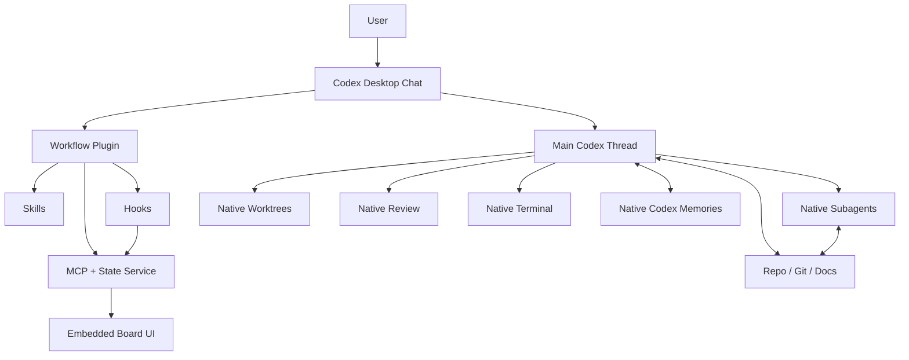

# Codex Workflow Next — Desktop-first Plugin Master Architecture & Implementation Plan

**Статус:** утверждённый архитектурный baseline для реализации  
**Ревизия:** 3.0 — Desktop-first + trace-based eval architecture  
**Дата среза:** 2026-09-02  
**Рабочее имя:** **Codex Workflow Next / Codex Director**  
**Основной продуктовый surface:** **Codex Desktop**  
**Совместимый surface:** **Codex CLI** без отдельного обязательного UI  
**Архитектурная база:** `viettran-edgeAI/codex_workflow` `experiment/beta-install-prompt` + native Codex capabilities + OpenAI Harness Engineering/Symphony/Security Workbench + лучшие agent-workflow практики августа–начала сентября 2026.


> **Ключевая коррекция ревизии 3.0.** Мы не строим отдельное desktop/web-приложение поверх Codex. Мы строим **плагин/надстройку внутри Codex Desktop**, который использует native chat, subagents, worktrees, review, terminal, permissions, memories, Skills, Hooks и MCP. Embedded Board — supervisory UI/control plane внутри Codex, а не отдельный scheduler или IDE.
>
> Дополнительно eval architecture переведена на **trace-first A/B/C methodology**: raw token telemetry и качество являются primary evidence; account Usage/credits используются только как secondary validation. Evals вынесены в ранний release gate до Board/Durable expansion, чтобы проект не наращивал orchestration layer без доказанной пользы.

---

<a id="idx-00"></a>
## [IDX-00] Назначение документа

Этот единственный файл является одновременно:

- архитектурной спецификацией;
- программным master-plan;
- UX/UI-спецификацией embedded Board;
- контрактом интеграции с Codex Desktop и CLI;
- спецификацией Skills, Hooks, MCP и Context Companion;
- моделью operational/durable state;
- реестром решений и рисков;
- планом тестирования/evals;
- планом миграции с `codex_workflow`;
- индексом происхождения архитектурных идей.

Документ должен быть достаточен, чтобы новый Codex/инженер мог начать реализацию без восстановления контекста из чата.

### Стабильные ID

| Префикс | Назначение |
|---|---|
| `GOAL-*` | цели продукта |
| `NOGO-*` | исключённый scope |
| `PRN-*` | архитектурные принципы |
| `REQ-*` | требования |
| `ARC-*` | компоненты/архитектурные решения |
| `DOM-*` | domain model |
| `POL-*` | routing/policy |
| `SKL-*` | Skill contracts |
| `AGT-*` | agent contracts |
| `SCR-*` | deterministic script/helper contracts |
| `HK-*` | Hook contracts |
| `CTX-*` | context/memory contracts |
| `UX-*` | UX/UI |
| `API-*` | MCP/API contracts |
| `SEC-*` | security |
| `OBS-*` | observability/evals |
| `MIG-*` | migration |
| `MILE-*` | milestones |
| `WP-*` | work packages |
| `AC-*` | acceptance criteria |
| `RISK-*` | риски |
| `ADR-*` | решения |
| `SRC-*` | источники |

Meta-ссылки в issue/PR/commit должны ссылаться на ID, например: `Implement [SKL-02], satisfy [AC-16], rationale [SRC-09][SRC-44]`.

<a id="idx-01"></a>
## [IDX-01] Быстрый meta-index

| Область | Ссылки |
|---|---|
| Product/scope | [GOAL-01](#goal-01)–[GOAL-08](#goal-08), [NOGO-01](#nogo-01)–[NOGO-13](#nogo-13) |
| Native Codex boundary | [ARC-01](#arc-01)–[ARC-05](#arc-05) |
| Принципы | [PRN-01](#prn-01)–[PRN-16](#prn-16) |
| Domain | [DOM-01](#dom-01)–[DOM-14](#dom-14) |
| Skills | [SKL-01](#skl-01)–[SKL-07](#skl-07) |
| Agents | [AGT-01](#agt-01)–[AGT-06](#agt-06) |
| Context/memory | [CTX-01](#ctx-01)–[CTX-10](#ctx-10) |
| Scripts/Hooks | [ARC-12](#arc-12), [SCR-01](#scr-01)–[SCR-07](#scr-07), [HK-01](#hk-01)–[HK-09](#hk-09) |
| Policy engine | [ARC-13](#arc-13), [POL-01](#pol-01)–[POL-11](#pol-11) |
| MCP/state | [ARC-14](#arc-14)–[ARC-17](#arc-17), [API-01](#api-01)–[API-04](#api-04) |
| Desktop Board | [UX-01](#ux-01)–[UX-24](#ux-24) |
| CLI | [ARC-19](#arc-19) |
| Durable/recovery | [ARC-20](#arc-20)–[ARC-23](#arc-23) |
| Security | [SEC-01](#sec-01)–[SEC-12](#sec-12) |
| Evals | [OBS-01](#obs-01)–[OBS-16](#obs-16) |
| Configuration | [ARC-28](#arc-28)–[ARC-30](#arc-30) |
| Repository/files | [ARC-31](#arc-31)–[ARC-33](#arc-33) |
| Roadmap | [MILE-00](#mile-00)–[MILE-10](#mile-10) |
| Risks | [RISK-01](#risk-01)–[RISK-17](#risk-17) |
| Sources | [SRC-01](#src-01) и далее |
| Final position | [ADR-20](#adr-20) |

---

# 1. Product Definition

<a id="goal-01"></a>
## [GOAL-01] Desktop-first Codex plugin, не отдельное приложение

Создать **Codex Desktop-first workflow plugin**, который добавляет адаптивную orchestration policy, Task Capsules, отдельный Context Companion, risk-aware verification, durable execution state и embedded supervisory Board, при этом **не заменяет** Codex runtime.

Основной пользовательский сценарий:

```text
Открыть Codex Desktop
→ открыть обычный проект/chat
→ написать обычным языком задачу
→ plugin/skills помогают main выбрать topology
→ native Codex agents/worktrees/review/terminal выполняют работу
→ Board показывает только нужное человеку состояние
→ пользователь продолжает работать в том же chat
```

Codex остаётся владельцем:

- conversation UX;
- model/session runtime;
- native subagents;
- worktrees и handoff;
- review/diff;
- integrated terminal;
- sandbox/permissions/approvals;
- web/search/MCP execution;
- cloud/automations там, где доступны.

Наш plugin владеет только **policy, transfer contracts, workflow projection, context indexing, evidence normalization и attention UX**.

<a id="goal-02"></a>
## [GOAL-02] Embedded Board как human-attention control plane

Board не является вторым scheduler. Его задача — отвечать на пять вопросов:

1. Что сейчас выполняется?
2. Где требуется решение пользователя?
3. Что заблокировано/сломалось?
4. Какие доказательства completion есть?
5. Каков usage/cost/coordination overhead?

Desktop UX должен использовать максимально native plugin/UI возможности:

```text
chat inline status card
        ↓ Open Board
embedded fullscreen Board
        ↕
composer остаётся доступен
```

Дополнительно, если host поддерживает:

- PiP status для ongoing activity;
- modal для decision gates;
- в будущем — persistent sidebar workbench **только после подтверждения public extension contract**.

Codex Security Workbench является архитектурным precedent: regular Codex task выполняет работу, отдельный workbench хранит scan/result state и возвращается в sidebar. Однако first-party Security workbench не считается доказательством публичного third-party sidebar API; поэтому sidebar — capability probe, не V1 dependency. [SRC-35]

<a id="goal-03"></a>
## [GOAL-03] Сохранить сильную экономическую идею `codex_workflow`

Сохраняется главный принцип upstream:

> сильный main хранит intent/решения/integration context; bounded workers поглощают operational noise и возвращают decision-ready delta/evidence.

Из `experiment` берём:

- main at center;
- semantic roles;
- dynamic topology;
- Companion/Investigator split;
- Task Capsule rationale;
- no mandatory task-independent waves;
- bounded mutable ownership;
- direct fast path. [SRC-01][SRC-02]

Не копируем prompt/code/lifecycle из-за license boundary [ADR-00].

<a id="goal-04"></a>
## [GOAL-04] Native primitive first

Любой новый компонент проходит проверку:

```text
Есть ли уже native Codex primitive?
  yes → используем его
  no  → реализуем минимальный слой
```

Это означает:

- native subagents вместо собственного agent process manager;
- native worktrees вместо собственного Git worktree manager;
- native `/review`/review pane вместо собственного diff/reviewer UI;
- native integrated terminal вместо web terminal;
- native permissions/sandbox вместо собственного permission engine;
- native local memories как optional ambient recall, а не новая generic memory DB;
- native Skills/Hooks/Plugins/MCP как extension foundation. [SRC-06][SRC-08][SRC-33][SRC-34][SRC-36]

<a id="goal-05"></a>
## [GOAL-05] CLI compatibility без отдельного CLI-продукта

Тот же plugin/Skills/MCP/Hooks должны работать в Codex CLI. V1 **не создаёт отдельный TUI/CLI board**.

CLI пользователь взаимодействует через обычный chat:

```text
покажи workflow status
какие задачи заблокированы?
продолжи текущую работу
```

или явно вызывает Skill. Native `/agent`, `/review`, `/plugins`, permissions и другие Codex commands остаются единственным preferred control UX.

<a id="goal-06"></a>
## [GOAL-06] Context economy без потери доказательности

Контекст делится на уровни:

```text
Main context                 дорогой, decision-critical
Context Companion thread     hot operational project context
Native Codex memories        optional ambient recall/hints
Plugin Context Index         provenance-aware cache/pointers
Repo docs/code/ADR           authoritative durable truth
Raw artifacts                evidence on demand
```

Никакой слой ниже repo truth не может переопределить код/актуальные ADR.

<a id="goal-07"></a>
## [GOAL-07] Оптимизировать успешный outcome после quality gates, а не один псевдо-экономический score

V1 **не складывает** токены/credits, секунды, вероятность rework и human interventions в одну формулу с произвольными коэффициентами. Это создаёт ложную точность до появления собственной калиброванной eval-выборки.

Порядок оценки:

```text
HARD GATES
──────────
correctness >= required threshold
safety/invariants satisfied
acceptance evidence sufficient

THEN MULTI-OBJECTIVE COMPARISON
───────────────────────────────
raw token usage by model/role
wall time
human interventions
retries/rework
false completion / regressions
account Usage impact where observable
```

Никакой один scalar `DirectorScore` не является source of truth. Уменьшение Main context полезно только если не маскирует рост total thread-family usage или падение качества. Account credits/Usage — secondary accounting projection, а не primary benchmark telemetry. [SRC-16][SRC-27][SRC-28][SRC-44][SRC-47][SRC-48]

<a id="goal-08"></a>
## [GOAL-08] Простая задача остаётся простой

Для bounded small work допустим нулевой materialization overhead:

```text
User → Main → edit/check → Done
```

Без:

- Board item;
- Companion;
- subagent;
- durable state;
- worktree;
- verifier;
- closure ritual.

---

# 2. Non-goals

<a id="nogo-01"></a>
## [NOGO-01] Не писать собственный LLM runtime

Не реализуем model invocation/thread runtime, который конкурирует с Codex.

<a id="nogo-02"></a>
## [NOGO-02] Не делать отдельный web/desktop app как primary UX

Нет обязательного `localhost:3000`, Electron/Tauri shell, отдельного login или отдельного window manager.

<a id="nogo-03"></a>
## [NOGO-03] Не делать HTTP/SSE backend только ради Board

Embedded UI должна общаться через MCP Apps bridge/tool calls. Event-driven state обновляется Hooks; UI читает materialized projection через MCP. HTTP/SSE допустим только если будущий host contract потребует его, но не входит в V1 baseline.

<a id="nogo-04"></a>
## [NOGO-04] Не строить собственный worktree lifecycle

Codex Desktop создаёт managed worktrees, умеет Local↔Worktree handoff, snapshots/restore и cleanup. Наш policy определяет **когда** isolation полезна, но не повторяет Git plumbing. [SRC-08]

<a id="nogo-05"></a>
## [NOGO-05] Не строить собственный review/diff/terminal

Используются native review pane, `/review` и integrated terminal. [SRC-33][SRC-34]

<a id="nogo-06"></a>
## [NOGO-06] Не делать mandatory fixed pipeline

Никаких универсальных `research → plan → build → tester → repair → closure`. Workflow задаёт objectives/boundaries/evidence, а topology выбирает main. [SRC-02][SRC-15]

<a id="nogo-07"></a>
## [NOGO-07] Не превращать Board в Jira/Kandev clone

Board — execution/attention projection, не general PM suite.

<a id="nogo-08"></a>
## [NOGO-08] Не создавать generic project-memory DB

Plugin DB хранит operational state, provenance-aware context pointers и evidence metadata. Repo/code/docs остаются source of truth. Native Codex memories используются только как optional helper. [SRC-36]

<a id="nogo-09"></a>
## [NOGO-09] Не разрешать свободный agent-to-agent chat

Основной transfer path: `Main → Task Capsule → Worker → Evidence/Delta → Main`.

<a id="nogo-10"></a>
## [NOGO-10] Не строить scheduler/DAG в normal path

Dependency graph появляется только в Durable Mode. Для обычной работы он не materialize'ится.

<a id="nogo-11"></a>
## [NOGO-11] Не делать scripts интеллектуальным orchestrator

Scripts/Hooks выполняют deterministic transformations/checks. Agent selection, architecture, acceptance и retry hypothesis остаются LLM/main decisions.

<a id="nogo-12"></a>
## [NOGO-12] Не использовать приватные Codex transcript/session formats как API

Внутренние JSONL/rollout files могут меняться. Hooks, MCP, config и public SDK/App Server используются только там, где документированы.

<a id="nogo-13"></a>
## [NOGO-13] Не делать benchmark claims по одной полоске Usage, одному Main thread или приватному trace schema

Primary controlled telemetry берётся из документированных machine-readable surfaces (`codex exec --json`, public Hooks/usage fields) и нейтрального benchmark observer. Account Usage/credits применяются только как внешняя сверка. Если descendant/subagent usage нельзя атрибутировать публично и полно, run получает `partial`, а claim о total token saving запрещён. Private rollout parsing допустим только как отдельный исследовательский адаптер вне product/runtime contracts и не может быть единственным доказательством release claim. [SRC-44][SRC-48]

---

# 3. Legal / provenance boundary

<a id="adr-00"></a>
## [ADR-00] Clean-room reimplementation обязательна

На момент среза upstream `viettran-edgeAI/codex_workflow` не содержит явного reuse license; `dev-yoshitani` отдельно документирует отсутствие license grant. Поэтому:

1. Не копировать upstream prompt/instruction text, Python runtime, installers, templates.
2. Использовать поведенческие/архитектурные идеи как reference.
3. Для каждого внешнего проекта перед кодовым заимствованием проверять license.
4. Вести `PROVENANCE.md`.
5. Публичный release блокируется до завершения provenance/license review.

---

# 4. Source-to-design map

<a id="arc-00"></a>
## [ARC-00] Что берём и что не берём

| Источник | Берём | Наша адаптация | Не берём |
|---|---|---|---|
| `codex_workflow experiment` | main center, Companion/Investigator, dynamic topology, capsules, fast path | native Codex plugin/agents | mandatory closure, route runtime, model-named roles |
| `codex_workflow 1.1.3` | knowledge distribution, operational-noise isolation | Context Companion + Context Delta | 6 mandatory agent_docs |
| WangWilly | skills/plugin-first, stateless default | Desktop-first plugin | hard dependency on legacy/private contracts |
| dev-yoshitani | recovery/failure history/DAG | Durable-only | scheduler in normal path |
| Aerox | deterministic release/package checks | own CI/release | old route architecture |
| OpenAI Harness Engineering | lean AGENTS, progressive repo knowledge, feedback loops | knowledge/source hierarchy | enterprise-specific machinery |
| OpenAI Symphony | board/control plane, objectives > transitions, isolated work | embedded attention Board | continuous daemon default |
| Codex Security | Desktop workbench + persistent scan state + native task execution | architectural precedent for embedded Board/state | assume first-party sidebar API is public |
| Codex Skills | progressive disclosure | procedural policy layer | giant always-on prompts |
| Codex Hooks | lifecycle events, `PLUGIN_DATA` | event projection/state | transcript parsing |
| Codex Memories | cross-chat local recall | optional hint layer | authoritative rules/state |
| Codex Worktrees | native parallel isolation/handoff | policy-only use | custom worktree manager |
| Codex Review/Terminal | native evidence/review surfaces | deep links/status only | duplicate UI |
| MCP Apps UI | inline/fullscreen/PiP/modal, UI-only `_meta` | embedded Board | separate SPA server |
| Cursor routing | model/cost routing economics | transparent heuristic profiles first | opaque ML router in V1 |
| `codex-workflows`/Zuggie | smallest sufficient process, explicit handoff/spec boundaries | conditional spec/verification | mandatory ceremony |
| Crewplane/Beads/Gas Town | durable graph/recovery patterns | optional future durable layer | factory runtime in core |
| Reddit benchmarks | whole-run measurement, anti-overcompression | eval discipline | anecdotal savings claims |


---

# 5. Architecture Principles

<a id="prn-01"></a>
## [PRN-01] Main owns intent and final truth

Main/Director — **логическая роль текущего primary Codex thread**, не отдельный обязательный agent/daemon.

Main владеет:

- user intent;
- scope;
- architecture/trade-offs;
- acceptance intent;
- cross-worker integration;
- final user-visible claims;
- решение о materialization workflow state.

Worker reports являются evidence, а не автоматической final truth.

<a id="prn-02"></a>
## [PRN-02] Progressive disclosure everywhere

Always-on context должен быть минимальным:

```text
AGENTS.md → invariants/map
Skill metadata → trigger hints
SKILL.md → only when selected
references/scripts → only when needed
Context Companion → only under context pressure
Context Index → fetch by scope/provenance
Raw evidence → fetch on demand
```

Это соответствует native Codex Skill loading: metadata сначала, `SKILL.md` после выбора, refs/scripts только по необходимости. [SRC-09]

<a id="prn-03"></a>
## [PRN-03] Task Capsule — основной transfer protocol

Worker не получает полный parent conversation. Capsule передаёт **минимум достаточного знания** и explicit authority.

<a id="prn-04"></a>
## [PRN-04] Capability composition вместо Light/Medium/Heavy

Main независимо решает:

- `delegate`;
- `isolate`;
- `verify`;
- `durable`;
- `research_external`;
- `context_companion`;
- `model_profile`.

Legacy слова Light/Medium/Heavy допустимы как UX aliases при migration, но не как internal state machine.

<a id="prn-05"></a>
## [PRN-05] Objectives > strict transitions

Workflow ограничивает authority и требует evidence, но не диктует универсальную последовательность reasoning steps.

<a id="prn-06"></a>
## [PRN-06] Events > polling

Codex lifecycle Hooks являются preferred event source. Не использовать background loops, которые периодически опрашивают agents/Git без причины.

<a id="prn-07"></a>
## [PRN-07] Evidence > claim

`done` означает не «агент написал готово», а completion contract с проверяемыми evidence entries.

<a id="prn-08"></a>
## [PRN-08] Native primitive first

Собственный код существует только там, где native Codex не решает задачу или не предоставляет нужную policy/metadata semantics.

<a id="prn-09"></a>
## [PRN-09] Semantic role != model

`builder`, `context_companion`, `verifier` — роли. `efficient`, `balanced`, `deep` — profiles. Конкретный model ID — config mapping, который может меняться.

<a id="prn-10"></a>
## [PRN-10] Repository truth > generated memory

При конфликте приоритет:

```text
current code / tests / explicit project docs
    > committed ADR/spec
    > verified plugin context index
    > active Context Companion summary
    > native Codex memory
    > stale historical notes
```

<a id="prn-11"></a>
## [PRN-11] No hidden expansion

Agent не может молча расширять:

- writable scope;
- destructive authority;
- network/secrets authority;
- model cost tier;
- concurrency;
- retry budget;
- task scope.

<a id="prn-12"></a>
## [PRN-12] Zero-overhead fast path

Если orchestration ROI ≤ 0, workflow остаётся невидимым. Допускается только дешёвая optional telemetry без создания WorkItem.

<a id="prn-13"></a>
## [PRN-13] Board is projection, not authority

Board отображает/фиксирует workflow state и human decisions. Интеллектуальное решение о topology принимает Main. UI mutation не должна напрямую запускать arbitrary model runtime в обход Main.

<a id="prn-14"></a>
## [PRN-14] Deterministic mechanisms stay deterministic

Schema validation, state migrations, idempotency, hashes, fingerprints, event normalization и evidence metadata выполняются кодом, а не LLM.

<a id="prn-15"></a>
## [PRN-15] Fresh contexts are a feature

Долгоживущий agent thread не является database. Для нового substantive run предпочтительнее fresh Companion, hydrated из current repo + verified durable pointers, чем вечный stale thread.

<a id="prn-16"></a>
## [PRN-16] Every optimization must survive whole-run eval

Context compression, extra agents, review layers, caching и model downgrades не принимаются по локальной метрике. Измеряется end-to-end quality/cost/rework.

---

# 6. Native Codex Capability Boundary

<a id="arc-01"></a>
## [ARC-01] Codex Desktop является host/runtime



`MCP + State Service` — plugin component, а не самостоятельное пользовательское приложение.

<a id="arc-02"></a>
## [ARC-02] Responsibility matrix

| Capability | Native Codex | Наш plugin |
|---|---|---|
| Main conversation | полностью | policy hints/tools |
| Subagent lifecycle | полностью | role/capsule policy |
| Agent threads UI | полностью | task↔thread correlation metadata |
| Worktree create/handoff/cleanup | полностью | decide/recommend isolation |
| Review/diff | полностью | verification requirement/evidence link |
| Terminal | полностью | scripts/commands may run there |
| Sandbox/approvals | полностью | MCP annotations/authority envelope |
| Model invocation | полностью | model profile recommendation/config |
| Local memories | полностью | optional use policy; no parsing internals |
| Skills | host loads | plugin packages procedures |
| Hooks | host emits | plugin handles/normalizes |
| MCP | host invokes | plugin state/tools/UI |
| Board | нет generic workflow Board | embedded UI projection |
| Task Capsules | нет нашего contract | plugin Skill/schema |
| Context Companion | native subagent primitive | custom role/lifecycle policy |
| Context Index | нет | provenance-aware lightweight cache |
| Evidence model | partial native surfaces | normalization/contract |
| Durable workflow projection | нет generic | SQLite + explicit durable mode |
| Evals/ROI policy | нет наш domain | plugin benchmark/policy trace |

<a id="arc-03"></a>
## [ARC-03] Native feature minimum baseline

Перед релизом plugin должен capability-detect, а не слепо предполагать наличие функций.

Минимально проверять:

- plugin manifest/Skills/MCP support;
- plugin Hooks support;
- native subagents + custom agents;
- Desktop MCP UI rendering;
- `PLUGIN_DATA` availability;
- Codex worktree support в Desktop;
- review surface;
- local memories feature availability (optional);
- CLI plugin/skills/hooks compatibility.

Current CLI version на дату среза — 0.152.0; **не хардкодить этот номер как вечный minimum**. Compatibility matrix фиксируется релизом. [SRC-37]

<a id="arc-04"></a>
## [ARC-04] App Server / SDK не входят в interactive critical path

Старый план ошибочно делал Codex SDK/App Server основой Board-managed runs. Desktop-first V1 этого не требует.

Использовать SDK/App Server только для:

- будущих external integrations;
- отдельных capability probes/research tools;
- headless automation, если `codex exec`/native Automations/Cloud не подходят.

Primary controlled benchmark использует документированный `codex exec --json`, а не App Server. [SRC-44]

Interactive path:

```text
Desktop chat → native Codex → plugin Skills/Hooks/MCP
```

а не:

```text
Desktop → our server → App Server → Codex
```

<a id="arc-05"></a>
## [ARC-05] UI extension capability levels

Три уровня, реализуем по убыванию portability:

### Level A — обязательно

MCP tool возвращает inline UI status card с `Open Board`.

### Level B — целевой V1

Embedded fullscreen Board через MCP Apps UI; composer остаётся доступным. PiP для ongoing status и modal для decision gates, если host реализует соответствующий display mode. [SRC-32]

### Level C — optional future

Persistent sidebar/workbench registration аналогично Codex Security. Реализовать **только** если public third-party workbench/sidebar API подтверждён документами/capability spike. First-party Security precedent не использовать как undocumented API. [SRC-35]

---

# 7. Technology and Packaging

<a id="arc-06"></a>
## [ARC-06] Recommended technology baseline

### Runtime

- TypeScript `strict`.
- Node.js **24 LTS** baseline для V1, если Codex plugin/MCP host compatibility spike не требует иного. Node 24 — Active LTS на 2026-09-02; Node 26 ещё Current и перейдёт в LTS позже октября. [SRC-38]
- ESM-only, если dependencies/platform spike подтверждает Windows compatibility.

### UI

- React + TypeScript.
- MCP Apps bridge; не отдельная SPA deployment.
- Лёгкие accessible primitives; избегать heavyweight design framework до usability proof.

### State

- SQLite в `$PLUGIN_DATA`.
- WAL, `busy_timeout`, bounded transactions.
- Driver выбирается spike'ом: при достаточной стабильности prefer built-in/current maintained driver; fallback `better-sqlite3` или другой actively-maintained native driver с Windows test matrix.

### Schemas

- Zod или equivalent runtime validation.
- JSON Schema export для MCP/domain contracts.
- Schema versioning обязателен.

### Tooling

- `pnpm` или npm — выбрать после plugin packaging spike; V1 не требует monorepo orchestrator.
- `tsc --noEmit`.
- один formatter/linter.
- Vitest для unit/integration.
- Playwright только там, где embedded UI можно реально smoke-test'ить; иначе component tests + host smoke.

### Logging

- structured JSON;
- default redaction;
- no prompt/source contents in logs unless explicit debug mode.

<a id="arc-07"></a>
## [ARC-07] Plugin package layout

Предпочтительный **single-package V1**, а не преждевременный monorepo:

```text
codex-workflow-next/
├── .codex-plugin/
│   └── plugin.json
├── skills/
│   ├── orchestrate-work/
│   │   └── SKILL.md
│   ├── task-capsule/
│   │   └── SKILL.md
│   ├── verify-work/
│   │   └── SKILL.md
│   ├── recover-work/
│   │   └── SKILL.md
│   └── workflow-status/
│       └── SKILL.md
├── hooks/
│   ├── hooks.json
│   └── handler.mjs
├── .mcp.json
├── src/
│   ├── domain/
│   ├── policy/
│   ├── context/
│   ├── state/
│   ├── mcp/
│   ├── evidence/
│   ├── hooks/
│   └── ui/
├── assets/
│   └── agent-templates/
│       ├── context-companion.toml
│       ├── investigator.toml
│       ├── builder.toml
│       └── verifier.toml
├── scripts/
│   ├── doctor.mjs
│   ├── state-migrate.mjs
│   ├── capsule-validate.mjs
│   ├── project-fingerprint.mjs
│   └── eval-run.mjs
├── tests/
│   ├── unit/
│   ├── contract/
│   ├── integration/
│   ├── ui/
│   └── live-smoke/
├── docs/
│   ├── architecture.md
│   ├── contracts.md
│   ├── compatibility.md
│   └── provenance.md
├── PROVENANCE.md
├── CHANGELOG.md
├── LICENSE
└── package.json
```

### Почему templates/agents, а не жёсткая автоматическая установка

Custom agents сейчас определяются в `~/.codex/agents/` или `.codex/agents/` TOML и формат может эволюционировать. Plugin не должен молча менять user/project config. Bootstrap/setup Skill может:

1. проверить наличие compatible role;
2. предложить установить project-level `.codex/agents/*.toml`;
3. показать diff;
4. изменить только после explicit approval.

Если custom-agent setup не выполнен, workflow должен degrade gracefully на built-in/generic native subagents с explicit Task Capsule. [SRC-06]

<a id="arc-08"></a>
## [ARC-08] Plugin manifest principles

`.codex-plugin/plugin.json` должен:

- иметь stable kebab-case name;
- явно перечислять Skills path;
- включать Hooks path;
- подключать MCP server config;
- не объявлять capability, которой нет;
- не требовать online backend;
- не выполнять post-install mutation без явной user action.

Codex plugins доступны в App, CLI и IDE; один public plugin listing может использоваться на поддерживаемых ChatGPT/Codex surfaces. [SRC-31]

---

# 8. Domain Model

<a id="dom-01"></a>
## [DOM-01] ProjectRef

```ts
interface ProjectRef {
  projectId: string;
  repoRoot: string;
  repoFingerprint?: string;
  remoteUrl?: string;
  defaultBranch?: string;
}
```

`repoRoot` canonicalized. `projectId` не строить только из path — path может меняться; использовать stable generated ID + stored repo identity hints.

<a id="dom-02"></a>
## [DOM-02] WorkflowRun

```ts
interface WorkflowRun {
  runId: string;
  projectId: string;
  objective: string;
  state: 'active' | 'paused' | 'blocked' | 'completed' | 'cancelled';
  durable: boolean;
  primarySessionId?: string;
  startedAt: string;
  updatedAt: string;
}
```

Substantive run materialize'ится только когда требуется tracking/delegation/durability. Fast path может не создавать его.

<a id="dom-03"></a>
## [DOM-03] WorkItem

```ts
interface WorkItem {
  workItemId: string;
  runId: string;
  title: string;
  objective: string;
  state:
    | 'ready'
    | 'running'
    | 'verifying'
    | 'needs_decision'
    | 'needs_review'
    | 'blocked'
    | 'done'
    | 'cancelled';
  risk: 'low' | 'medium' | 'high' | 'critical';
  ownerRole?: AgentRole;
  agentThreadId?: string;
  worktreeRef?: string;
  version: number;
}
```

State names описывают human-visible execution state, а не внутреннюю reasoning stage machine.

<a id="dom-04"></a>
## [DOM-04] AgentRole

```ts
type AgentRole =
  | 'context_companion'
  | 'investigator'
  | 'builder'
  | 'specialist'
  | 'verifier'
  | 'docs_steward';
```

`docs_steward` optional/rare.

<a id="dom-05"></a>
## [DOM-05] ModelProfile

```ts
type ModelProfile =
  | 'efficient_read'
  | 'efficient_write'
  | 'balanced'
  | 'deep'
  | 'critical_review';
```

Config resolves profile → current model/reasoning. Domain/event history сохраняет и profile, и фактически использованный model ID, если он доступен публично.

<a id="dom-06"></a>
## [DOM-06] TaskCapsule

```ts
interface TaskCapsule {
  capsuleVersion: 1;
  workItemId: string;
  objective: string;
  expectedOutcome: string;
  writableScope: string[];
  protectedScope: string[];
  relevantDecisions: EvidenceRef[];
  constraints: string[];
  contextRefs: ContextRef[];
  acceptance: AcceptanceSpec;
  authority: AuthorityEnvelope;
  returnContract: ReturnContract;
}
```

### Required semantics

- objective конкретный;
- write scope bounded;
- protected scope explicit при наличии чувствительных поверхностей;
- settled decisions не переоткрываются worker'ом без evidence;
- acceptance описывает **что доказывает completion**, а не micromanagement test cases;
- authority включает resource/budget ceilings;
- capsule не содержит hidden chain-of-thought main.

<a id="dom-07"></a>
## [DOM-07] AuthorityEnvelope и monotonic authority

```ts
interface AuthorityEnvelope {
  write: 'none' | 'bounded';
  network: 'inherit' | 'none' | 'bounded';
  destructive: boolean;
  mayCreateTests: boolean;
  maxRetries: number;
  preferredProfile: ModelProfile;
  allowEscalationTo?: ModelProfile;
}
```

`AuthorityEnvelope` — **requested/subtask ceiling**, а не источник новых прав. Эффективная authority вычисляется как пересечение:

```text
EffectiveAuthority =
    NativeHostAuthority
  ∩ UserSessionAuthority
  ∩ ProjectPolicyAuthority
  ∩ TaskCapsuleAuthority
```

Каждый последующий слой может только **сужать**, но никогда не расширять права, уже ограниченные host/user/project. Enforcement hierarchy:

1. native Codex sandbox/permissions — главный hard boundary;
2. `PreToolUse`/permission hooks — механически проверяемые ограничения, когда public hook contract позволяет;
3. Task Capsule — semantic ownership/authority contract;
4. post-run diff/evidence verification — финальная проверка bounded scope.

Capsule не может повысить network/destructive/filesystem authority относительно native/user/project ceiling.

<a id="dom-08"></a>
## [DOM-08] Evidence

```ts
interface Evidence {
  evidenceId: string;
  workItemId?: string;
  kind:
    | 'test'
    | 'build'
    | 'lint'
    | 'review'
    | 'git'
    | 'artifact'
    | 'source'
    | 'manual';
  summary: string;
  status: 'pass' | 'fail' | 'partial' | 'unknown';
  sourceUri?: string;
  command?: string;
  exitCode?: number;
  gitSha?: string;
  createdAt: string;
}
```

<a id="dom-09"></a>
## [DOM-09] Decision

```ts
interface Decision {
  decisionId: string;
  runId: string;
  workItemId?: string;
  question: string;
  alternatives?: DecisionAlternative[];
  recommendation?: string;
  status: 'pending' | 'resolved' | 'superseded';
  authority: 'main' | 'user';
  resolution?: string;
}
```

2–3 alternatives генерируются только когда реально существуют materially different options.

<a id="dom-10"></a>
## [DOM-10] ContextItem

```ts
interface ContextItem {
  contextId: string;
  projectId: string;
  kind:
    | 'module_summary'
    | 'source_pointer'
    | 'test_pointer'
    | 'decision_pointer'
    | 'history_pointer'
    | 'pitfall'
    | 'dependency_pointer';
  scope: string;
  summary: string;
  sourceUri: string;
  sourceHash?: string;
  gitSha?: string;
  verifiedAt: string;
  stale: boolean;
}
```

Это cache/index, а не truth.

<a id="dom-11"></a>
## [DOM-11] WorkflowEvent

```ts
interface WorkflowEvent {
  eventId: string;
  eventType: string;
  projectId?: string;
  runId?: string;
  workItemId?: string;
  sessionId?: string;
  agentId?: string;
  idempotencyKey: string;
  occurredAt: string;
  payload: unknown;
}
```

<a id="dom-12"></a>
## [DOM-12] PolicyTrace

```ts
interface PolicyTrace {
  policyDecisionId: string;
  runId?: string;
  decision:
    | 'direct'
    | 'delegate'
    | 'use_companion'
    | 'isolate'
    | 'verify'
    | 'durable'
    | 'escalate';
  signals: Record<string, string | number | boolean>;
  rationale: string;
  chosenProfile?: ModelProfile;
}
```

Policy trace нужен для debug/evals, но не должен содержать private chain-of-thought. Rationale — concise externally inspectable reason.

<a id="dom-13"></a>
## [DOM-13] RunUsage / ThreadFamilyUsage

```ts
type UsageCompleteness = 'complete' | 'partial' | 'unavailable';

interface ModelUsage {
  modelId?: string;
  role?: AgentRole | 'main';
  threadId?: string;
  inputTokens?: number;
  cachedInputTokens?: number;
  cacheWriteInputTokens?: number;
  outputTokens?: number;
  reasoningOutputTokens?: number;
  requests?: number;
}

interface RunUsage {
  runId: string;
  completeness: UsageCompleteness;
  rootThreadId?: string;
  modelUsage: ModelUsage[];
  wallTimeMs?: number;
  source: 'codex_exec_json' | 'public_hook' | 'public_usage' | 'mixed';
  missingFields: string[];
}
```

Нормализация обязана хранить raw counters без двойного счёта. `cached_input_tokens` трактуется как часть input, если текущий public schema определяет его именно так; derived `uncached_input = input - cached` вычисляется отдельно. Не складывать `input + cached` как total input. Если semantics поля изменились/не доказаны текущей документацией, derived metric помечается `unknown`.

`ThreadFamilyUsage` агрегирует Main + публично атрибутируемых descendants/Verifier. Нельзя объявлять total workflow saving, если family attribution неполна.

<a id="dom-14"></a>
## [DOM-14] RuntimeIsolationProfile

```ts
interface RuntimeIsolationProfile {
  filesystem: 'shared' | 'isolated';
  ports: 'none' | 'shared' | 'isolated' | 'unknown';
  database: 'none' | 'shared_readonly' | 'shared' | 'isolated' | 'unknown';
  services: 'none' | 'shared' | 'isolated' | 'unknown';
  tempData: 'shared' | 'isolated' | 'unknown';
}
```

Native worktree доказывает filesystem isolation, но **не автоматически** ports/database/services isolation. Unknown runtime collisions должны снижать допустимый parallel write/test concurrency; plugin не строит Docker/port scheduler ради устранения этого риска.


---

# 9. Skills Layer

<a id="arc-09"></a>
## [ARC-09] Skills = procedural intelligence layer

Skills содержат повторяемые процедуры/контракты, которые **не должны быть always-on**. Они не хранят mutable project state и не заменяют custom agents.

Разделение:

```text
AGENTS.md     → постоянные invariants/map
Skills        → reusable reasoning procedures
Agents        → bounded execution contexts
Hooks/scripts → deterministic lifecycle/mechanics
MCP/SQLite    → state/interfaces/UI
```

Native Codex Skills используют progressive disclosure: metadata сначала, полный `SKILL.md` только после выбора, scripts/references только по необходимости. [SRC-09]

<a id="skl-01"></a>
## [SKL-01] `orchestrate-work`

**Purpose:** помочь Main определить минимальную полезную topology без fixed route.

**Trigger:** substantive task, где есть хотя бы один сигнал: широкий scope, высокий context pressure, независимые work packages, external uncertainty, material verification risk, multi-session horizon.

**Do not trigger:** small bounded edit/Q&A, если Main уверенно решает сам.

**Input:** user objective + current project constraints + optional workflow state.

**Procedure:**

1. Проверить fast-path gate [POL-01].
2. Определить context pressure [POL-02].
3. Определить delegation benefit/cost [POL-03].
4. Определить external research need.
5. Определить write isolation need [POL-05].
6. Определить verification risk [POL-06].
7. Определить durability need [POL-07].
8. Выбрать минимальный набор native agents/capabilities.
9. Записать concise PolicyTrace при materialized run.
10. Не создавать workflow objects, которые не нужны.

**Output:** Main internal action plan/explicit delegation choices, а не пользовательская бюрократическая форма.

<a id="skl-02"></a>
## [SKL-02] `task-capsule`

**Purpose:** сформировать bounded handoff для worker.

**Trigger:** перед каждым delegated production/research/verification package, если generic one-line request недостаточен.

**Do not trigger:** direct main work.

**Rules:**

- переносить settled decisions, не весь discussion;
- дать worker право на bounded local discovery;
- write/protected scope формулировать конкретно;
- acceptance не превращать в сотню prescribed steps;
- include evidence/context refs, когда они уже существуют;
- не передавать user secrets, не нужные worker;
- не включать chain-of-thought.

**Canonical human-readable form:**

```text
Task: <id/title>
Objective: ...
Expected outcome: ...
Writable scope: ...
Protected scope: ...
Settled decisions/constraints: ...
Relevant context/evidence: ...
Acceptance: ...
Authority/budget: ...
Return: changed / verified / residual risk / decision needed
```

<a id="skl-03"></a>
## [SKL-03] `verify-work`

**Purpose:** выбрать пропорциональную verification strategy.

**Trigger:** implementation/result, для которого risk policy требует больше self-check.

**Procedure:**

- classify blast radius, reversibility, security/data/public-contract risk;
- prefer native `/review`/review agent, existing test suites, terminal actions;
- свежий verifier context для medium/high risk;
- production fix и independent verification не должны сливаться в один pass, если независимость является целью;
- record Evidence, но не копировать весь terminal output в model-visible context;
- `partial`/`not run` никогда не отображать как pass.

<a id="skl-04"></a>
## [SKL-04] `recover-work`

**Purpose:** восстановить substantive workflow после нового chat/session/restart/compaction без replay старого transcript.

**Trigger:** active/paused durable run или explicit «продолжи работу» при наличии persisted state.

**Procedure:**

1. Получить current repo fingerprint.
2. Загрузить active Run/WorkItems/Decisions/Evidence pointers.
3. Отметить stale context по source hash/HEAD changes.
4. При необходимости создать fresh Context Companion и hydrate [CTX-06].
5. Не считать старый agent summary корректным без current-source validation для изменившейся поверхности.
6. Определить next safe action.

<a id="skl-05"></a>
## [SKL-05] `workflow-status`

**Purpose:** единый conversational status interface для Desktop/CLI.

**Desktop output:** concise model-visible summary + optional embedded status card.

**CLI output:** text table/summary.

Пример:

```text
Workflow RUN-42 · active
Ready 2 · Running 1 · Verify 1 · Blocked 0 · Done 8
Needs decision: DEC-17
Active: TASK-21 (builder, efficient_write)
```

<a id="skl-06"></a>
## [SKL-06] `decision-gate` — post-V1/conditional

Используется только для material user-authority decisions:

- irreversible action;
- product requirement expansion;
- breaking public contract;
- major architecture/storage/dependency trade-off;
- expensive external action.

Не генерировать 3 фиктивных alternatives для очевидной локальной правки.

<a id="skl-07"></a>
## [SKL-07] `promote-run` — post-V1

Verified successful run может стать candidate reusable recipe/Skill:

```text
verified run
→ detect reusable procedure
→ remove project-specific details
→ human review
→ eval on another task
→ promote or discard
```

Это предпочтительнее автоматического добавления новых строк в `AGENTS.md` после каждого failure.

<a id="req-01"></a>
## [REQ-01] Skill metadata quality

Каждый Skill description обязан явно отвечать:

- когда trigger;
- когда **не** trigger;
- какой artifact/output он создаёт;
- какие dependencies/scripts использует.

Избегать overlap descriptions, иначе Codex может загружать лишние Skills и увеличивать context ambiguity.

---

# 10. Semantic Agents

<a id="arc-10"></a>
## [ARC-10] Agent role system

Custom agents — native Codex subagents в отдельных threads. Desktop показывает каждый thread, CLI предоставляет `/agent`, поэтому plugin не строит свой transcript viewer. [SRC-06]

<a id="agt-01"></a>
## [AGT-01] `context_companion`

**Тип:** read-only hot project-context worker.

**Основная идея:** сохранить лучшую функцию Explorer/Companion из `codex_workflow`, но убрать вечный thread и сделать context lifecycle freshness-aware.

**Sources:**

- current repo files;
- local docs/ADR/specs;
- tests/config;
- Git history по bounded запросу;
- plugin Context Index;
- existing Evidence pointers;
- native Codex memories только как low-trust hint, если пользователь их включил.

**Не делает:**

- Internet research;
- production edits;
- final architecture decision;
- user communication;
- blind whole-repo scan на старте.

**Return:** Context Delta [CTX-05].

**Persistence policy:** один Companion на substantive run, reuse внутри run; новый run → fresh Companion по умолчанию.

<a id="agt-02"></a>
## [AGT-02] `investigator`

Read-only external-information specialist:

- official docs;
- upstream repos/releases;
- standards;
- current compatibility;
- web sources.

Возвращает source-linked synthesis. Не имплементирует и не принимает final project decision.

<a id="agt-03"></a>
## [AGT-03] `builder`

Bounded writer:

- получает Task Capsule;
- local discovery внутри scope;
- implementation;
- self-check;
- один ordinary repair, если failure понятен;
- не расширяет protected/writable scope без Main.

<a id="agt-04"></a>
## [AGT-04] `specialist`

Используется не как постоянный «senior executor», а когда failure/decision требует существенно более глубокой capability:

- architecture/root cause;
- math/algorithm;
- cross-cutting consistency;
- сложная migration/concurrency/security reasoning.

<a id="agt-05"></a>
## [AGT-05] `verifier`

Fresh independent context по возможности.

- production files read-only;
- может создавать assigned test artifact только если policy разрешила;
- не чинит production code в том же independent verification pass;
- использует native review/tests/terminal;
- возвращает prioritized findings + evidence + uncertainty.

<a id="agt-06"></a>
## [AGT-06] `docs_steward` — conditional

Только когда substantive work требует reconciliation durable documentation. Не mandatory end-of-run worker.

<a id="arc-11"></a>
## [ARC-11] Model profiles and current mapping

Role не содержит commercial model name.

Current recommended starting mapping на 2026-09-02 после eval, не hard contract:

| Profile | Suggested current family | Use |
|---|---|---|
| `efficient_read` | Terra / efficient model | repo/doc scans |
| `efficient_write` | Luna/Terra depending eval | mechanical bounded implementation |
| `balanced` | Terra or Sol lower effort | normal coding/review |
| `deep` | Sol high/xhigh | ambiguous/cross-cutting reasoning |
| `critical_review` | Sol high/xhigh or dedicated review model | high-risk verification |

OpenAI guidance рекомендует GPT-5.6 для demanding agent work и Terra для более быстрых/дешёвых subagent scans; фактический mapping необходимо проверять собственными evals. [SRC-39]

<a id="req-02"></a>
## [REQ-02] No implicit expensive inheritance

Если delegated role экономически значим, workflow/config должен по возможности задавать model/reasoning profile явно. Native Codex может наследовать parent model/reasoning через config hierarchy; это удобно, но способно случайно размножить frontier model. [SRC-06][SRC-40]

---

# 11. Context and Memory Architecture

<a id="ctx-01"></a>
## [CTX-01] Five-layer context model

```text
L1 Main Context
   intent, current decisions, integration, concise worker deltas

L2 Context Companion
   hot operational repo context for current substantive run

L3 Native Codex Memories (optional)
   cross-chat ambient recall generated by Codex

L4 Plugin Context Index
   provenance/freshness-aware pointers/cache

L5 Repository Truth + Raw Evidence
   code/tests/docs/ADR/artifacts
```

Каждый нижний слой имеет меньший authority, кроме L5, который является authoritative source.

<a id="ctx-02"></a>
## [CTX-02] Native Codex Memories — использовать, но не зависеть

Codex Desktop/CLI имеют отдельный локальный memory store, управляемый `/memories`; feature может быть отключён, generation background/conditional и не мгновенный. OpenAI прямо рекомендует не использовать memory как единственный источник обязательных правил. [SRC-36]

Следовательно:

- plugin не требует `memories = true`;
- не парсит `~/.codex/memories` как private integration API;
- Companion может использовать memory, если Codex сам предоставил его в context;
- workflow state/acceptance/decisions не зависят от memory generation timing;
- memory conflict с repo → repo wins;
- sensitive/project-specific rules → AGENTS/docs, не memory.

<a id="ctx-03"></a>
## [CTX-03] Context Index — не vector DB

V1 не требует embeddings/vector search.

Index хранит:

- concise summary;
- source URI;
- scope;
- source hash;
- Git SHA;
- verified timestamp;
- stale flag.

Это позволяет cheaply обнаружить, что прошлое knowledge устарело, и направить Companion к нужному source.

<a id="ctx-04"></a>
## [CTX-04] Lazy accumulation

Companion не индексирует весь repo при SessionStart.

```text
Task touches auth
→ inspect/index auth surface
Task later touches persistence
→ extend index into persistence
```

Full map допустим только когда задача сама требует repo-wide analysis.

<a id="ctx-05"></a>
## [CTX-05] Context Delta contract

Companion возвращает только новое/изменившееся:

```text
Context Delta
Relevant facts new to Main:
- ...

Changed since prior brief:
- ...

Evidence/source pointers:
- ...

Stale/uncertain:
- ...

Potential conflict/decision:
- ...
```

Не повторять статический project summary при каждом вопросе.

<a id="ctx-06"></a>
## [CTX-06] Companion hydration

Fresh Companion получает hydration capsule:

```text
Project identity + current HEAD
Run objective
Active WorkItems
Relevant settled Decisions
Known ContextItems for current scope
Current Evidence pointers
Known stale markers
```

Затем самостоятельно перечитывает source по необходимости.

Никогда не hydrate полным transcript предыдущей сессии.

<a id="ctx-07"></a>
## [CTX-07] Freshness and invalidation

ContextItem становится stale, если:

- source content hash изменился;
- repo HEAD изменился и item привязан к changed path;
- decision superseded;
- explicit invalidation event;
- configurable TTL для inherently external/volatile pointer.

Stale item можно использовать только как hint «проверь здесь», не как факт.

<a id="ctx-08"></a>
## [CTX-08] Context pressure gate

Companion полезен, если выполняется хотя бы один сильный сигнал:

- large/multi-module repo navigation;
- repeated file/source rediscovery;
- long session with growing main context;
- multi-session durable work;
- multiple workers needing shared local project evidence;
- analysis requires significant Git/test/config history.

Не запускать Companion ради small bounded edit.

<a id="ctx-09"></a>
## [CTX-09] Compaction safety

Hooks вокруг compaction не должны читать/интерпретировать приватный transcript format. Перед/после compaction сохраняем только explicit workflow state:

- active task IDs;
- unresolved decisions;
- evidence refs;
- fingerprints;
- state versions.

Semantic summary выполняет Main/Companion через public context, а не transcript parser.

<a id="ctx-10"></a>
## [CTX-10] Context data minimization

Не хранить в Context Index:

- secrets;
- raw full file contents;
- chain-of-thought;
- large terminal logs;
- user data без workflow need.

Хранить pointer/hash/summary. Raw evidence живёт отдельно и имеет retention policy.

---

# 12. Deterministic Layer: Hooks and Scripts

<a id="arc-12"></a>
## [ARC-12] Rule: reasoning → Skill/agent; determinism → code

Распределение:

| Задача | Механизм |
|---|---|
| решить, нужна ли delegation | Main + Skill |
| сформировать capsule semantics | Main + Skill |
| выбрать architecture | Main/Specialist |
| normalize hook JSON | script/code |
| migrate SQLite | script/code |
| compute source hash/fingerprint | script/code |
| проверить schema capsule | script/code |
| определить достаточность тестов | Main/Verifier |
| записать test exit metadata | code |
| render Board | MCP UI |

<a id="scr-01"></a>
## [SCR-01] Hook event handler

`hooks/handler.mjs`:

- принимает hook payload через documented mechanism;
- validate schema/version;
- нормализует event;
- вычисляет idempotency key;
- записывает event + materialized state update в одной bounded transaction;
- fail-safe: ошибка handler не должна повреждать Codex user work;
- log redacted diagnostic.

<a id="scr-02"></a>
## [SCR-02] `state-migrate`

- forward-only schema migrations;
- backup DB перед destructive/incompatible migration;
- migration journal;
- dry-run/doctor compatibility;
- rollback strategy = restore backup, не magical reverse migration.

<a id="scr-03"></a>
## [SCR-03] `capsule-validate`

Проверяет structural invariants:

- required fields;
- scope path normalization;
- no obvious writable/protected overlap;
- valid enum/profile;
- referenced IDs exist;
- acceptance not empty for material production task.

Не оценивает, хороша ли архитектура.

<a id="scr-04"></a>
## [SCR-04] `evidence-normalize`

Normalizes:

- command;
- exit code;
- duration;
- suite/check name;
- artifact/source URI;
- Git SHA;
- status.

Large stdout не копируется в DB; сохраняется artifact pointer.

<a id="scr-05"></a>
## [SCR-05] `project-fingerprint`

Минимальный fingerprint:

```text
canonical repo root
HEAD SHA
current branch/detached state
dirty summary
selected manifest/lockfile hashes
workflow schema version
```

Не хешировать весь repo на каждый hook event.

<a id="scr-06"></a>
## [SCR-06] `workflow-doctor`

Проверяет:

- plugin manifest/load;
- MCP availability;
- hook trust/load status;
- `$PLUGIN_DATA` write;
- DB integrity/schema;
- subagent support;
- optional custom agent config;
- UI render capability;
- worktree/review capability where relevant;
- Node/runtime compatibility.

Output human-readable + `--json` для tests.

<a id="scr-07"></a>
## [SCR-07] Eval/benchmark runner

Benchmark runner — отдельный **test-only** package/helper, не runtime dependency interactive plugin. Primary controlled surface — документированный `codex exec --json`, который выдаёт machine-readable turn events и token usage. [SRC-44]

Правила:

- primary auth для product-representative eval: ChatGPT subscription login, тот же тип доступа, что у реальной Plus-разработки; [SRC-45]
- API-key runs разрешены только как secondary engineering/CI experiment и не используются для claims о Plus usage;
- raw JSONL сохраняется как immutable benchmark artifact;
- neutral observer/instrumentation одинаков для A/B/C и не добавляет semantic workflow instructions;
- public Hooks/thread correlation используются для attribution, если доступны;
- private Codex rollout/session parser не входит в production/eval baseline;
- если family attribution неполна, `completeness=partial`, total-saving claim запрещён;
- runner фиксирует versions, repo SHA, model/effort, fast mode, memories, permissions и environment manifest.

App Server/SDK могут использоваться в отдельном tooling spike только если дают необходимую документированную capability; они не обязательны для benchmark architecture.

<a id="hk-01"></a>
## [HK-01] Hook philosophy

Hooks — event/guardrail layer, не orchestration brain. Plugin hooks требуют user trust; setup UX должен объяснить каждый hook и работать в degraded mode, если hooks не trusted/enabled. [SRC-30]

<a id="hk-02"></a>
## [HK-02] `SessionStart`

Использование:

- bind current session to project identity if a materialized run exists;
- capability/fingerprint lightweight check;
- **не** запускать whole-repo scan/Companion автоматически.

<a id="hk-03"></a>
## [HK-03] `UserPromptSubmit`

Optional metadata signal для objective/session correlation. Не блокировать каждый prompt и не переписывать user input.

<a id="hk-04"></a>
## [HK-04] `SubagentStart`

Если agent связан с WorkItem:

- set running;
- save thread/agent correlation if public ID available;
- record role/profile if known.

Unknown unrelated agents не materialize как наши tasks автоматически.

<a id="hk-05"></a>
## [HK-05] `SubagentStop`

- mark worker returned/stopped;
- не считать task done автоматически;
- await Main/verification/evidence transition.

<a id="hk-06"></a>
## [HK-06] `PostToolUse`

Использовать очень селективно:

- normalize explicitly relevant checks/artifacts;
- не логировать каждое `read_file`/grep как Board activity;
- не захламлять DB/tool transcript.

<a id="hk-07"></a>
## [HK-07] `PreCompact` / `PostCompact`

Сохранять explicit workflow checkpoint и stale markers. Никакого transcript mining.

<a id="hk-08"></a>
## [HK-08] `Stop`

Turn-level signal, не automatic run completion. Main/Skill должен явно завершить/поставить на pause materialized run.

<a id="hk-09"></a>
## [HK-09] `SessionEnd`

Для durable/active run:

- persist checkpoint;
- close ephemeral correlations;
- не генерировать mandatory Closure Steward;
- optional docs reconciliation только если durable knowledge changed.


---

# 13. Adaptive Policy Engine

<a id="arc-13"></a>
## [ARC-13] Policy is transparent heuristic first

V1 не строит ML router. Main/Skill использует explainable signals и пишет concise PolicyTrace только для materialized decisions. После накопления eval data правила можно calibrate.

<a id="pol-01"></a>
## [POL-01] Fast-path gate

Direct work предпочтительно, если:

- scope bounded;
- один writer;
- низкий/средний risk;
- нет material external uncertainty;
- нет context pressure;
- delegation не даст meaningful specialization/parallelism/context isolation.

Fast path не обязан создавать Run/WorkItem.

<a id="pol-02"></a>
## [POL-02] Context Companion gate

`use_companion = true`, если context isolation/reuse benefit явно выше startup cost.

Signals:

```text
repo breadth
repeated navigation
main context growth
multi-session horizon
shared local evidence across workers
Git/history complexity
```

Companion не включается просто потому, что «workflow active».

<a id="pol-03"></a>
## [POL-03] Delegation decision table + shadow ROI signals

V1 не использует некалиброванный scalar `Benefit - Cost >= X`. Main/Skill применяет explainable decision table:

```text
simple bounded write
→ direct

independent read-heavy exploration
→ delegate when context isolation/reuse is material

external/current uncertainty
→ Investigator

high-risk independent evidence need
→ Verifier

parallel independent writers
→ delegate + native isolation only if runtime collision risk acceptable
```

Для исследований/evals сохраняются **shadow signals**, которые пока не управляют routing напрямую:

```text
context_isolation_signal
parallelism_signal
specialist_signal
independent_evidence_signal
capsule_overhead_signal
integration_signal
conflict_signal
```

После накопления paired eval dataset можно проверить корреляцию signals с quality/rework/tokens/time и только затем вводить calibrated thresholds. До этого математически выглядящий score запрещён как routing authority.

<a id="pol-04"></a>
## [POL-04] External research

Investigator нужен, если решение зависит от current/external facts:

- API/library version;
- upstream issue/release;
- current documentation;
- compatibility/legal/standards;
- external comparisons.

Local repo question не отправлять Investigator «для второго мнения» без причины.

<a id="pol-05"></a>
## [POL-05] Isolation / native Worktree + runtime collision profile

Filesystem policy:

```text
read-only worker
→ same project context, no worktree

single writer
→ current Local/worktree selected by user

two genuinely independent concurrent writers
→ recommend/use native Codex managed worktrees

long background/autonomous writer
→ native worktree preferred
```

Но Git worktree не доказывает isolation runtime resources. Перед parallel integration/test work policy оценивает [DOM-14]:

- TCP ports;
- local DB/storage namespace;
- Docker/container/service names;
- tmp/data dirs;
- shared test credentials/external services.

Если filesystem isolated, но critical runtime resource = `shared|unknown`, plugin **не притворяется**, что workers полностью изолированы: либо сериализует conflicting phase, либо просит project-local setup/namespace contract, либо снижает parallelism.

Не создавать собственный worktree/container/port lifecycle manager V1. Codex управляет worktree/handoff/snapshots/cleanup; project setup scripts/environment configuration отвечают за известные runtime namespaces. [SRC-08][SRC-14]

<a id="pol-06"></a>
## [POL-06] Verification risk

Risk score учитывает:

- security/privacy;
- data migration/destructive potential;
- public API/compatibility;
- concurrency/state integrity;
- blast radius;
- reversibility;
- novelty/uncertainty;
- test coverage confidence.

Recommended action:

```text
LOW
→ builder self-check + focused tests

MEDIUM
→ focused tests + optional fresh verifier/native review

HIGH
→ fresh verifier + native review + relevant regression checks

CRITICAL
→ deep verifier/specialist + explicit user gate for irreversible action
```

<a id="pol-07"></a>
## [POL-07] Durability gate

Durable state оправдан, если:

- task/run должен пережить session/restart;
- есть несколько dependent work items;
- unattended/background horizon;
- human decisions могут откладываться;
- >1 isolated workstream;
- resume without rediscovery materially valuable.

Иначе run ephemeral.

<a id="pol-08"></a>
## [POL-08] Retry policy

Default semantic-failure ladder:

```text
Attempt 1: normal worker
    ↓ fail with evidence
Repair 1: same worker, exact failure evidence
    ↓ fail
Fresh alternative: only if new hypothesis/context is meaningful
    ↓ fail
Specialist escalation
    ↓ fail
BLOCKED / NEEDS DECISION
```

Provider/transient infrastructure retries отделяются от semantic retries и имеют bounded exponential backoff.

<a id="pol-09"></a>
## [POL-09] Capability escalation > blind model escalation

После failure сначала classify:

```text
missing local context → Companion
missing current external fact → Investigator
implementation mistake → repair/fresh Builder
architecture/root cause ambiguity → Specialist/deep
verification uncertainty → Verifier
user authority needed → Decision
```

Только потом повышать model profile.

<a id="pol-10"></a>
## [POL-10] Human decision gate

User gate только если Main не имеет authority или риск material:

- destructive/irreversible;
- scope/product change;
- breaking API/data migration;
- expensive external action;
- choice with real business/product preference.

Board Decision Inbox должен минимизировать interruptions.

<a id="pol-11"></a>
## [POL-11] No duplicate delegated work

После delegation Main не должен параллельно повторять тот же exploration/implementation «на всякий случай». Он может заниматься независимой частью. Fresh credible evidence rerun'ится только при concrete reason.

---

# 14. MCP, State Store and Projection

<a id="arc-14"></a>
## [ARC-14] MCP = plugin interface, не отдельный backend product

MCP server отвечает за:

- workflow state CRUD в bounded domain terms;
- Context Index access;
- Evidence recording/query;
- Board render payloads;
- decision resolution;
- diagnostics/status.

Он **не** вызывает LLM API и не является agent scheduler.

<a id="api-01"></a>
## [API-01] Model-facing MCP tools

Минимальный V1 tool surface:

### `workflow_status`

Read-only. Возвращает compact summary текущего project/run.

### `workflow_run_get`

Read-only active run + attention summary.

### `workflow_work_create`

Создать WorkItem после Main decision materialize task.

### `workflow_work_update`

Versioned state/metadata update.

### `workflow_decision_request`

Создать human decision gate.

### `workflow_decision_resolve`

Mutating, explicit user-authority tool; destructive hint false, open-world false.

### `workflow_evidence_add`

Добавить normalized evidence metadata/pointer.

### `workflow_context_query`

Read-only Context Index query по scope/kind/freshness.

### `workflow_context_upsert`

Bounded cache update, обычно Main/Companion.

### `workflow_checkpoint`

Durable run checkpoint.

### `workflow_board_render`

Read-only render tool, привязанный к UI resource.

<a id="api-02"></a>
## [API-02] Tool annotations

Каждый MCP tool обязан корректно объявлять `readOnlyHint`, `destructiveHint`, `openWorldHint` и другие доступные annotations. Host использует annotations в approval/security UX; ложные annotations запрещены. [SRC-32]

<a id="api-03"></a>
## [API-03] UI result separation

Для Board:

```text
structuredContent/content
→ только model-relevant concise state

_meta
→ rich UI-only tasks/history/metrics/evidence indexes
```

MCP UI reference прямо указывает, что `_meta` доставляется component и скрыт от model/transcript. Это критичный context-efficiency primitive. [SRC-32]

Пример:

```ts
return {
  structuredContent: {
    runId,
    counts: { running: 2, blocked: 1, needsDecision: 1 },
    attention: ['DEC-17']
  },
  content: [{ type: 'text', text: '2 running, 1 blocked, 1 decision needed.' }],
  _meta: {
    allTasks,
    fullTimeline,
    chartSeries,
    evidenceByTask,
    usageBreakdown
  }
};
```

<a id="api-04"></a>
## [API-04] UI actions

UI может:

- call MCP tools для read/update bounded state;
- send follow-up message в conversation для semantic action;
- request host display modes where supported.

Кнопка `Retry` предпочтительно не spawn'ит model напрямую. Она либо обновляет intent/state и отправляет follow-up Main, либо вызывает narrowly-defined native-compatible action после explicit contract.

<a id="arc-15"></a>
## [ARC-15] SQLite schema

Минимальные tables:

```text
schema_migrations
projects
runs
work_items
work_dependencies        # only materialized when durable
agent_runs
agent_correlations
decisions
evidence
artifacts
context_items
policy_traces
workflow_events
usage_samples
settings
```

### Storage rules

- UUID/ULID-style app IDs.
- ISO UTC timestamps.
- optimistic `version` для mutable entities.
- FK enabled.
- WAL.
- bounded `busy_timeout`.
- short transactions.
- entity mutation + corresponding audit/event record commit **в одной SQLite transaction**.
- mutation commands имеют idempotency key там, где retry возможен.
- schema migration выполняется только одним migrator lock/lease за раз; normal readers/writers не становятся global single-instance runtime.
- backup/checkpoint перед destructive/incompatible migration.
- event payload size bounded.
- large binary/text artifacts вне SQLite, DB содержит path/hash/metadata.

<a id="arc-16"></a>
## [ARC-16] State semantics

`workflow_events` — audit/recovery log, но V1 не должен становиться full event-sourced system.

Current tables — materialized source для Board. Events используются для:

- diagnostics;
- recovery clues;
- idempotency;
- replay limited projections в tests.

Git/code/docs не проецируются в DB как authoritative copy.

<a id="arc-17"></a>
## [ARC-17] `$PLUGIN_DATA`

Runtime state хранится в Codex-provided writable plugin directory (`PLUGIN_DATA` для hooks/plugin processes), а не в случайном home path. [SRC-30]

Пример logical layout:

```text
$PLUGIN_DATA/
├── state.sqlite3
├── artifacts/
│   └── <project>/<run>/...
├── backups/
├── logs/
└── cache/
```

No secrets by design.

---

# 15. Codex Desktop Integration

<a id="arc-18"></a>
## [ARC-18] Desktop is the primary product surface

Основное взаимодействие остаётся conversational:

```text
User: "Продолжи реализацию плана"
Main: выбирает Skills/agents/worktree/verification
Board: автоматически отражает materialized state
User: продолжает чат или открывает Board по необходимости
```

Пользователь **не должен отдельно запускать workflow daemon**.

<a id="ux-01"></a>
## [UX-01] Inline status card

Для materialized run chat может показать compact card:

```text
Workflow RUN-42
● 2 running   ◐ 1 verify   ! 1 decision
[Open Board]  [Needs attention]
```

Card не должна появляться после каждого small task.

<a id="ux-02"></a>
## [UX-02] Fullscreen Board

MCP Apps UI рекомендует fullscreen для rich tasks и сохраняет composer доступным. Это primary Board target. [SRC-32]

Layout:

```text
┌──────────────────────────────────────────────────────────┐
│ Workflow · RUN-42 · Objective                 Search ... │
├──────────────────────────────────────────────────────────┤
│ Needs attention  1 decision · 1 review                  │
├──────────┬──────────┬──────────┬──────────┬─────────────┤
│ Ready    │ Running  │ Verify   │ Blocked  │ Done        │
│ TASK-22  │ TASK-21  │ TASK-20  │          │ TASK-18     │
├──────────┴──────────┴──────────┴──────────┴─────────────┤
│ Details / Evidence / Decisions / Usage / Timeline       │
└──────────────────────────────────────────────────────────┘
              Codex composer remains available
```

<a id="ux-03"></a>
## [UX-03] PiP monitor

Если host поддерживает PiP:

```text
Workflow
2 running
1 verify
1 decision
[Open]
```

Использовать только для ongoing activity. Не занимать экран в idle state. MCP UI guidance прямо позиционирует PiP для активности, которая остаётся видимой во время conversation. [SRC-32]

<a id="ux-04"></a>
## [UX-04] Decision modal

Decision modal содержит:

- question;
- why user authority needed;
- 2–3 genuine alternatives, если есть;
- recommendation + evidence refs;
- impact/reversibility;
- actions: approve / choose / discuss in chat.

`Discuss in chat` использует MCP Apps message bridge/follow-up message, чтобы semantic discussion проходила у Main, а не внутри UI business logic. [SRC-32]

<a id="ux-05"></a>
## [UX-05] Sidebar/workbench is an enhancement, not assumption

Codex Security показывает first-party workbench в Desktop sidebar и хранит scans/findings/repo history отдельно от обычной task execution. Это сильный UX precedent. Но публичная general third-party sidebar registration должна быть подтверждена MILE-00. [SRC-35]

Если API есть — Board получает persistent sidebar entry. Если нет — fullscreen MCP UI остаётся official supported path.

<a id="ux-06"></a>
## [UX-06] Board is not agent transcript viewer

Agent thread/activity уже видны native Codex. Board показывает только correlation:

```text
TASK-21
builder · running · profile efficient_write
native agent thread: available
worktree: native managed WT
```

Если host предоставляет deep-link/open-thread action публично — используем. Если нет, Board только показывает identifier/status; не reverse-engineer navigation.

<a id="ux-07"></a>
## [UX-07] Board is not review pane

При `needs_review`:

```text
TASK-21
✓ tests
✓ build
Needs review
[Open/Run native review if host integration supports it]
```

Diff/comments/stage/revert/commit остаются native Codex review pane. [SRC-33]

<a id="ux-08"></a>
## [UX-08] Board is not terminal

Board показывает check summary, а raw command/session живёт в integrated terminal/artifact. Native Desktop terminal scoped к project/worktree и его output доступен Codex. [SRC-34]

<a id="ux-09"></a>
## [UX-09] Primary information hierarchy

В порядке приоритета:

1. **Needs attention**.
2. Current objective/progress.
3. Running/verifying/blocked.
4. Evidence/remaining risk.
5. Usage/coordination.
6. Historical timeline.

Agent chatter и low-level tool calls по умолчанию скрыты.

<a id="ux-10"></a>
## [UX-10] Board columns

Default:

```text
Ready | Running | Verify | Blocked | Done
```

`Needs Decision`/`Needs Review` подсвечиваются attention layer и могут отображаться как state badges, а не отдельные бесконечные колонки.

<a id="ux-11"></a>
## [UX-11] Work Item detail

Панель содержит:

- objective/expected outcome;
- state/risk;
- role/profile;
- native thread/worktree correlation;
- Task Capsule concise view;
- dependencies;
- latest Evidence;
- residual risk;
- decision/review actions;
- timeline;
- usage if complete data available.

<a id="ux-12"></a>
## [UX-12] Evidence view

Evidence grouped by:

- tests;
- build/lint;
- native review;
- source/external research;
- artifacts;
- manual/user approval.

Каждый item показывает provenance/status/timestamp, а не только green check.

<a id="ux-13"></a>
## [UX-13] Usage / Trace UI

Не показывать ложную точность и не сводить всё к credits. Для каждого run по возможности показывать:

```text
Telemetry: complete | partial | unavailable

Main
  input
  cached input
  uncached input (derived only when valid)
  output

Workers / Verifier
  same breakdown by role/model

Thread-family total
  only when descendant attribution complete

Operational
  requests / turns / retries / wall time
```

Account Usage/credits могут отображаться отдельной secondary строкой, если Codex предоставляет их публично, но Board не подменяет raw trace ими и не пересчитывает included Plus allowance по неподтверждённой формуле. Missing ≠ zero. [SRC-41][SRC-44][SRC-48]

<a id="ux-14"></a>
## [UX-14] Policy explanations

По запросу пользователь видит:

```text
Why delegated?
- repeated repo exploration
- independent package
- expected context isolation benefit high

Why no worktree?
- only one writer
```

Не раскрывать hidden chain-of-thought; только concise inspectable policy rationale.

<a id="ux-15"></a>
## [UX-15] Manual controls

V1 controls ограничены:

- pause/cancel workflow intent;
- mark blocked reason;
- resolve decision;
- request verification/retry discussion;
- open evidence/details;
- clear/archive completed workflow state.

Не делать drag-and-drop Kanban основным способом управлять Codex. Board auto-projects state.

<a id="ux-16"></a>
## [UX-16] Accessibility

- keyboard navigation;
- visible focus;
- semantic labels;
- status не только цветом;
- reduced motion;
- screen-reader friendly decision/evidence controls;
- responsive fullscreen layout.

<a id="ux-17"></a>
## [UX-17] Stale/disconnected UX

Если MCP/state process временно недоступен:

- chat/Codex продолжает работать;
- Board показывает stale timestamp;
- никакого silent fake real-time;
- reconnect manually/automatically with backoff;
- after reconnect projection reconciles by IDs/version.

<a id="ux-18"></a>
## [UX-18] Onboarding

После установки:

1. Plugin explains purpose in ≤1 screen.
2. Hooks trust review объясняется явно.
3. `workflow-doctor` проверяет host capabilities.
4. Optional agent templates setup предлагает diff, а не silent config mutation.
5. Small demo task показывает status card/Board.
6. User learns one fact: **работайте как обычно через chat**.

<a id="ux-19"></a>
## [UX-19] Settings UX

Основные настройки:

- orchestration: adaptive / conservative / manual-off;
- Companion: auto / ask / disabled;
- default model profiles;
- verification aggressiveness;
- durable tracking auto threshold;
- artifact retention;
- telemetry local-only toggle;
- native memories: informational status only, не plugin-owned switch без public API.

<a id="ux-20"></a>
## [UX-20] Narrow mode

Board должен сохранять usefulness в узком окне: вместо 5 columns — stacked sections/filters. Mobile не является V1 target, но embedded UI не должен ломаться при narrow Desktop pane.

<a id="ux-21"></a>
## [UX-21] Empty/fast-path state

Если нет materialized run:

```text
No active workflow.
Codex is working directly.
```

Не создавать artificial task history.

<a id="ux-22"></a>
## [UX-22] Search/filter

V1: state, role, risk, text. Не строить query language.

<a id="ux-23"></a>
## [UX-23] UI-only data minimization

Даже `_meta`, скрытая от model, не должна содержать secrets/raw source без причины. `_meta` снижает model context overhead, но не отменяет privacy/storage discipline. [SRC-32]

<a id="ux-24"></a>
## [UX-24] Design language

Визуально Board должен ощущаться частью developer tool/Codex:

- плотный, но читаемый;
- минимальная декоративность;
- status/attention-first;
- monospace только для IDs/code/evidence;
- избегать SaaS-dashboard KPI theatre.


---

# 16. CLI Surface

<a id="arc-19"></a>
## [ARC-19] CLI is capability-compatible, not UI-equivalent

V1 не делает отдельный TUI Board.

CLI получает тот же:

- plugin;
- Skills;
- Hooks;
- MCP tools;
- SQLite state;
- custom/native agents.

Presentation:

```text
Desktop → embedded rich Board
CLI     → concise text status via chat/Skill/MCP
```

### Native CLI primitives remain authoritative

Использовать native commands/features для:

- agent thread navigation;
- review;
- plugins;
- permissions;
- MCP;
- cloud/non-interactive operations.

Не создавать aliases, которые скрывают native semantics без необходимости.

### Optional post-V1 helper

Тонкий executable `codex-workflow status --json` допустим только для automation/diagnostics и должен читать public plugin state, не управлять Codex runtime.

---

# 17. Durable Mode and Recovery

<a id="arc-20"></a>
## [ARC-20] Durability is optional materialization

Normal workflow не создаёт DAG. Durable run добавляет:

- persistent WorkItems;
- explicit dependency edges;
- checkpoints;
- failure fingerprints;
- deferred decisions;
- recovery state.

<a id="arc-21"></a>
## [ARC-21] Dependency semantics

V1 durable dependency types:

```text
blocks
requires_evidence_from
```

Не моделировать сложный workflow DSL.

`ready` вычисляется только для durable items:

```text
all blocking dependencies done
AND no unresolved user gate
AND required evidence dependencies satisfied
```

<a id="arc-22"></a>
## [ARC-22] Recovery reconciliation

При `recover-work` сравниваются:

1. persisted run/work state;
2. current repo fingerprint/HEAD/dirty state;
3. available native thread/worktree correlations;
4. evidence/artifact existence;
5. unresolved decisions.

Recovery не должен автоматически продолжить mutation, если:

- repo target изменился;
- writable scope moved/conflicts;
- original worktree unavailable and state cannot be validated;
- irreversible action waiting;
- required evidence artifact missing.

В таких случаях state → `blocked`/`needs_decision` с explanation.

<a id="arc-23"></a>
## [ARC-23] Native worktrees in Durable Mode

Не хранить private worktree internals как control authority. Persist только public/observable correlation:

- logical worktree ref/name if available;
- associated work item;
- starting branch/SHA if known;
- current evidence Git SHA.

Codex manages creation, handoff, snapshots and cleanup. Worktree disappearance не означает автоматическую потерю workflow: repo/evidence reconciliation определяет next state. [SRC-08]

<a id="req-03"></a>
## [REQ-03] No unattended infinite loop

Durable/background execution обязана иметь:

- objective;
- acceptance;
- max semantic retries;
- model/profile ceiling;
- stop/blocked behavior;
- optional time/budget ceiling.

No «продолжай до победы любой ценой».

---

# 18. Verification and Proof of Work

<a id="arc-24"></a>
## [ARC-24] Completion contract

WorkItem может перейти `done`, если:

1. expected outcome реализован/получен;
2. required checks выполнены или explicit `not_run` accepted Main/user;
3. known failures не скрыты;
4. residual risk записан, если non-zero;
5. decision gates resolved;
6. evidence соответствует risk policy.

<a id="arc-25"></a>
## [ARC-25] Native review is preferred independent code review surface

Для code changes использовать native `/review`/review pane, который умеет dedicated reviewer и показывает diff/findings без изменения working tree. [SRC-33]

Plugin может:

- попросить Main запустить review;
- привязать summary/evidence к WorkItem;
- показать `needs_review`;
- не дублировать diff renderer.

<a id="arc-26"></a>
## [ARC-26] Evidence capture hierarchy

Предпочтительно:

```text
machine result + provenance
> normalized summary
> worker textual claim
```

Например test evidence:

```text
command: pnpm test
exitCode: 0
duration: 14.2s
gitSha: ...
artifact: ...
```

а не только «tests passed».

<a id="req-04"></a>
## [REQ-04] No verification weakening for cost

Workflow никогда не уменьшает existing required test/assertion/security checks ради token saving. Оптимизировать можно model/context/topology, но не acceptance bar.

<a id="arc-27"></a>
## [ARC-27] Documentation promotion

После substantive change Main решает, изменилось ли durable truth.

- no durable change → никакого docs worker;
- локальный doc touch → Main/Builder по scope;
- multi-doc reconciliation/material architecture change → optional docs_steward;
- generated operational state не коммитить в repo без explicit promotion.

---

# 19. Security and Trust Model

<a id="sec-01"></a>
## [SEC-01] Native Codex sandbox/permissions remain enforcement layer

Plugin не реализует собственный bypass/allow-all. MCP tools декларируют правдивые annotations; destructive/external mutations требуют native approval semantics. [SRC-32]

<a id="sec-02"></a>
## [SEC-02] Hooks are untrusted until reviewed

Codex не считает plugin hooks trusted автоматически и пропускает их до review/trust. Workflow обязан функционировать degraded без hooks: chat/Skills/MCP остаются usable, только live projection/recovery quality ниже. [SRC-30]

<a id="sec-03"></a>
## [SEC-03] No secrets in workflow state

SQLite/logs/context index/Board не хранят API keys, environment secrets, auth tokens. Evidence redaction layer скрывает common secret patterns, но primary rule — не ingest unnecessary secret material.

<a id="sec-04"></a>
## [SEC-04] Path containment

Все artifact/context source paths canonicalize и проверяются относительно current project/plugin data roots. Symlink/reparse/junction handling test matrix обязателен на Windows/macOS/Linux.

<a id="sec-05"></a>
## [SEC-05] Authority monotonically narrows; capsule cannot grant power

[DOM-07] является requested/task ceiling. Реальные права:

```text
EffectiveAuthority =
    NativeHostAuthority
  ∩ UserSessionAuthority
  ∩ ProjectPolicyAuthority
  ∩ TaskCapsuleAuthority
```

При конфликте всегда выигрывает более строгая граница. Task Capsule не может включить network/destructive/write capability, которой нет у host/user/project.

Механически enforceable ограничения реализуются через native sandbox и поддерживаемые `PreToolUse`/permission hooks. Semantic ownership остаётся в Capsule, а post-run diff/evidence validator проверяет, что worker не вышел за bounded surface. Unsupported static parsing shell-команд не выдаётся за hard security guarantee. [SRC-30]

<a id="sec-06"></a>
## [SEC-06] External research separation

Investigator external content считается untrusted data. Он не может менять production code и не передаёт web instructions как project instructions. Source citations/evidence обязательны для material external claims.

<a id="sec-07"></a>
## [SEC-07] Prompt injection resilience

- web/source content never promoted to AGENTS/Skill automatically;
- memory hints low-trust;
- `promote-run` requires review/eval;
- external tool output cannot silently expand authority;
- Board renders text safely, no arbitrary HTML from model/source.

<a id="sec-08"></a>
## [SEC-08] MCP UI CSP and external links

Embedded UI использует restrictive CSP/resource allowlists. External navigation only through documented host bridge and explicit allowlist/confirmation. [SRC-32]

<a id="sec-09"></a>
## [SEC-09] SQLite integrity, atomicity and migration serialization

- FK on;
- WAL;
- bounded busy timeout;
- optimistic entity versions;
- idempotent commands/events;
- entity mutation + audit event = one transaction;
- exactly one schema migrator lock/lease at a time;
- backups before incompatible migrations;
- interrupted migration fixture;
- corruption → read-only diagnostic mode, not silent recreation;
- multiple normal plugin readers/writers supported without introducing standalone single-instance Director daemon.

<a id="sec-10"></a>
## [SEC-10] Supply chain

- lockfile committed;
- dependency review;
- minimal runtime dependencies;
- SBOM on release;
- provenance/sign/checksum release artifacts where ecosystem supports;
- no install scripts unless essential and documented.

<a id="sec-11"></a>
## [SEC-11] Privacy/retention

Default retention:

- operational events: bounded configurable days;
- completed run detail: configurable;
- artifacts: shorter default than metadata;
- context cache invalidatable/clearable per project;
- user can clear plugin data without touching repo.

<a id="sec-12"></a>
## [SEC-12] Native memories privacy boundary

Codex memories may contain useful cross-chat context and are user-controlled. Plugin не должен включать/читать filesystem memory store без public API/user intent. UI показывает лишь «native memories may be available»; memory controls остаются native `/memories`/settings. [SRC-36]

---

# 20. Observability, Trace Accounting and Evals

<a id="obs-01"></a>
## [OBS-01] Trace-first telemetry

Primary benchmark evidence — machine-readable token/turn/tool telemetry, а не screenshot/percent Usage и не «сколько токенов видел Main». Для controlled runs preferred source — `codex exec --json`, где `turn.completed.usage` документирован публично. [SRC-44]

Собирать без full prompts/source contents по умолчанию:

- input tokens;
- cached input tokens;
- cache-write input tokens, если public surface их выдаёт;
- output tokens;
- reasoning output tokens, если public schema их различает;
- model/role/thread correlation, если публично наблюдаемо;
- requests/turns/compactions;
- tool/web/MCP calls;
- subagent starts/stops;
- retries/escalations;
- verification outcomes;
- wall time / time-to-useful-result;
- human decisions/reviews/corrections.

<a id="obs-02"></a>
## [OBS-02] Usage completeness and no silent zero

Каждый `RunUsage` имеет:

```text
complete | partial | unavailable
```

Missing field ≠ zero. Если public telemetry не покрывает descendants, cache writes или отдельную activity, report явно перечисляет missing fields. Нельзя выводить total-saving percentage из `partial` данных без ограниченного claim, который точно соответствует измеренной поверхности. [SRC-41][SRC-44]

<a id="obs-03"></a>
## [OBS-03] Thread-family attribution

Для multi-agent run считаются **две разные метрики**:

```text
Main usage
Thread-family usage = Main + all publicly attributable descendants/verifiers
```

Main context reduction показывает, работает ли context isolation. Thread-family total показывает, экономит ли система вообще. Возможный результат `Main -70%, Family +15%` считается честным: context isolation полезен, но global token economy не доказана.

Attribution строится только на public thread/hook/run correlations или одинаковом neutral observer. Никакой private rollout schema не становится release dependency. Если descendants нельзя полно связать с run, completeness = `partial`.

<a id="obs-04"></a>
## [OBS-04] Token normalization rules

- сохранять raw counters как получены;
- `cached_input_tokens` не прибавлять второй раз к input, если по текущему schema это subset;
- `uncached_input = input - cached` только когда semantics доказаны;
- reasoning/output не объединять произвольно;
- каждое derived field содержит formula/schema version;
- parser/normalizer version и Codex version обязательны в artifact manifest.

<a id="obs-05"></a>
## [OBS-05] Plus/subscription accounting — secondary validation

Основная разработка и primary product eval выполняются через **ChatGPT subscription login**, а не API key, чтобы workload соответствовал реальному использованию Plus. Codex официально различает subscription access и API-key usage billing. [SRC-45]

Account-level Usage/credits:

- сохраняются before/after как secondary validation, если доступны;
- не заменяют trace;
- могут включать другие agentic surfaces/shared allowance;
- могут обновляться/округляться иначе, чем raw run telemetry;
- purchased-credit rate card не используется для реконструкции included Plus allowance, если OpenAI явно не гарантирует такое соответствие. [SRC-48]

API-key benchmark разрешён отдельно для CI/reproducibility, но помечается `api_billed` и не используется для claim «экономит Plus usage».

<a id="obs-06"></a>
## [OBS-06] Primary A/B/C baselines

### A — Stock Codex Direct

- plugin policy off;
- no forced subagents;
- обычный Codex direct behavior.

### B — Native Codex Multi-Agent

- native subagents/worktrees where beneficial;
- fixed best-practice baseline instructions/config;
- **без** наших Task Capsule/policy/Companion/Board semantics.

### C — Codex Workflow Next Core

- Task Capsule;
- adaptive policy;
- semantic profiles;
- conditional Companion/Investigator;
- risk-based Verifier.

### D — optional historical reference

`codex_workflow experiment`, только если legal/technical execution отдельно допустимо. D не заменяет B: главный product question — добавляет ли наш layer value поверх **современного native Codex**, а не только поверх старого workflow.

<a id="obs-07"></a>
## [OBS-07] Два режима eval: controlled harness и product default

### Controlled Harness Eval

Фиксируем максимально одинаково:

- Main model/reasoning;
- worker model/reasoning для B/C, где worker существует;
- repo snapshot;
- permissions;
- environment;
- fast mode;
- memory mode.

Цель: проверить **архитектурную добавочную ценность** policy/capsule/context layer.

### Product Default Eval

A/B/C используют реальные recommended/default settings своих путей. Цель: ответить, что реально получает пользователь. Controlled и Product результаты публикуются отдельно.

<a id="obs-08"></a>
## [OBS-08] Representative corpus

Классы:

- **S / Small:** one-function/one-test bounded fix — защита zero-overhead fast path;
- **R / Read-heavy:** large repo analysis/root-cause mapping — Companion/context isolation;
- **W / Write:** bounded multi-file feature/bug — Task Capsule/delegation;
- **H / High-risk:** auth/concurrency/persistence/migration — verifier/evidence;
- **D / Durable:** multi-stage/restart/repo-drift — recovery correctness.

Каждый task имеет frozen repo SHA/fixture, user prompt, acceptance contract и evaluator. Где возможно — hidden/held-out tests либо evaluator, который agent не видит. Cursor swarm также оценивает against held-out test suite, а CursorBench строится на реальных agent tasks и multi-dimensional quality/efficiency signals. [SRC-16][SRC-47]

<a id="obs-09"></a>
## [OBS-09] Run controls and contamination prevention

Каждый comparable run фиксирует:

```text
task_id / variant / randomization_position
repo SHA / dirty state
Codex Desktop + CLI version
plugin git SHA / benchmark observer SHA
model IDs / reasoning efforts
fast mode
permissions/sandbox
memories flags
environment fingerprint
start/end timestamps
```

Для controlled A/B/C:

- fresh thread;
- одинаковый repo snapshot;
- `memories.use_memories=false`;
- `memories.generate_memories=false`;
- fast mode OFF или одинаков во всех arms;
- не запускать параллельно посторонние agentic sessions во время account-level validation campaign;
- order балансируется Latin-square/randomized schedule (`ABC`, `BCA`, `CAB`, ...), а не всегда A→B→C. [SRC-36][SRC-46]

<a id="obs-10"></a>
## [OBS-10] Neutral benchmark observer

Instrumentation одинаково присутствует во всех arms и **не меняет semantic instructions**. Его задача — записать public events/usage/correlations, не подсказать agent решение.

Observer не:

- вставляет Task Capsule;
- включает Companion;
- меняет model routing;
- добавляет project knowledge;
- veto tool calls, кроме отдельного safety harness, одинакового для всех arms.

Перед использованием observer проходит non-interference smoke: A с observer vs A без observer на маленьком fixture не должно materially менять behavior/context.

<a id="obs-11"></a>
## [OBS-11] Primary metrics

### P0 Quality

- acceptance/hidden tests;
- regression count/severity;
- false completion;
- accepted/reverted patch;
- manual evaluator findings.

### P1 Resource telemetry

- Main input/cached/uncached/output;
- Worker/Verifier usage by role/model;
- thread-family total when complete;
- model requests/turns/compactions/tool calls.

### P2 Human cost

- manual corrections;
- decision interrupts;
- forced restarts;
- review actions needed.

### P3 Latency

- wall time;
- time to first useful result;
- blocked/wait time.

### P4 Orchestration health

- agents spawned;
- retries;
- duplicate work;
- collisions;
- stale-context incidents;
- unnecessary delegation.

Не создавать один общий `DirectorScore`.

<a id="obs-12"></a>
## [OBS-12] Workflow-specific derived metrics

### Main Context Reduction

```text
1 - C.main_usage / A.main_usage
```

### Total Family Delta

```text
C.family_usage / A.family_usage - 1
```

Только при `complete` family telemetry.

### Delegation Amplification

```text
family_usage / root_usage
```

Показывает, не превратился ли delegation в runaway multiplier.

### Useful Delegation Rate

Доля delegated work, которое materially contributed accepted evidence/result.

### Duplicate Work Rate

Повторная exploration/tests/search между Main/workers, где можно измерить без full-content surveillance.

Derived metrics не являются hard promotion gate по отдельности.

<a id="obs-13"></a>
## [OBS-13] Sequential A/B/C campaign design для Plus

Чтобы benchmark не съедал значительную часть Plus allowance до появления полезного сигнала:

1. **Harness validation:** ~3 tasks × A/B/C = 9 runs. Проверить telemetry/evaluator, не делать claims.
2. **Pilot:** ~6 representative tasks × A/B/C = 18 runs. Оценить direction/effect size.
3. **Core corpus:** ~10–12 paired tasks × A/B/C = 30–36 первичных runs, если pilot подтверждает смысл.
4. **Selective replication:** повторять high-variance/ambiguous/publication-critical cases, а не полный factorial matrix.

Нельзя публиковать процент на основании одного cherry-picked run. Для aggregate claims использовать paired corpus + uncertainty (например bootstrap confidence interval по task-level differences), а не псевдо-точную среднюю без variance. User-configurable eval budget/stop threshold обязателен; benchmark не должен лишать проект основной Plus-квоты на разработку.

<a id="obs-14"></a>
## [OBS-14] Targeted ablations после A/B/C

Если C выигрывает, выяснить **почему** посредством минимальных one-variable ablations только на релевантных классах:

- `C vs C-no-Companion` на R/context-heavy;
- `C vs C-no-Verifier` на H/risk;
- `C-fixed-profiles vs C-adaptive-profiles`;
- `C-full-capsule vs C-minimal-capsule` при необходимости.

Не запускать полный `2^N` factorial на Plus. Feature остаётся default только если её marginal value подтверждается либо она требуется correctness/safety.

<a id="obs-15"></a>
## [OBS-15] Whole-run and held-out evaluation only

Не принимать optimization по:

- отдельному compressed grep output;
- одному дешевому worker turn;
- только Main usage;
- только account Usage%;
- «меньше tokens» без quality/rework;
- self-reported anecdote.

Community token-saving benchmarks показывают rebound effect: локальное сокращение output может вызвать больше subsequent reads/calls. Cursor experiments аналогично фиксируют same task/model/time и held-out quality, а не только spend. [SRC-16][SRC-27][SRC-28]

<a id="obs-16"></a>
## [OBS-16] Promotion / kill gates

Default policy/feature/model profile попадает дальше Core Alpha только если:

1. quality hard gates пройдены;
2. fast-path S-class не имеет material regression;
3. feature даёт measurable benefit хотя бы по одному primary dimension на релевантном task class без неприемлемого ухудшения остальных;
4. telemetry enough to support claim (`complete` where total usage claim required);
5. result explainable/rollbackable.

Особенно важен **B vs C**: если Native Codex Multi-Agent даёт практически тот же результат, feature/plugin layer должен быть сокращён, а не защищён sunk cost. Benchmark имеет authority удалить Companion/router/Board feature из default scope, если marginal value не доказана.

---

# 21. Configuration

<a id="arc-28"></a>
## [ARC-28] Configuration layers

Priority:

```text
explicit user/session instruction
> project workflow config
> plugin defaults
```

Native Codex config отдельно остаётся source для model/sandbox/subagent settings.

Project file optional:

```text
.codex/workflow.toml
```

Не создавать его, пока пользователь не настраивает project-specific policy.

<a id="arc-29"></a>
## [ARC-29] Example workflow config

```toml
[workflow]
mode = "adaptive"
materialize_board_for_small_tasks = false

[context]
companion = "auto"            # auto | ask | off
context_index = true
native_memories = "inherit"   # information only; plugin does not force setting

[delegation]
max_concurrent_workers = 4
prefer_explicit_profiles = true

[verification]
level = "risk_based"

[durable]
auto = true
max_semantic_retries = 2

[retention]
completed_runs_days = 30
artifacts_days = 14

[profiles.efficient_read]
role_hint = "terra_or_current_efficient_read"

[profiles.deep]
role_hint = "sol_or_current_frontier"
```

Model IDs лучше хранить в native Codex agent/config layer; workflow config может содержать semantic overrides only unless explicit compatibility need.

<a id="arc-30"></a>
## [ARC-30] AGENTS.md contract

Plugin не должен переписывать project `AGENTS.md` автоматически.

Рекомендуемый optional snippet максимально короткий:

```markdown
## Workflow integration

- Keep the main Codex thread responsible for final scope, architecture, integration, and claims.
- Use the installed workflow Skills only when they add clear value; keep bounded work direct.
- Do not duplicate work already delegated to a fresh subagent without a concrete reason.
- Keep required verification at least as strong as the repository's existing standards.
- Treat repository code/tests/docs as authoritative over generated memories or cached workflow context.
```

Установка snippet — explicit opt-in/diff.

---

# 22. Repository Architecture

<a id="arc-31"></a>
## [ARC-31] V1 single-package repository

Не использовать прежний monorepo split до доказанной необходимости. Внутренние modules разделяются directory boundaries/interfaces.

```text
src/domain        pure schemas/state transitions
src/policy        heuristic decisions, no I/O
src/context       index/freshness/hydration helpers
src/state         SQLite repositories/migrations
src/evidence      evidence normalization
src/hooks         Codex hook adapters
src/mcp           MCP tools/resources
src/ui            embedded Board UI
evals/fixtures     frozen A/B/C task fixtures + evaluators
evals/runner       test-only codex exec/observer/normalizer
evals/results      ignored raw local results; publication artifacts curated separately
```

<a id="arc-32"></a>
## [ARC-32] Dependency direction

```text
UI ───────→ MCP contracts
Hooks ────→ application/state
MCP ──────→ application/state
Application → domain + policy + context
State ────→ domain
Domain/policy → no Codex UI/SQLite concrete dependency
```

Forbidden:

- UI direct SQLite access;
- policy importing React/MCP transport;
- domain importing Codex SDK/App Server;
- hook handler containing architecture decisions.

<a id="arc-33"></a>
## [ARC-33] Interfaces

Минимальные internal ports:

```ts
interface WorkflowStore { /* runs, work, decisions, evidence */ }
interface ContextIndex { /* query/upsert/invalidate */ }
interface ArtifactStore { /* put/get/retention */ }
interface PolicyEvaluator { /* pure-ish decisions */ }
interface CapabilityProbe { /* host/platform availability */ }
interface Clock { now(): Date }
```

No `CodexRuntimeManager` interface in V1 interactive core, потому что Codex runtime не наш.

---

# 23. Testing Strategy

<a id="arc-34"></a>
## [ARC-34] Test pyramid

### Unit

- state transitions;
- policy decision tables + shadow signals;
- authority intersection;
- trace normalization/completeness;
- RuntimeIsolationProfile decisions;
- capsule validator;
- context freshness;
- fingerprints;
- evidence normalization;
- redaction;
- config resolution.

### Property/fuzz

- path containment;
- event idempotency;
- state transition invariants;
- migration round-trips fixtures;
- malformed MCP payloads.

### Contract

- MCP input/output schemas;
- hook payload fixtures from documented schemas;
- plugin manifest validation;
- custom agent template validation against current Codex config where feasible.

### Integration

- SQLite concurrent writes + migration serialization;
- entity mutation + event atomic transaction;
- Hook → event → projection;
- MCP tool → state mutation;
- render tool → model-visible vs `_meta` separation;
- artifact retention;
- benchmark observer non-interference;
- `codex exec --json` fixture/schema normalization;
- partial descendant attribution must not become zero/complete.

### UI

- attention states;
- decision flow;
- work item detail;
- stale/reconnect;
- accessibility;
- large task list without dumping data into model-visible output.

### Eval / benchmark smoke

- frozen S-class fixture A/B/C;
- same repo SHA and fresh threads;
- memories off;
- raw JSONL artifact retained;
- quality evaluator runs after agent completion;
- normalized report matches raw counters;
- no A/B/C semantic contamination from observer.

### Live Codex smoke

На Windows/macOS/Linux where available:

- install local plugin;
- trust hooks;
- invoke Skill;
- spawn native subagent;
- render embedded UI;
- use fullscreen if supported;
- verify `$PLUGIN_DATA` persistence;
- same plugin in CLI;
- worktree scenario on Desktop;
- native review/terminal coexistence;
- restart/recovery.

<a id="ac-01"></a>
## [AC-01] No mocked platform success in release smoke

Release blocked, если core documented Codex integration verified только mock'ами и ни разу не прошла live smoke на supported surface.

---

# 24. CI/CD and Release

<a id="arc-35"></a>
## [ARC-35] Required CI

Matrix:

- Windows latest supported;
- macOS latest supported;
- Linux Ubuntu LTS;
- Node 24 LTS;
- optional Node 22 LTS compatibility only if low-cost and dependencies support it.

Checks:

```text
install --frozen-lockfile
typecheck
lint/format check
unit
contract
integration
UI tests
eval schema/normalizer tests
benchmark fixture validation
manifest validation
package dry-run
license/provenance scan
SBOM generation
```

Live Codex smoke может быть separate protected workflow из-за credentials/product environment. Full A/B/C campaign не запускается на каждый PR: mandatory для material policy/model/context changes и release candidates, с user-configured Plus eval budget.

<a id="arc-36"></a>
## [ARC-36] Release artifacts

- plugin package compatible with local marketplace testing;
- source archive;
- checksums/signatures where supported;
- SBOM;
- CHANGELOG;
- compatibility matrix;
- migration notes;
- benchmark report for material policy/model/context changes; `not benchmarked` допустим только для изменений, не влияющих на agent behavior/economics, с явным rationale.

<a id="arc-37"></a>
## [ARC-37] Governance

- protected `main`;
- PR required;
- CI required;
- conventional/scoped commit discipline;
- no generated secret/runtime DB artifacts in repo;
- architecture changes reference ADR/plan IDs;
- public release requires actual LICENSE + provenance review.


---

# 25. Migration from `codex_workflow`

<a id="mig-01"></a>
## [MIG-01] New product identity, not in-place replacement

Из-за architectural rewrite и license boundary новый plugin получает собственное package/plugin identity. Не маскироваться под upstream workflow ID и не пытаться обновить существующую установку «на месте».

Migration UX:

```text
Detect old codex_workflow artifacts
→ explain coexistence/conflicts
→ dry-run import recommendations
→ user chooses migrate/keep/disable old workflow
```

<a id="mig-02"></a>
## [MIG-02] Import only user-owned project facts

Разрешён импорт:

- пользовательских preferences;
- project-local docs, созданных/принадлежащих пользователю;
- selected durable decisions после human review;
- model preferences;
- active task summary, если пользователь хочет продолжить.

Не импортировать/перепаковывать upstream proprietary/unlicensed prompt/runtime text.

<a id="mig-03"></a>
## [MIG-03] `agent_docs` migration

Если старый проект имеет `agent_docs/`:

1. классифицировать содержимое как durable fact / stale generated summary / ephemeral handoff;
2. предложить mapping в existing repo docs/ADR или discard;
3. не переносить шесть файлов как новый обязательный framework;
4. сохранять original untouched до user approval;
5. migration report показывает каждый перенесённый/пропущенный факт.

<a id="mig-04"></a>
## [MIG-04] Legacy route aliases

Опционально распознавать пользовательские фразы `light`, `medium`, `heavy` как intent hints:

- `light` → prefer direct;
- `medium` → allow context/tracking but conservative delegation;
- `heavy` → allow delegation/durability/high verification.

Внутри всё равно capability composition; alias не диктует fixed topology.

<a id="mig-05"></a>
## [MIG-05] Coexistence safety

Doctor проверяет конфликтующие:

- old AGENTS managed blocks;
- old custom agents/model aliases;
- old project docs automation;
- old hooks/scripts;
- duplicate MCP tools.

Никакого silent removal. Для destructive cleanup нужен dry-run + explicit confirmation.

---

# 26. Detailed Implementation Roadmap

> План выполняется milestone-by-milestone. Каждый Work Package заканчивается independently testable deliverable и отдельным review gate. **Core Alpha обязан пройти trace-based A/B/C gate до Board/Durable expansion.** Не начинать UI polish до platform capability spike, stable core contracts и MILE-06 decision report.

<a id="mile-00"></a>
## [MILE-00] Codex Desktop Extension Capability Spike

**Цель:** доказать, что целевая Desktop-first architecture опирается на реальные public extension points на текущем Codex, прежде чем строить domain/runtime.

<a id="wp-001"></a>
### [WP-001] Provenance baseline

**Create:**

- `PROVENANCE.md`
- `docs/provenance-sources.md`

**Actions:**

- зафиксировать upstream refs + no-license boundary;
- проверить license каждого репозитория, откуда может переноситься code, не только idea;
- запретить дословное копирование upstream instruction files.

**Tests/review:** manual legal/provenance checklist.

<a id="wp-002"></a>
### [WP-002] Minimal local plugin

**Create:**

- `.codex-plugin/plugin.json`
- `skills/workflow-status/SKILL.md`
- `.mcp.json`
- minimal `src/mcp/server.ts`

**Prove:**

- local marketplace install in Codex Desktop;
- same plugin visible/usable in CLI;
- new chat picks up installed skill.

<a id="wp-003"></a>
### [WP-003] MCP UI capability

**Create:** minimal Board status component.

**Prove:**

- render inline card;
- open/expand fullscreen using documented MCP Apps display capability available in host;
- composer remains usable;
- UI calls a read-only tool;
- UI sends follow-up message;
- verify `_meta` data is not visible in conversation/model-facing payload;
- test PiP/modal if host exposes documented support.

<a id="wp-004"></a>
### [WP-004] Sidebar/workbench probe

**Question:** существует ли публичный third-party API для persistent Codex sidebar/workbench entry?

**Outcome:**

- if documented/supported: record exact contract and implement throwaway proof;
- if not: explicitly close V1 path as unsupported; use inline→fullscreen Board.

**Forbidden:** reverse-engineering first-party Security internals/Electron bundle.

<a id="wp-005"></a>
### [WP-005] Hooks + `PLUGIN_DATA`

**Prove:**

- plugin hook loads after trust;
- `SessionStart`, `SubagentStart`, `SubagentStop`, `PreCompact`, `SessionEnd` fixtures/live events where available;
- hook can safely write a small event to `PLUGIN_DATA`;
- workflow still works when hook not trusted.

<a id="wp-006"></a>
### [WP-006] Native agents/config probe

**Prove:**

- built-in explorer/subagent thread;
- project/user custom agent TOML;
- explicit model/reasoning mapping;
- Desktop thread visibility;
- CLI `/agent` visibility;
- inheritance behavior documented.

<a id="wp-007"></a>
### [WP-007] Native worktree/review/terminal coexistence

**Prove in Desktop:**

- local chat;
- managed worktree chat;
- handoff semantics observed;
- review pane `/review` works;
- integrated terminal works per worktree;
- plugin does not need own equivalent.

<a id="wp-008"></a>
### [WP-008] Native memories probe

**Prove:**

- `/memories` control visible where supported;
- workflow works with memories off;
- no direct dependency on memory filesystem.

<a id="wp-009"></a>
### [WP-009] Compatibility report

**Create:** `docs/compatibility.md` with:

- tested Desktop version/build;
- CLI version;
- supported OS;
- UI modes;
- hook events;
- custom agent format;
- `codex exec --json` token fields/schema observed;
- descendant/subagent attribution capability classified `complete|partial|unavailable`;
- known missing features.

<a id="ac-10"></a>
### [AC-10] MILE-00 acceptance

- [ ] plugin installs in Desktop and CLI;
- [ ] MCP tool runs;
- [ ] inline embedded UI renders;
- [ ] fullscreen or equivalent rich mode confirmed;
- [ ] `_meta` separation confirmed;
- [ ] hook trust/degraded behavior confirmed;
- [ ] `PLUGIN_DATA` confirmed;
- [ ] native agent/worktree/review/terminal capabilities documented;
- [ ] `codex exec --json` usage fields validated on current CLI;
- [ ] descendant/subagent usage attribution explicitly classified complete/partial/unavailable;
- [ ] sidebar capability explicitly classified supported/unsupported;
- [ ] no private Codex format/API used.

---

<a id="mile-01"></a>
## [MILE-01] Plugin Foundation + Domain Contracts

**Цель:** создать minimal installable plugin без orchestration complexity.

<a id="wp-010"></a>
### [WP-010] Project scaffold

**Create/modify:**

- `package.json`
- `tsconfig.json`
- lockfile
- formatter/lint config
- `src/domain/*`
- test folders.

**Requirement:** single-package structure [ARC-07][ARC-31].

<a id="wp-011"></a>
### [WP-011] Domain schemas

Implement/test:

- ProjectRef;
- WorkflowRun;
- WorkItem;
- TaskCapsule;
- AuthorityEnvelope;
- Evidence;
- Decision;
- ContextItem;
- WorkflowEvent;
- PolicyTrace.

No persistence yet beyond in-memory test repository.

<a id="wp-012"></a>
### [WP-012] State transition invariants

Pure functions:

- legal WorkItem transitions;
- attention state rules;
- completion preconditions;
- no `done` with unresolved required decision;
- no automatic `SubagentStop → done`.

<a id="wp-013"></a>
### [WP-013] Skills skeleton

Implement reviewed V1 Skills:

- `orchestrate-work`;
- `task-capsule`;
- `verify-work`;
- `recover-work`;
- `workflow-status`.

Trigger descriptions tested manually against representative prompts to avoid overlap.

<a id="wp-014"></a>
### [WP-014] Plugin manifest/package validation

Validate manifest, Skills paths, Hooks path, MCP config and assets. Add packaging CI.

<a id="ac-11"></a>
### [AC-11] MILE-01 acceptance

- [ ] plugin package installable after clean build;
- [ ] domain tests green;
- [ ] invalid transitions rejected;
- [ ] Skills activate only on intended prompt classes in smoke tests;
- [ ] no agent runtime/state DB yet required for direct task.

---

<a id="mile-02"></a>
## [MILE-02] Deterministic State + Hooks + MCP

**Цель:** создать надёжную event/state foundation перед Board/orchestration.

<a id="wp-020"></a>
### [WP-020] SQLite schema/migrations

Implement [ARC-15][SEC-09].

Tests:

- fresh create;
- sequential migrations;
- interrupted migration fixture;
- backup/restore;
- concurrent writes;
- corruption detection.

<a id="wp-021"></a>
### [WP-021] Workflow repositories

Repositories:

- Runs;
- WorkItems;
- Decisions;
- Evidence;
- ContextItems;
- PolicyTrace;
- Events;
- Usage.

<a id="wp-022"></a>
### [WP-022] Event handler

Implement [SCR-01], hook fixture suite, idempotency.

<a id="wp-023"></a>
### [WP-023] MCP tools

Implement [API-01] schema-first with annotations.

Tests:

- malformed input;
- optimistic conflict;
- read-only no mutation;
- destructive annotations where applicable.

<a id="wp-024"></a>
### [WP-024] Artifact store

Filesystem artifact store under `PLUGIN_DATA`:

- content hash;
- metadata;
- atomic temp→rename;
- retention;
- size ceilings.

<a id="wp-025"></a>
### [WP-025] Doctor

Implement human + JSON diagnostics [SCR-06].

<a id="ac-12"></a>
### [AC-12] MILE-02 acceptance

- [ ] Hook event safely updates projection;
- [ ] duplicate hook event idempotent;
- [ ] MCP CRUD passes contract tests;
- [ ] DB survives process restart;
- [ ] plugin data clear/reset documented;
- [ ] direct Codex workflow remains functional if MCP state unavailable.

---

<a id="mile-03"></a>
## [MILE-03] Context Companion + Knowledge Economy

**Цель:** реализовать ключевое преимущество upstream без превращения Companion в stale database.

<a id="wp-030"></a>
### [WP-030] Agent templates/setup flow

Create templates:

- `context-companion.toml`;
- `investigator.toml`;
- `builder.toml`;
- `verifier.toml`.

Setup Skill/doctor:

- detect existing custom roles;
- show proposed diff;
- install project-level config only after approval;
- graceful fallback to generic native subagents.

<a id="wp-031"></a>
### [WP-031] Context Index

Implement query/upsert/invalidate by scope/source/hash.

No embeddings in V1.

<a id="wp-032"></a>
### [WP-032] Project fingerprint

Implement efficient fingerprint, changed-path aware invalidation where feasible through Git/public tools.

<a id="wp-033"></a>
### [WP-033] Companion hydration

Implement hydration builder from current run/decisions/context pointers/evidence, with hard payload budget.

<a id="wp-034"></a>
### [WP-034] Context Delta return contract

Skill/agent instruction + parser/schema for concise Context Delta. Tests ensure unchanged facts not obligatorily repeated.

<a id="wp-035"></a>
### [WP-035] Native memories policy

Document/test:

- memories on/off;
- no correctness dependency;
- no memory filesystem parsing;
- repository truth priority.

<a id="wp-036"></a>
### [WP-036] Context-pressure heuristic

Rule-based initial policy + telemetry signals. Tune only via eval.

<a id="ac-13"></a>
### [AC-13] MILE-03 acceptance

- [ ] large repo task can use Companion without passing whole main transcript;
- [ ] small task does not spawn Companion;
- [ ] fresh Companion can hydrate after restart;
- [ ] changed source invalidates stale context item;
- [ ] workflow works with native memories disabled;
- [ ] no whole-repo scan on ordinary SessionStart.

---

<a id="mile-04"></a>
## [MILE-04] Adaptive Delegation + Task Capsules + Model Profiles

**Цель:** заменить Light/Medium/Heavy реальной capability composition.

<a id="wp-040"></a>
### [WP-040] Fast-path and orchestration Skill

Implement [POL-01]–[POL-04] initial rules.

<a id="wp-041"></a>
### [WP-041] Task Capsule generator/validator

Main/Skill generates semantic capsule; deterministic validator verifies structure.

<a id="wp-042"></a>
### [WP-042] Model profile resolver

Resolve semantic profile against available native Codex config/capabilities. Never silently jump above configured cost ceiling.

<a id="wp-043"></a>
### [WP-043] Delegated builder flow

Representative bounded package:

```text
Main → Capsule → native Builder → concise return → Main integration
```

Hook correlation updates WorkItem only if run materialized.

<a id="wp-044"></a>
### [WP-044] Investigator flow

External research task returns source-linked synthesis without code mutation.

<a id="wp-045"></a>
### [WP-045] No-duplicate-work guardrail

Skill/AGENTS guidance + policy trace/eval detects main redoing delegated exploration in benchmark cases.

<a id="wp-046"></a>
### [WP-046] Retry/escalation

Implement state metadata + Skill procedure [POL-08][POL-09]. No scheduler loop.

<a id="ac-14"></a>
### [AC-14] MILE-04 acceptance

- [ ] small tasks remain direct;
- [ ] broad read-heavy task can delegate Companion/Investigator;
- [ ] bounded write package uses capsule;
- [ ] role/model separable;
- [ ] explicit worker profile prevents accidental expensive inheritance in test setup;
- [ ] failed worker does not create unbounded retry loop.

---

<a id="mile-05"></a>
## [MILE-05] Core Verification + Authority Enforcement

**Цель:** завершить Core Alpha correctness boundary до первого сравнительного eval.

<a id="wp-050"></a>
### [WP-050] Risk classifier

Implement transparent LOW/MEDIUM/HIGH/CRITICAL rule set [POL-06]. Никаких псевдо-точных numeric thresholds без eval calibration.

<a id="wp-051"></a>
### [WP-051] Native review integration procedure

Skill instructs Main использовать native review/`/review` where appropriate. Capture result только через explicit/public evidence path; no UI scraping.

<a id="wp-052"></a>
### [WP-052] Test/build evidence adapters

Normalize explicit command/check results. Large logs → artifact pointers.

<a id="wp-053"></a>
### [WP-053] Verifier flow

Fresh native verifier for medium/high risk, bounded by Capsule and EffectiveAuthority.

<a id="wp-054"></a>
### [WP-054] Authority intersection + tool guardrails

Implement [DOM-07][SEC-05]:

- project/user/capsule ceilings;
- `PreToolUse` checks for mechanically observable path/tool restrictions where supported;
- post-run changed-path validator;
- deny/flag protected-scope mutation.

<a id="wp-055"></a>
### [WP-055] Completion validator

Reject `done` when required evidence unresolved/failed or scope/authority violation detected.

<a id="wp-056"></a>
### [WP-056] Docs promotion

Conditional docs_steward only for real durable truth changes.

<a id="ac-15"></a>
### [AC-15] MILE-05 acceptance

- [ ] low-risk task avoids unnecessary verifier;
- [ ] high-risk fixture triggers independent verification;
- [ ] failed required check blocks completion;
- [ ] Task Capsule cannot widen native/user/project authority;
- [ ] protected-scope mutation is mechanically detected/blocked where public hook allows and always detected post-run;
- [ ] native review remains canonical diff UI;
- [ ] verification never silently weakened for savings.

---

<a id="mile-06"></a>
## [MILE-06] Core Alpha Trace Eval Gate — A/B/C

**Цель:** до Board/Durable expansion доказать, что policy/capsule/context layer даёт marginal value поверх современного native Codex. [OBS-01]–[OBS-16]

<a id="wp-060"></a>
### [WP-060] Neutral benchmark observer

Build instrumentation-only observer shared by A/B/C. Prove non-interference on small fixture.

<a id="wp-061"></a>
### [WP-061] `codex exec --json` trace runner

- ChatGPT subscription auth primary;
- raw JSONL immutable artifact;
- parser/normalizer versioned;
- no App Server/private rollout dependency.

<a id="wp-062"></a>
### [WP-062] Usage normalizer + completeness

Implement [DOM-13]: raw token fields, cached/uncached derivation rules, missing-field labels, thread/role correlation where publicly observable.

<a id="wp-063"></a>
### [WP-063] Frozen corpus v1

Create at least S/R/W/H representative fixtures with frozen repo SHA, prompt, acceptance and hidden/frozen evaluator. D-class recovery fixtures remain for MILE-08.

<a id="wp-064"></a>
### [WP-064] Controlled A/B/C pilot

Run harness validation then pilot [OBS-13]:

```text
A Stock Direct
B Native Multi-Agent
C Workflow Next Core
```

Same Main model/effort, same B/C worker profiles where applicable, memories off, fast mode off, balanced order.

<a id="wp-065"></a>
### [WP-065] Product-default A/B/C

After controlled pilot, compare real recommended settings separately.

<a id="wp-066"></a>
### [WP-066] Companion / Verifier targeted ablations

Only on R/H classes and only after baseline C result. No factorial explosion.

<a id="wp-067"></a>
### [WP-067] Core Alpha decision report

Produce paired per-task table:

- correctness;
- Main usage;
- family usage/completeness;
- wall time;
- human actions;
- retries;
- policy explanation.

Explicit decision: `continue`, `narrow feature`, or `remove feature`.

<a id="ac-16"></a>
### [AC-16] MILE-06 acceptance

- [ ] `codex exec --json` usage parsed against current documented schema;
- [ ] A/B/C pilot reproducible from frozen fixtures;
- [ ] B vs C marginal value explicitly evaluated;
- [ ] no total-saving claim from Main-only or partial family usage;
- [ ] если C Core практически не превосходит B, core scope сужен; Board может продолжиться только как отдельно сформулированная attention/UX hypothesis, а Durable expansion блокируется до нового evidence;
- [ ] Companion/Verifier defaults narrowed or removed if ablation shows no marginal value;
- [ ] benchmark budget does not consume unbounded Plus allowance.

---

<a id="mile-07"></a>
## [MILE-07] Embedded Desktop Board Beta

**Цель:** после Core Alpha gate сделать supervisory UX внутри Codex, не превращая Board в scheduler/PM suite.

<a id="wp-070"></a>
### [WP-070] Render tool and inline card

Implement `workflow_board_render` with minimal `structuredContent` and rich `_meta`.

<a id="wp-071"></a>
### [WP-071] Fullscreen Board shell

Objective, Needs Attention, state columns, detail inspector.

<a id="wp-072"></a>
### [WP-072] Work Item detail

Task Capsule summary, native correlations, evidence, decisions, trace usage/completeness, timeline.

<a id="wp-073"></a>
### [WP-073] Decision Inbox/modal

Resolve bounded state through MCP; `Discuss` sends follow-up to Main.

<a id="wp-074"></a>
### [WP-074] Evidence UI

Provenance/status/artifact link; no fake green checks.

<a id="wp-075"></a>
### [WP-075] Trace/policy UI

Show Main vs workers, completeness and `why delegated/verified/isolate`; credits/account Usage only secondary.

<a id="wp-076"></a>
### [WP-076] PiP ongoing status

Only if documented host mode confirmed by MILE-00.

<a id="wp-077"></a>
### [WP-077] Sidebar workbench

Only if public third-party API confirmed; otherwise deferred.

<a id="wp-078"></a>
### [WP-078] Accessibility/performance

Keyboard/screen-reader/focus; no huge initial payload.

<a id="wp-079"></a>
### [WP-079] Attention UX eval

Small usability study/fixture: time-to-identify blocker/decision/review vs native threads alone. Board must prove attention benefit, not just visual novelty.

<a id="ac-17"></a>
### [AC-17] MILE-07 acceptance

- [ ] no localhost page required;
- [ ] Board opens from chat tool/card;
- [ ] rich detail stays outside model context via `_meta` where appropriate;
- [ ] user can continue conversation;
- [ ] reasoning actions route to Main;
- [ ] CLI works without Board;
- [ ] Board highlights decision/blocker/evidence rather than duplicating native agent transcript/review/terminal;
- [ ] trace completeness visible.

---

<a id="mile-08"></a>
## [MILE-08] Durable Beta + Runtime Isolation / Recovery

**Цель:** добавить persistence только после Core Alpha доказательства и с корректной моделью worktree-vs-runtime isolation.

<a id="wp-080"></a>
### [WP-080] Durable materialization

Create dependencies/checkpoints only when [POL-07] true or explicit user request.

<a id="wp-081"></a>
### [WP-081] RuntimeIsolationProfile

Implement [DOM-14] discovery/config with conservative `unknown`; no custom container/port scheduler.

<a id="wp-082"></a>
### [WP-082] Native worktree policy

Document/prompt integration; parallel conflicting runtime phases serialize when isolation incomplete.

<a id="wp-083"></a>
### [WP-083] Recovery reconciliation

Implement [ARC-22] across restart/repo change/worktree disappearance fixtures.

<a id="wp-084"></a>
### [WP-084] Failure fingerprints

Store concise failure type/evidence/new-hypothesis requirement.

<a id="wp-085"></a>
### [WP-085] Human decision persistence

Unresolved decision survives restart and appears first in attention UI.

<a id="wp-086"></a>
### [WP-086] Cleanup/retention

Completed durable state retention without deleting user repo/worktrees.

<a id="wp-087"></a>
### [WP-087] D-class recovery eval

Intentional restart, HEAD drift, missing worktree, shared-runtime collision fixtures. Correct recovery > token saving.

<a id="ac-18"></a>
### [AC-18] MILE-08 acceptance

- [ ] active durable run survives plugin/Desktop restart;
- [ ] completed work not repeated after recovery;
- [ ] stale repo state blocks unsafe continuation;
- [ ] native worktree used instead of custom Git lifecycle;
- [ ] shared/unknown runtime resource prevents unsafe concurrent integration test;
- [ ] unresolved human decision survives restart;
- [ ] no custom environment scheduler introduced.

---

<a id="mile-09"></a>
## [MILE-09] Eval Expansion, Optimization and Experience Promotion

**Цель:** превратить ранний eval harness в release-quality regression system и калибровать policy только по данным.

<a id="wp-090"></a>
### [WP-090] Corpus expansion / versioning

Expand frozen S/R/W/H/D tasks; maintain eval version, changelog and invalidated-run log.

<a id="wp-091"></a>
### [WP-091] Paired reports + uncertainty

Generate per-task/raw tables and aggregate paired differences with uncertainty; no single opaque score.

<a id="wp-092"></a>
### [WP-092] Profile/router study

Controlled fixed-profile vs adaptive-profile study; shadow signals calibrated before thresholds affect routing.

<a id="wp-093"></a>
### [WP-093] Companion ROI study

Main-context reduction vs thread-family total vs quality on context-heavy tasks.

<a id="wp-094"></a>
### [WP-094] Verification ROI study

Additional defects prevented vs resource/human cost by risk class.

<a id="wp-095"></a>
### [WP-095] Board attention study

Measure time-to-identify decision/blocker, unnecessary thread inspection and human interventions.

<a id="wp-096"></a>
### [WP-096] Candidate `promote-run`

Only after eval foundation; no automatic Skill modification.

<a id="wp-097"></a>
### [WP-097] Plus/account validation

Sample raw trace against public account/thread Usage where available. Record discrepancy; never treat account indicator as raw telemetry replacement.

<a id="ac-19"></a>
### [AC-19] MILE-09 acceptance

- [ ] reproducible eval versioned;
- [ ] at least one feature/policy demonstrated removable if no marginal value;
- [ ] small-task regression gate protected;
- [ ] routing thresholds, if enabled, are calibrated from observed data rather than invented score;
- [ ] no automatic self-modifying prompt/Skill;
- [ ] public benchmark tables expose completeness and uncertainty;
- [ ] account Usage/credits never replace raw token trace in primary comparison.

---

<a id="mile-10"></a>
## [MILE-10] Hardening and Public Release

<a id="wp-100"></a>
### [WP-100] Security review

Threat model plugin MCP/UI/hooks/state/supply chain/authority intersection.

<a id="wp-101"></a>
### [WP-101] Cross-platform live smoke

Windows first-class; macOS/Linux included.

<a id="wp-102"></a>
### [WP-102] Migration assistant

Dry-run old `codex_workflow` coexistence/import.

<a id="wp-103"></a>
### [WP-103] Release provenance/SBOM/checksums

No public release until license/provenance complete.

<a id="wp-104"></a>
### [WP-104] Documentation

- install/update/remove;
- normal chat-first usage;
- Board;
- CLI;
- custom agents optional setup;
- memories policy;
- benchmark methodology;
- troubleshooting/doctor;
- compatibility matrix.

<a id="wp-105"></a>
### [WP-105] Benchmark publication

Publish frozen corpus version, A/B/C definition, raw/normalized artifacts where safe, telemetry completeness, uncertainty, invalidated runs and quality results. No marketing-only token percent.

<a id="wp-106"></a>
### [WP-106] Release governance

Protected branch, release checklist, rollback/compatibility policy.

<a id="ac-20"></a>
### [AC-20] MILE-10 acceptance

- [ ] one-command/plugin-directory install path documented;
- [ ] no Python prerequisite;
- [ ] no separate Board daemon launch;
- [ ] Desktop normal chat primary UX;
- [ ] CLI same core works without custom TUI;
- [ ] upgrade preserves/migrates state safely;
- [ ] clear uninstall/clear-state behavior;
- [ ] provenance/license complete;
- [ ] A/B/C methodology and current eval version published;
- [ ] no Plus-saving claim unsupported by trace completeness.

---

# 27. Failure Taxonomy

<a id="arc-38"></a>
## [ARC-38] Failure classes

| Class | Example | Default response |
|---|---|---|
| `transient_platform` | MCP timeout, temporary process error | bounded technical retry/backoff |
| `missing_context` | worker lacks relevant local facts | Context Companion / rehydrate |
| `stale_context` | cached summary no longer matches source | invalidate + reread source |
| `external_uncertainty` | API/version/current fact unknown | Investigator |
| `implementation_failure` | test fails after change | one evidence-guided repair |
| `hypothesis_failure` | same approach fundamentally wrong | fresh alternative worker/context |
| `architecture_ambiguity` | cross-cutting trade-off unresolved | Specialist/Main |
| `verification_failure` | independent check finds defect | return to Main, new repair package |
| `authority_block` | destructive/product decision | user Decision gate |
| `scope_conflict` | writer touches protected/overlap surface | stop/re-scope |
| `repo_drift` | HEAD/target changed during durable run | reconcile/block |
| `state_corruption` | SQLite integrity failure | read-only diagnostic + backup restore |
| `capability_missing` | host lacks UI/hook/sidebar feature | degrade/fallback, not fake support |
| `budget_exhausted` | retry/model/time ceiling hit | blocked with evidence |

Failure class обязан менять следующий action; blind retry без new evidence/hypothesis запрещён для semantic failures.

---

# 28. Risk Register

<a id="risk-01"></a>
## [RISK-01] Мы снова построим отдельный orchestrator

**Risk:** policy/state/UI постепенно начнут spawn/manage agents независимо от Main.  
**Mitigation:** [PRN-01][PRN-13], code review rule: никакой model runtime invocation в UI/state layer V1.

<a id="risk-02"></a>
## [RISK-02] First-party Security workbench mistaken for public sidebar API

**Risk:** архитектура зависит от undocumented internal extension.  
**Mitigation:** [WP-004], supported fallback inline→fullscreen MCP UI; no reverse engineering.

<a id="risk-03"></a>
## [RISK-03] Custom agent format evolves

Codex docs прямо отмечают, что custom-agent format может развиваться.  
**Mitigation:** templates optional, capability probe, generic subagent fallback, compatibility matrix. [SRC-06]

<a id="risk-04"></a>
## [RISK-04] Hooks not trusted/enabled

**Mitigation:** degraded-mode design; Hooks improve projection but не являются единственным way to use Skills/MCP.

<a id="risk-05"></a>
## [RISK-05] Companion costs more than it saves

Subagents consume separate model/tool budgets.  
**Mitigation:** context-pressure gate + Companion ROI eval + no Companion on small tasks. [SRC-06]

<a id="risk-06"></a>
## [RISK-06] Context Index becomes stale shadow database

**Mitigation:** provenance/hash/stale semantics, repo truth priority, no raw knowledge duplication.

<a id="risk-07"></a>
## [RISK-07] Native memories conflict with workflow truth

**Mitigation:** memory optional/low-trust, no correctness dependency, repo wins, no filesystem parsing.

<a id="risk-08"></a>
## [RISK-08] Board becomes PM/IDE product

**Mitigation:** attention/evidence/status-only scope; native Review/Terminal/threads/worktrees remain canonical.

<a id="risk-09"></a>
## [RISK-09] `_meta` used as excuse to overcollect data

**Mitigation:** privacy minimization applies to UI-only data too; rich data can be hidden from model but still sensitive.

<a id="risk-10"></a>
## [RISK-10] Model routing saves unit cost but increases rework

**Mitigation:** quality gates + multi-objective trace evals [OBS-11][OBS-16]; profile promotion/rollback только после paired evidence.

<a id="risk-11"></a>
## [RISK-11] Worktree overuse adds Git/setup friction

**Mitigation:** native worktrees only for actual concurrent/background writers; read-only/single writer stays simple.

<a id="risk-12"></a>
## [RISK-12] Durable state drifts from reality

**Mitigation:** repo fingerprint/recovery reconciliation; persisted state never authoritative over current repo.

<a id="risk-13"></a>
## [RISK-13] Upstream copyright/license contamination

**Mitigation:** clean-room [ADR-00], provenance review, new wording/contracts/code.

<a id="risk-14"></a>
## [RISK-14] Self-improvement causes prompt/Skill rot

**Mitigation:** Experience Promotion only after repeated evidence + eval + human review; prefer test/tool enforcement over new text instruction.

<a id="risk-15"></a>
## [RISK-15] Main-thread telemetry makes delegation look artificially cheap

**Risk:** worker/subagent usage остаётся вне наблюдаемой поверхности, и C кажется эффективным только потому, что cost вынесен из Main.  
**Mitigation:** [DOM-13][OBS-02][OBS-03]; no total-saving claim при `partial` thread-family attribution.

<a id="risk-16"></a>
## [RISK-16] Benchmark contaminates itself через memories/order/account activity

**Mitigation:** fresh threads, memories off, frozen repo, randomized/Latin-square order, fixed speed/permissions, campaign isolation и complete run manifest [OBS-09].

<a id="risk-17"></a>
## [RISK-17] Worktree gives false sense of full runtime isolation

**Mitigation:** [DOM-14][POL-05]; shared/unknown ports/DB/services reduce concurrency or require project setup namespace. Не строить custom container scheduler V1.

---

# 29. Architecture Decision Records

<a id="adr-01"></a>
## [ADR-01] Desktop-first host

**Decision:** Codex Desktop is primary host; no standalone Board app V1.  
**Status:** approved.

<a id="adr-02"></a>
## [ADR-02] Embedded Board via MCP Apps UI

**Decision:** inline→fullscreen primary; PiP/modal optional per documented host capability; sidebar only after public API proof.  
**Status:** approved pending capability spike details.

<a id="adr-03"></a>
## [ADR-03] Main remains orchestration intelligence

**Decision:** Board/state/scripts do not become LLM scheduler.  
**Status:** approved.

<a id="adr-04"></a>
## [ADR-04] Skills are procedure layer

**Decision:** five V1 Skills [SKL-01]–[SKL-05]; no giant route files.  
**Status:** approved.

<a id="adr-05"></a>
## [ADR-05] Context Companion retained and redesigned

**Decision:** conditional native read-only Companion per substantive run + freshness-aware Context Index; no eternal project agent.  
**Status:** approved.

<a id="adr-06"></a>
## [ADR-06] Native memories are optional helper

**Decision:** support but never require/parse as authoritative source.  
**Status:** approved.

<a id="adr-07"></a>
## [ADR-07] No Python runtime dependency

**Decision:** TypeScript/Node V1 unless a concrete platform blocker found.  
**Status:** approved subject to MILE-00.

<a id="adr-08"></a>
## [ADR-08] Node 24 LTS baseline

**Decision:** start V1 on Node 24 LTS; compatibility matrix may additionally support Node 22. Node 26 Current not minimum until LTS/maturity eval.  
**Status:** proposed-final after spike.

<a id="adr-09"></a>
## [ADR-09] SQLite in plugin data

**Decision:** operational state + context pointers + events in SQLite under plugin data, not repo.  
**Driver:** selected MILE-00/01 based on native build/Windows reliability.

<a id="adr-10"></a>
## [ADR-10] No vector DB V1

**Decision:** provenance-aware source pointer index first.  
**Status:** approved.

<a id="adr-11"></a>
## [ADR-11] No custom worktree manager

**Decision:** use native Codex managed worktrees/handoff.  
**Status:** approved.

<a id="adr-12"></a>
## [ADR-12] No dedicated CLI UI V1

**Decision:** same conversational/plugin core, text status only.  
**Status:** approved.

<a id="adr-13"></a>
## [ADR-13] App Server/SDK test/integration-only by default

**Decision:** not interactive runtime critical path.  
**Status:** approved.

<a id="adr-14"></a>
## [ADR-14] Hooks as event source, not transcript parser

**Decision:** use documented lifecycle Hooks; no private JSONL parsing.  
**Status:** approved.

<a id="adr-15"></a>
## [ADR-15] Conditional durability

**Decision:** no DAG in normal path.  
**Status:** approved.

<a id="adr-16"></a>
## [ADR-16] Risk-based verification

**Decision:** no mandatory verifier chain; native review/Verifier based on risk.  
**Status:** approved.

<a id="adr-17"></a>
## [ADR-17] UI-only `_meta` for rich Board state

**Decision:** keep model-visible board payload compact; rich UI details in component-only metadata.  
**Status:** approved, subject to host contract smoke.

<a id="adr-18"></a>
## [ADR-18] Single-package repo V1

**Decision:** no monorepo framework until scale requires it.  
**Status:** approved.

<a id="adr-19"></a>
## [ADR-19] New product identity and clean migration

**Decision:** no in-place upstream replacement.  
**Status:** approved.

<a id="adr-20"></a>
## [ADR-20] Final architectural position

Строим **Desktop-first Codex plugin / thin adaptive policy-and-context layer**.

Формула:

```text
Codex Desktop host
        +
minimal AGENTS invariants
        +
progressively-loaded Skills
        +
Main-owned adaptive policy
        +
Task Capsule protocol
        +
conditional native Context Companion
        +
semantic native subagents/model profiles
        +
Codex-native worktrees/review/terminal/permissions
        +
Hooks → local state projection
        +
MCP + SQLite under PLUGIN_DATA
        +
embedded Board (inline/fullscreen/PiP/modal where supported)
        +
optional Durable recovery
        +
whole-run evals
```

Новая функция добавляется только если она даёт measurable quality/control/cost benefit больше, чем добавляет coordination/state/UX complexity.

<a id="adr-21"></a>
## [ADR-21] Trace-first A/B/C eval является ранним architecture gate

**Decision:** primary baselines A=Stock Direct, B=Native Multi-Agent, C=Workflow Next; raw public trace telemetry + frozen evaluator важнее account Usage. Core Alpha проходит A/B/C до Board/Durable expansion.  
**Status:** approved.

<a id="adr-22"></a>
## [ADR-22] No scalar optimizer before empirical calibration

**Decision:** V1 routing = decision table + shadow signals; no arbitrary weighted score across tokens/time/rework/human actions.  
**Status:** approved.

<a id="adr-23"></a>
## [ADR-23] Runtime isolation is broader than Git worktree

**Decision:** native worktree remains filesystem primitive; runtime collision profile controls parallel integration/test phases without creating our own environment scheduler.  
**Status:** approved.

---

# 30. Definition of Done for V1

<a id="ac-40"></a>
## [AC-40] Functional DoD

V1 готов, когда:

- [ ] plugin устанавливается в supported Codex Desktop;
- [ ] тот же plugin/Skills доступны в CLI;
- [ ] обычная маленькая задача остаётся direct;
- [ ] substantive task может materialize Run/WorkItems;
- [ ] Task Capsule реально передаёт bounded worker context;
- [ ] Context Companion условно запускается и возвращает Context Delta;
- [ ] fresh Companion может восстановиться после restart без full transcript;
- [ ] Investigator отделён от local context;
- [ ] model profiles не привязаны domain names к Luna/Sol;
- [ ] Hooks обновляют projection при наличии trust;
- [ ] workflow работает degraded при отключённых Hooks;
- [ ] Board открывается внутри Codex через supported embedded UI;
- [ ] rich Board data не обязана попадать в model context;
- [ ] Decision gate возвращается в Main conversation;
- [ ] native Worktree используется вместо custom worktree manager;
- [ ] native Review/Terminal не дублируются;
- [ ] Durable run переживает restart;
- [ ] evidence-backed completion работает;
- [ ] CLI не требует отдельного TUI;
- [ ] doctor диагностирует missing capabilities.

<a id="ac-41"></a>
## [AC-41] Architectural DoD

- [ ] no separate mandatory localhost Board app;
- [ ] no custom LLM runtime;
- [ ] no App Server in interactive critical path;
- [ ] no private Codex transcript parsing;
- [ ] no generic vector memory DB;
- [ ] no mandatory Light/Medium/Heavy state machine;
- [ ] no mandatory Closure Steward;
- [ ] no fixed reviewer chain;
- [ ] no automatic prompt self-modification;
- [ ] operational DB removable without loss of repo truth;
- [ ] no Python prerequisite;
- [ ] clean-room provenance verified.

<a id="ac-42"></a>
## [AC-42] Quality / Trace / Economic DoD

До утверждения default adaptive policy и Public V1:

- [ ] frozen A/B/C corpus существует;
- [ ] A Stock Direct и B Native Multi-Agent записаны как отдельные baselines;
- [ ] controlled и product-default eval не смешиваются;
- [ ] raw `codex exec --json`/public telemetry artifacts сохранены для controlled runs;
- [ ] Main и worker/thread-family usage разделены;
- [ ] total token-saving claim разрешён только при complete family attribution;
- [ ] cached input не double-counted;
- [ ] memories disabled и run order randomized для controlled campaign;
- [ ] fast-path S-class не имеет material regression;
- [ ] hidden/frozen evaluator проверяет correctness раньше economics;
- [ ] Companion benefit доказан на R-class либо default gate уменьшен/отключён;
- [ ] Verifier marginal value доказан на H-class либо policy сужена;
- [ ] B vs C показывает measurable marginal value plugin layer либо scope сокращён;
- [ ] account Usage/credits используются только как secondary Plus validation;
- [ ] API-key runs не используются для claims о Plus subscription economics;
- [ ] public percentages основаны на paired corpus/uncertainty, не на cherry-picked n=1.

---

# 31. Instructions for Codex Implementing This Plan# 31. Instructions for Codex Implementing This Plan

<a id="idx-02"></a>
## [IDX-02] Execution protocol

Когда этот файл передаётся implementation Codex:

1. Прочитать полностью [ADR-20], [NOGO-*], [MILE-00] и текущий milestone.
2. Не начинать feature code до MILE-00 capability proofs.
3. Не предполагать undocumented Desktop/sidebar API.
4. Для каждого WP сначала проверить current official Codex docs/changelog, если platform contract мог измениться.
5. Реализовывать test-first там, где component deterministic/domain; для UI/platform spikes сначала minimal proof, затем contract tests.
6. Не добавлять dependency/framework без justification.
7. Каждый PR указывает `WP-*`, `ADR-*`, affected `AC-*`.
8. Перед milestone completion:
   - run type/lint/tests;
   - live smoke where required;
   - check placeholder-marker in shipped contract docs;
   - review provenance/license;
   - update compatibility/source date if Codex changed.
9. Если official Codex primitive делает наш planned component лишним — остановить custom implementation и предложить plan amendment.
10. Если public platform capability отсутствует — use documented fallback, не private reverse engineering.

### Recommended task ordering

Начать строго:

```text
MILE-00  Desktop capability spike
→ MILE-01 Plugin/domain foundation
→ MILE-02 State/Hooks/MCP
→ MILE-03 Context Companion
→ MILE-04 Adaptive delegation/capsules
→ MILE-05 Verification/authority
→ MILE-06 CORE A/B/C EVAL GATE
→ MILE-07 Board Beta
→ MILE-08 Durable Beta
→ MILE-09 Eval expansion/optimization
→ MILE-10 Public V1
```

Board implementation не опережает MILE-06. Durable state/recovery не расширяется до доказательства Core Alpha value. Sidebar не блокирует V1. Если B Native Multi-Agent практически равен C, scope C уменьшается прежде, чем продолжается roadmap.

---

# 32. Source Index

> Дата доступа: 2026-09-02. Official OpenAI/Codex contracts имеют приоритет над community sources. URLs приведены как meta-sources; перед реализацией platform-sensitive WP повторно проверить changelog.

## Upstream / forks

<a id="src-01"></a>
### [SRC-01] `viettran-edgeAI/codex_workflow` — experiment AGENTS

https://github.com/viettran-edgeAI/codex_workflow/blob/experiment/beta-install-prompt/codex_workflow/AGENTS.md

Использовано: Main ownership, Companion/Investigator separation, dynamic topology, fast path, capsule concept, no mandatory task-independent gates.

<a id="src-02"></a>
### [SRC-02] `codex_workflow` — experiment Heavy Route

https://github.com/viettran-edgeAI/codex_workflow/blob/experiment/beta-install-prompt/codex_workflow/heavy_route.md

Использовано: Main at center, bounded roles, task knowledge distribution, non-overlapping writers, concise evidence.

<a id="src-03"></a>
### [SRC-03] `codex_workflow` experiment branch

https://github.com/viettran-edgeAI/codex_workflow/tree/experiment/beta-install-prompt

<a id="src-04"></a>
### [SRC-04] `codex_workflow` main / 1.1.3 reference

https://github.com/viettran-edgeAI/codex_workflow

Использовано: knowledge-plane/Explorer economics historical reference.

<a id="src-22"></a>
### [SRC-22] WangWilly/codex_workflow

https://github.com/WangWilly/codex_workflow

Использовано: Skills/plugin/stateless/worktree direction.

<a id="src-23"></a>
### [SRC-23] dev-yoshitani/codex_workflow

https://github.com/dev-yoshitani/codex_workflow

Использовано: optional durable DAG/recovery/failure-history reference; no-license warning.

<a id="src-24"></a>
### [SRC-24] Aerox912/codex_workflow

https://github.com/Aerox912/codex_workflow

Использовано: release/package validation and cross-platform attention.

## Official Codex/OpenAI

<a id="src-06"></a>
### [SRC-06] Codex Subagents / custom agents

https://learn.chatgpt.com/docs/agent-configuration/subagents

Использовано: separate threads, Desktop visibility/CLI `/agent`, custom agent TOML, model/reasoning inheritance, token overhead warning.

<a id="src-07"></a>
### [SRC-07] AGENTS.md

https://learn.chatgpt.com/docs/agent-configuration/agents-md

Использовано: durable hierarchical project instructions.

<a id="src-08"></a>
### [SRC-08] Git Worktrees

https://learn.chatgpt.com/docs/environments/git-worktrees

Использовано: native managed worktrees, Local↔Worktree handoff, snapshots/cleanup, `.worktreeinclude` semantics.

<a id="src-09"></a>
### [SRC-09] Build Skills / Customization

https://learn.chatgpt.com/docs/build-skills
https://learn.chatgpt.com/docs/customization/overview

Использовано: progressive disclosure, trigger descriptions, scripts/references loaded on demand.

<a id="src-10"></a>
### [SRC-10] Codex SDK

https://learn.chatgpt.com/docs/codex-sdk

Использовано: future test/headless integration reference, not interactive V1 runtime.

<a id="src-11"></a>
### [SRC-11] Codex App Server

https://learn.chatgpt.com/docs/app-server

Использовано: future custom client/headless integration, deliberately removed from interactive critical path.

<a id="src-12"></a>
### [SRC-12] Plugins in ChatGPT/Codex

https://learn.chatgpt.com/docs/plugins

Использовано: plugins across Desktop/CLI/IDE and packaging direction.

<a id="src-14"></a>
### [SRC-14] OpenAI Harness Engineering

https://openai.com/index/harness-engineering/

Использовано: lean instructions, repo as knowledge system, agent-legible tools/observability, feedback loops.

<a id="src-15"></a>
### [SRC-15] OpenAI Symphony

https://openai.com/index/open-source-codex-orchestration-symphony/

Использовано: human-attention/control-plane, objectives over rigid transitions, isolated work, durable orchestration only where needed.

<a id="src-30"></a>
### [SRC-30] Codex Hooks

https://learn.chatgpt.com/docs/hooks

Использовано: plugin hook lifecycle, trust semantics, `PLUGIN_ROOT`, `PLUGIN_DATA`, event-driven projection.

<a id="src-31"></a>
### [SRC-31] Build Plugins / Codex plugin packaging

https://learn.chatgpt.com/docs/build-plugins

Использовано: `.codex-plugin/plugin.json`, Skills + MCP, local marketplace testing, shared ChatGPT/Codex plugin directory.

<a id="src-32"></a>
### [SRC-32] MCP Plugin UI / Reference

https://developers.openai.com/plugins/build/chatgpt-ui
https://developers.openai.com/plugins/reference

Использовано: MCP Apps UI, fullscreen/PiP, follow-up messages, tool calls from UI, annotations, `structuredContent`/`content` vs component-only `_meta`.

<a id="src-33"></a>
### [SRC-33] Codex Code Review

https://learn.chatgpt.com/docs/code-review

Использовано: native review pane, `/review`, dedicated reviewer, diff/stage/revert/commit UX.

<a id="src-34"></a>
### [SRC-34] Integrated Terminal

https://learn.chatgpt.com/docs/integrated-terminal

Использовано: native terminal scoped to project/worktree and Codex-readable output.

<a id="src-35"></a>
### [SRC-35] Codex Security Workbench

https://learn.chatgpt.com/docs/security/plugin/workbench
https://learn.chatgpt.com/docs/security

Использовано: first-party precedent `plugin + regular Codex task + persistent Desktop workbench`. Не используется как proof публичного sidebar extension API.

<a id="src-36"></a>
### [SRC-36] Codex local Memories

https://learn.chatgpt.com/docs/customization/memories

Использовано: optional local cross-chat memory, `/memories`, background generation, not authoritative for team rules.

<a id="src-37"></a>
### [SRC-37] ChatGPT/Codex Changelog

https://learn.chatgpt.com/docs/changelog

На 2026-09-01 Codex CLI 0.152.0; августовские releases включают plugin/MCP extension improvements. Использовать как compatibility source, не фиксировать version навсегда.

<a id="src-39"></a>
### [SRC-39] OpenAI GPT-5.6 model guidance

https://developers.openai.com/api/docs/guides/latest-model

Использовано: Sol/Terra/Luna current capability/cost positioning; actual workflow mapping gated by own evals.

<a id="src-40"></a>
### [SRC-40] Codex config reference

https://learn.chatgpt.com/docs/config-file/config-reference

Использовано: `agents.default_subagent_model`, reasoning effort, custom agent role config/inheritance.

<a id="src-41"></a>
### [SRC-41] Codex Security plugin changelog

https://learn.chatgpt.com/docs/security/plugin/changelog

Использовано как first-party engineering precedent: real-time worker progress, measured token usage with completeness states, interrupted work recovery, reduced coordination overhead in standard runs.

<a id="src-44"></a>
### [SRC-44] Codex non-interactive mode / `codex exec --json`

https://learn.chatgpt.com/docs/non-interactive-mode

Использовано: documented machine-readable JSONL events, including `turn.completed.usage` with input/cached/output/reasoning token fields; primary controlled eval surface.

<a id="src-45"></a>
### [SRC-45] Codex authentication

https://learn.chatgpt.com/docs/auth

Использовано: ChatGPT login = subscription access; API key = usage-based API billing. Primary Plus benchmark uses subscription auth.

<a id="src-46"></a>
### [SRC-46] Codex Speed / Fast Mode

https://learn.chatgpt.com/docs/agent-configuration/speed

Использовано: benchmark must pin/record fast mode; controlled baseline keeps service tier equal across arms.

<a id="src-47"></a>
### [SRC-47] CursorBench

https://cursor.com/blog/cursorbench

Использовано: real-session-derived tasks, correctness + efficiency + interaction behavior, offline/online eval separation and fixed eval-version comparisons.

<a id="src-48"></a>
### [SRC-48] Codex usage with ChatGPT plan / flexible credits

https://help.openai.com/en/articles/11369540
https://help.openai.com/en/articles/12642688

Использовано: Plus/Pro included usage precedes purchased credits; account Usage/credits are subscription/accounting signals and shared agentic surfaces can affect allowance. Поэтому они secondary validation, не primary raw telemetry.

## Platform/runtime

<a id="src-38"></a>
### [SRC-38] Node.js release status

https://nodejs.org/en/about/previous-releases

На 2026-09-02: Node 24 Active LTS, Node 26 Current. Использовано для runtime baseline decision.

## Portable/ecosystem references

<a id="src-13"></a>
### [SRC-13] Agent Plugins ecosystem/spec reference

https://agent-plugins.org/specification
https://github.com/agentplugins/agent-plugins-spec

Использовано только как portability/ecosystem reference; actual Codex packaging follows current official Codex plugin manifest docs when they differ.

<a id="src-05"></a>
### [SRC-05] Agent Plugins ecosystem announcement

https://developers.googleblog.com/agent-plugins-package-your-skills-tools-and-more/

## Agent workflow references

<a id="src-18"></a>
### [SRC-18] shinpr/codex-workflows

https://github.com/shinpr/codex-workflows

Использовано: smallest sufficient process, explicit handoffs, proportional artifacts/review.

<a id="src-19"></a>
### [SRC-19] Crewplane

https://github.com/crewplaneai/crewplane

Использовано: durable blackboard/artifact/DAG as optional-mode reference, not core.

<a id="src-20"></a>
### [SRC-20] Zuggie

https://github.com/raniejade/zuggie

Использовано: accepted spec boundary, worktree/reviewer/model-tier ideas.

<a id="src-21"></a>
### [SRC-21] Kandev

https://github.com/kdlbs/kandev

Использовано: control-plane/attention/worktree visibility UX reference, not full IDE scope.

## Routing/economics

<a id="src-16"></a>
### [SRC-16] Cursor agent swarm model economics

https://cursor.com/blog/agent-swarm-model-economics

Использовано: planner/worker economics, same-task/model/time comparisons, held-out SQL evaluation, worker-token attribution and role/model mix effects.

<a id="src-17"></a>
### [SRC-17] Cursor model router

https://cursor.com/blog/how-cursor-router-works

Использовано: task-specific model routing concept; V1 remains transparent heuristic.

## Community evidence — secondary

<a id="src-25"></a>
### [SRC-25] Token-saving work with Codex

https://www.reddit.com/r/codex/comments/1v6qkfw/tokensaving_work_with_codex/

Qualitative Task Capsule/handoff signal only.

<a id="src-26"></a>
### [SRC-26] codex_workflow knowledge-plane community report

https://www.reddit.com/r/codex/comments/1vmqscy/how_i_effectively_got_3_more_codex_usage_by/

Anecdotal savings; architectural rationale only.

<a id="src-27"></a>
### [SRC-27] Token-saving methods benchmark

https://www.reddit.com/r/codex/comments/1v9xdc5/i_tested_5_popular_token_saving_methods_on_gpt56/

Использовано: rebound effect/whole-run measurement warning.

<a id="src-28"></a>
### [SRC-28] Multi-tool token-saving benchmark

https://www.reddit.com/r/codex/comments/1vixb6k/i_benchmarked_5_token_saving_tools_across_codex/

Secondary confirmation: context tools must be evaluated end-to-end.

<a id="src-29"></a>
### [SRC-29] WBS/dependency-aware orchestration proposal

https://www.reddit.com/r/codex/comments/1va5d1n/codex_already_has_parallel_agents_now_it_needs_a/

Использовано: acceptance contract/minimal packets/coordination-cost awareness; WBS disappears for small tasks.

<a id="src-42"></a>
### [SRC-42] Workflow handoff/overhead discussion

https://www.reddit.com/r/codex/comments/1v852jd/how_do_you_guys_handoff_work_between_agents/

Использовано как anti-pattern signal: self-growing framework/artificial blockers.

<a id="src-43"></a>
### [SRC-43] Subagent/model routing discussion

https://www.reddit.com/r/codex/comments/1ved4a9/subagent_orchestrator_recommendations/

Qualitative support for role-specific model/reasoning profiles.

---

# 33. Final Summary

Этот план теперь сознательно отличается от первоначальной standalone-архитектуры.

## Что является продуктом

**Не:** отдельное приложение, scheduler или IDE.

**Да:** Desktop-first Codex plugin, который делает native Codex более управляемым и экономичным для больших задач.

## Главные собственные компоненты

1. **Adaptive orchestration Skills** — решают, когда native capabilities полезны.
2. **Task Capsule protocol** — переносит bounded knowledge без parent-chat noise.
3. **Context Companion** — отдельный read-only hot context thread для больших runs.
4. **Context Index** — provenance/freshness-aware cache pointers, не memory database.
5. **Hooks + deterministic helpers** — event projection, state, hashes, migrations, evidence metadata.
6. **MCP + SQLite** — inspectable operational state.
7. **Embedded Board** — human-attention/evidence/decision UI внутри Codex.
8. **Risk-based verification** — использует native review/tests/Verifier только там, где это оправдано.
9. **Optional Durable Mode** — restart/dependencies без превращения каждого запроса в DAG.
10. **Trace-based A/B/C Evals** — Stock Direct vs Native Multi-Agent vs Workflow Next; raw token/thread-family telemetry, held-out quality и targeted ablations защищают от workflow ceremony и ложной token optimization.

## Главная архитектурная формула

```text
User stays in Codex Desktop chat
        ↓
Main owns intent/decisions/integration
        ↓
Skills add only needed procedure
        ↓
Context Companion/Investigator/Builder/Verifier
are native Codex subagent threads
        ↓
Codex owns worktrees/review/terminal/permissions
        ↓
Hooks project lifecycle into local state
        ↓
MCP exposes concise model state + rich UI-only Board state
        ↓
Board asks user only for attention-worthy actions
```

## Главный anti-feature

Если спустя разработку small task начинает требовать Board, Companion, несколько agents и status ceremony, архитектура считается регрессировавшей независимо от количества добавленных возможностей.

